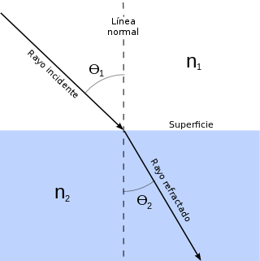

Grados: Óptica  
Fecha: 16 de Diciembre de 2019

## Ejercicio 1

La ley de Snell establece que en la refracción de un rayo el producto del índice de refracción del primer medio por el seno del ángulo de incidencia es igual al producto del índice de refracción del segundo medio por el seno del ángulo de refracción, es decir:

$$n_1\operatorname{sen} \theta_1=n_2\operatorname{sen} \theta_2$$

donde $n_1$ es el índice de refracción del primer medio, $\theta_1$ es el ángulo de incidencia, $n_2$ es el índice de refracción del segundo medio y $\theta_2$ es el ángulo de refracción, tal y como se muestra en la figura.

 

Se proyecta un rayo de luz sobre una piscina de agua a una altura de 3 metros sobre el borde de la piscina con un ángulo de incidencia de 60º. Suponiendo que la profundidad de la piscina es de 2 metros, ¿a qué distancia del borde de la piscina se reflejará el rayo en el fondo de la piscina?  
Nota: Tomar como índice de refracción del aire $n_1=1$ y como índice de refracción del agua $n_2=1.333$.

<button class="solution">Mostrar solución</button>

Ángulo de refracción $\theta_2=0.707$ rad y el rayo se refleja a $7.1885$ m del borde de la piscina.

## Ejercicio 2

Se administra una medicina a un enfermo y $t$ horas después la concentración en sangre del principio activo viene dada por la función $c(t) = t^2e^{-t/2}$ miligramos por mililitro.
Se pide:

1. Calcular el valor máximo de la concentración e indicar en qué momento se alcanza dicho valor máximo.
2. Estudiar la concavidad y calcular los puntos de inflexión de la concentración.

<button class="solution">Mostrar solución</button>

1. El valor máximo se alcanza en el instante $t=4$ horas y $c(4)=16e^{-2}$ mg/dl. 
2. Hay dos puntos de inflexión en $t=1.1716$ y $t=6.8284$. 
La función es cóncava hacia arriba en $(-\infty, 1.1716) \cup (6.8284, \infty)$ y cóncava hacia abajo en $(1.1716, 6.8284)$.

## Ejercicio 3

Se sabe que el núcleo del Polonio 210 es radiactivo y que su tiempo de semidesintegración (tiempo necesario para que la cantidad inicial se reduzca a la mitad) es de 138 días. 

1. Si inicialmente tenemos 40 gramos de polonio, ¿qué cantidad de polonio quedará al cabo de 100 días?
2. ¿Qué tiempo tendrá que transcurrir para que se desintegre un 10% de la masa inicial?

Nota: La velocidad de desintegración del polonio (derivada) es proporcional a la cantidad de polonio.

<button class="solution">Mostrar solución</button>

Sea $p(t)$ la cantidad de polonio en cada instante $t$. 
1. Ecuación diferencial: $p' = kp$. 
Solución particular: $p(t) = 40 e^{-0.005 t}$. 
$p(100)=24.2612$ gr. 
2. $21.0721$ días.

