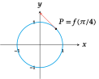
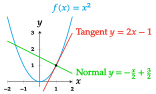
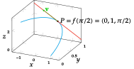

### Generalization to curvilinear motion

The notion of derivative as a velocity along a trajectory in the real line can be generalized to a trajectory in any euclidean space $\mathbb{R}^n$.

In case of a two dimensional space $\mathbb{R}^2$, if $f(t)$ describes the position of a moving object in the real plane at any time $t$, taking as reference the coordinates origin $O$ and the unitary vectors $\{\mathbf{i}=(1,0),\mathbf{j}=(0,1)\}$, we can represent the position of the moving object $P$ at every moment $t$ with a vector $\vec{OP}=x(t)\mathbf{i}+y(t)\mathbf{j}$, where the coordinates

$$
\begin{cases}
x=x(t) & \\
y=y(t)
\end{cases}
\quad
t\in \mbox{Dom}(f)
$$

are known as *coordinate functions* of $f$ and denoted $f(t)=(x(t),y(t))$.

### Velocity of a curvilinear motion in the plane

In the context of a trajectory $f(t)=(x(t),y(t))$ in the real plane $\mathbb{R}^2$, the derivative of the function $f(t)$ at the moment $t_0$ is the vector
\\[\mathbf{v} = \lim_{\Delta t\rightarrow 0} \frac{f(t_0+\Delta t)-f(t_0)}{\Delta t},\\]
that is known, as long as the limit exists, as the *velocity* of the trajectory $f$ at moment $t_0$.

As $f(t)=(x(t),y(t))$,

$$
\begin{aligned}
f'(t_0)&=\lim_{\Delta t\rightarrow 0} \frac{f(t_0+\Delta t)-f(t_0)}{\Delta t} = \lim_{\Delta t\rightarrow 0} \frac{(x(t_0+\Delta t),y(t_0+\Delta t))-(x(t_0),y(t_0))}{\Delta t} =\\
&=  \lim_{\Delta t\rightarrow 0} \left(\frac{x(t_0+\Delta t)-x(t_0)}{\Delta t},\frac{y(t_0+\Delta t)-y(t_0)}{\Delta t}\right) =\\
&= \left(\lim_{\Delta t\rightarrow 0}\frac{x(t_0+\Delta t)-x(t_0)}{\Delta t},\lim_{\Delta t\rightarrow 0}\frac{y(t_0+\Delta t)-y(t_0)}{\Delta t}\right) = (x'(t_0),y'(t_0)).\end{aligned}
$$

Thus, \\[\mathbf{v} = x'(t_0)\mathbf{i}+y'(t_0)\mathbf{j}.
\\]

**Example**. Given the trajectory $f(t) = (\cos t,\sin t)$, $t\in \mathbb{R}$, whose image is the unit circumference centered in the coordinate origin, its coordinate functions are $x(t) = \cos t$, $y(t) = \sin t$, $t\in \mathbb{R}$, and its velocity is \\[\mathbf{v}=f'(t)=(x'(t),y'(t))=(-\sin t, \cos t).\\]
In the moment $t=\pi/4$, the object is in position $f(\pi/4) = (\cos(\pi/4),\sin(\pi/4)) =(\sqrt{2}/2,\sqrt{2}/2)$ and it is moving with a velocity $\mathbf{v}=f'(\pi/4)=(-\sin(\pi/4),\cos(\pi/4))=(-\sqrt{2}/2,\sqrt{2}/2)$.

Observe that the module of the velocity vector is always 1 as $|\mathbf{v}|=\sqrt{(-\sin t)^2+(\cos t)^2}=1$.

## Tangent line to a trajectory

### Tangent line to a trajectory in the plane

Given a trajectory $f(t)$ in the real plane, the vectors that are parallel to the velocity $\mathbf{v}$ at a moment $t_0$ are called *tangent vectors* to the trajectory $f$ at the moment $t_0$, and the line passing through $P=f(t_0)$ directed by $\mathbf{v}$ is the tangent line to $f$ at the moment $t_0$.

> **Definition - Tangent line to a trajectory**. Given a trajectory $f(t)$ in the real plane $\mathbb{R}^2$, the *tangent line* to $f$ at $t=t_0$ is the line with equation
>
$$
\begin{aligned}
l:(x,y) &=f(t_0)+tf'(t_0) = (x(t_0),y(t_0))+t(x'(t_0),y'(t_0)) =\\
&= (x(t_0)+tx'(t_0),y(t_0)+ty'(t_0)).
\end{aligned}
$$

**Example**. We have seen that for the trajectory $f(t) = (\cos t,\sin t)$, $t\in \mathbb{R}$, whose image is unit circumference at the coordinate origin, the object position at the moment $t=\pi/4$ is $f(\pi/4)=(\sqrt{2}/2,\sqrt{2}/2)$ and its velocity $\mathbf{v}=(-\sqrt{2}/2,\sqrt{2}/2)$. Thus the equation of the tangent line to $f$ at that moment is
\\[l: (x,y) = f(\pi/4)+t\mathbf{v} =
\left(\frac{\sqrt{2}}{2},\frac{\sqrt{2}}{2}\right)+t\left(\frac{-\sqrt{2}}{2},\frac{\sqrt{2}}{2}\right) =
\left(\frac{\sqrt{2}}{2}-t\frac{\sqrt{2}}{2},\frac{\sqrt{2}}{2}+t\frac{\sqrt{2}}{2}\right).\\]

From the vectorial equation of the tangent to a trajectory $f(t)$ at the moment $t_0$ we can get the coordinate functions

$$
\begin{cases}
x=x(t_0)+tx'(t_0)\\
y=y(t_0)+ty'(t_0)
\end{cases}
\quad t\in \mathbb{R},
$$

and solving for $t$ and equalling both equations we get the *Cartesian equation* of the tangent \\[\frac{x-x(t_0)}{x'(t_0)}=\frac{y-y(t_0)}{y'(t_0)},\\]
if $x'(t_0)\neq 0$ and $y'(t_0)\neq 0$.

From this equation is easy to get the *point-slope equation* of the tangent \\[y-y(t_0)=\frac{y'(t_0)}{x'(t_0)}(x-x(t_0)).\\]

**Example**. Using the vectorial equation of the tangent of the previous example
\\[l: (x,y)=\left(\frac{\sqrt{2}}{2}-t\frac{\sqrt{2}}{2},\frac{\sqrt{2}}{2}+t\frac{\sqrt{2}}{2}\right),\\] its Cartesian equation is \\[\frac{x-\sqrt{2}/2}{-\sqrt{2}/2} = \frac{y-\sqrt{2}/2}{\sqrt{2}/2}\\]
and the point-slope equation is
\\[y-\sqrt{2}/2 = \frac{-\sqrt{2}/2}{\sqrt{2}/2}(x-\sqrt{2}/2) \Rightarrow y=-x+\sqrt{2}.\\]

### Normal line to a trajectory in the plane

We have seen that the tangent line to a trajectory $f(t)$ at $t_0$ is the line passing through the point $P=f(t_0)$ directed by the velocity vector $\mathbf{v}=f'(t_0)=(x'(t_0),y'(t_0))$. If we take as direction vector a vector orthogonal to $\mathbf{v}$, we get another line that is known as *normal line* to $f$ at moment $t_0$.

> **Definition - Normal line to a trajectory**. Given a trajectory $f(t)$ in the real plane $\mathbb{R}^2$, the *normal line* to $f$ at moment $t=t_0$ is the line with equation \\[l: (x,y)=(x(t_0),y(t_0))+t(y'(t_0),-x'(t_0)) = (x(t_0)+ty'(t_0),y(t_0)-tx'(t_0)).\\]

The Cartesian equation is \\[\frac{x-x(t_0)}{y'(t_0)} = \frac{y-y(t_0)}{-x'(t_0)},\\] and the point-slope equation is \\[y-y(t_0) = \frac{-x'(t_0)}{y'(t_0)}(x-x(t_0)).\\] The normal line is always perpendicular to the tangent line as their direction vectors are orthogonal.

**Example**. Considering again the trajectory of the unit circumference $f(t) = (\cos t,\sin t)$, $t\in \mathbb{R}$, the normal line to $f$ at moment $t=\pi/4$ is

$$
\begin{aligned}
l: (x,y)&=(\cos(\pi/2),\sin(\pi/2))+t(\cos(\pi/2),\sin(\pi/2)) =\\
&= \left(\frac{\sqrt{2}}{2},\frac{\sqrt{2}}{2}\right)+t\left(\frac{\sqrt{2}}{2},\frac{\sqrt{2}}{2}\right)
=\left(\frac{\sqrt{2}}{2}+t\frac{\sqrt{2}}{2},\frac{\sqrt{2}}{2}+t\frac{\sqrt{2}}{2}\right),\end{aligned}
$$

the Cartesian equation is \\[\frac{x-\sqrt{2}/2}{\sqrt{2}/2} = \frac{y-\sqrt{2}/2}{\sqrt{2}/2},\\]
and the point-slope equation is
\\[y-\sqrt{2}/2 = \frac{\sqrt{2}/2}{\sqrt{2}/2}(x-\sqrt{2}/2) \Rightarrow y=x.\\]

### Tangent and normal lines to a function

A particular case of tangent and normal lines to a trajectory are the tangent and normal lines to a function of one real variable. For every function $y=f(x)$, the trajectory that trace its graph is
\\[g(x) = (x,f(x))  \quad x\in \mathbb{R},\\]
and its velocity is \\[g'(x) = (1,f'(x)),\\] so that the tangent line to $g$ at the moment $x_0$ is \\[\frac{x-x_0}{1} = \frac{y-f(x_0)}{f'(x_0)} \Rightarrow y-f(x_0) = f'(x_0)(x-x_0),\\]
and the normal line is
\\[\frac{x-x_0}{f'(x_0)} = \frac{y-f(x_0)}{-1} \Rightarrow y-f(x_0) = \frac{-1}{f'(x_0)}(x-x_0),\\]

**Example**. Given the function $y=x^2$, the trajectory that traces the its graph is $g(x)=(x,x^2)$ and its velocity is $g'(x)=(1,2x)$. At the moment $x=1$ the trajectory passes through the point $(1,1)$ with a velocity $(1,2)$. Thus, the tangent line at that moment is \\[\frac{x-1}{1} = \frac{y-1}{2} \Rightarrow y-1 = 2(x-1) \Rightarrow y = 2x-1,\\]
and the normal line is
\\[\frac{x-1}{2} = \frac{y-1}{-1} \Rightarrow y-1 = \frac{-1}{2}(x-1) \Rightarrow y = \frac{-x}{2}+\frac{3}{2}.\\]

### Tangent line to a trajectory in the space

The concept of tangent line to a trajectory in can be easily extended from the real plane to the three-dimensional space $\mathbb{R}^3$.

If $f(t)=(x(t),y(t),z(t))$, $t\in \mathbb{R}$, is a trajectory in the real space $\mathbb{R}^3$, then at the moment $t_0$, the moving object that follows this trajectory will be at the position $P=(x(t_0),y(t_0),z(t_0))$ with a velocity $\mathbf{v}=f'(t)=(x'(t),y'(t),z'(t))$. Thus, the tangent line to $f$ at this moment have the following vectorial equation

$$
\begin{aligned}
l&: (x,y,z)=(x(t_0),y(t_0),z(t_0))+t(x'(t_0),y'(t_0),z'(t_0)) =\\
&= (x(t_0)+tx'(t_0),y(t_0)+ty'(t_0),z(t_0)+tz'(t_0)),
\end{aligned}
$$

and the Cartesian equations are \\[\frac{x-x(t_0)}{x'(t_0)}=\frac{y-y(t_0)}{y'(t_0)}=\frac{z-z(t_0)}{z'(t_0)},\\]
provided that $x'(t_0)\neq 0$, $y'(t_0)\neq 0$ y $z'(t_0)\neq 0$.

**Example**. Given the trajectory $f(t)=(\cos t, \sin t, t)$, $t\in \mathbb{R}$ in the real space, at the moment $t=\pi/2$ the trajectory passes through the point \\[f(\pi/2)=(\cos(\pi/2),\sin(\pi/2),\pi/2)=(0,1,\pi/2),\\] with a velocity \\[\mathbf{v}=f'(\pi/2)=(-\sin(\pi/2),\cos(\pi/2), 1)=(-1,0,1),\\]
and the tangent line to $f$ at that moment is \\[l:(x,y,z)=(0,1,\pi/2)+t(-1,0,1) = (-t,1,t+\pi/2).\\]

