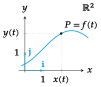
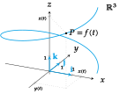
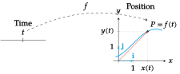
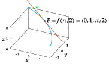
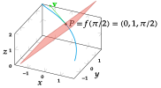
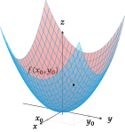
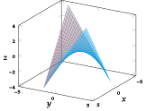
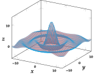
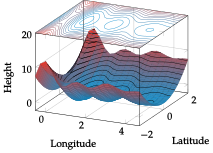
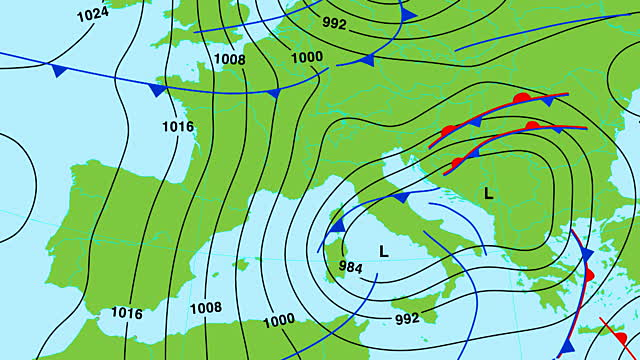

## Vector functions of a single real variable

> **Definition - Vector function of a single real variable**. A *vector function of a single real variable* or *vector field of a scalar variable* is a function that maps every scalar value $t\in D\subseteq \mathbb{R}$ into a vector $(x_1(t),\ldots,x_n(t))$ in $\mathbb{R}^n$:
>
$$
\begin{array}{rccl}
f: & \mathbb{R} & \longrightarrow & \mathbb{R}^n\\
& t & \longrightarrow & (x_1(t),\ldots, x_n(t))
\end{array}
$$
>
where $x_i(t)$, $i=1,\ldots,n$, are real function of a single real variable known as *coordinate functions*.

The most common vector field of scalar variable are in the the real plane $\mathbb{R}^2$, where usually they are represented as
\\\[f(t)=x(t)\mathbf{i}+y(t)\mathbf{j},\\\]
and in the real space $\mathbb{R}^3$, where usually they are represented as
\\\[f(t)=x(t)\mathbf{i}+y(t)\mathbf{j}+z(t)\mathbf{k},\\\]

### Graphic representation of vector fields
The graphic representation of a vector field in $\mathbb{R}^2$ is a trajectory in the real plane.

The graphic representation of a vector field in $\mathbb{R}^3$ is a trajectory in the real space.

## Derivative of a vector field

The concept of derivative as the limit of the average rate of change of a function can be extended easily to vector fields.

> **Definition - Derivative of a vectorial field**. A vectorial field $f(t)=(x_1(t),\ldots,x_n(t))$ is *differentiable* at a point $t=a$ if the limit
\\\[\lim_{\Delta t\rightarrow 0} \frac{f(a+\Delta t)-f(a)}{\Delta t}.\\\]
exists. In such a case, the value of the limit is known as the *derivative* of the vector field at $a$, and it is written $f'(a)$.

Many properties of real functions of a single real variable can be extended to vector fields through its component functions. Thus, for instance, the derivative of a vector field can be computed from the derivatives of its component functions.

> **Theorem**. Given a vector field $f(t)=(x_1(t),\ldots,x_n(t))$, if $x_i(t)$ is differentiable at $t=a$ for all $i=1,\ldots,n$, then $f$ is differentiable at $a$ and its derivative is
\\\[f'(a)=(x_1'(a),\ldots,x_n'(a))\\\]

The proof for a vectorial field in $\mathbb{R}^2$ is easy.
$$\begin{aligned}
f'(a)&=\lim_{\Delta t\rightarrow 0} \frac{f(a+\Delta t)-f(a)}{\Delta t} = \lim_{\Delta t\rightarrow 0} \frac{(x(a+\Delta t),y(a+\Delta t))-(x(a),y(a))}{\Delta t} =\\
&=  \lim_{\Delta t\rightarrow 0} \left(\frac{x(a+\Delta t)-x(a)}{\Delta t},\frac{y(a+\Delta t)-y(a)}{\Delta t}\right) =\\
&= \left(\lim_{\Delta t\rightarrow 0}\frac{x(a+\Delta t)-x(a)}{\Delta t},\lim_{\Delta t\rightarrow 0}\frac{y(a+\Delta t)-y(a)}{\Delta t}\right) =
(x'(a),y'(a)).
\end{aligned}
$$

### Kinematics: Curvilinear motion

The notion of derivative as a velocity along a trajectory in the real line can be generalized to a trajectory in any euclidean space $\mathbb{R}^n$.

In case of a two dimensional space $\mathbb{R}^2$, if $f(t)$ describes the position of a moving object in the real plane at any time $t$, taking as reference the coordinates origin $O$ and the unitary vectors $\{\mathbf{i}=(1,0),\mathbf{j}=(0,1)\}$, we can represent the position of the moving object $P$ at every moment $t$ with a vector $\vec{OP}=x(t)\mathbf{i}+y(t)\mathbf{j}$, where the coordinates

$$
\begin{cases}
x=x(t)\\
y=y(t)
\end{cases}
\quad
t\in \mbox{Dom}(f)
$$

are the *coordinate functions* of $f$.

### Velocity of a curvilinear motion in the plane

In this context the derivative of a trajectory $f'(a)=(x_1'(a),\ldots,x_n'(a))$ is the *velocity* vector of the trajectory $f$ at moment $t=a$.

**Example**. Given the trajectory $f(t) = (\cos t,\sin t)$, $t\in \mathbb{R}$, whose image is the unit circumference centered in the coordinate origin, its coordinate functions are $x(t) = \cos t$, $y(t) = \sin t$, $t\in \mathbb{R}$, and its velocity is \\\[\mathbf{v}=f'(t)=(x'(t),y'(t))=(-\sin t, \cos t).\\\] In the moment $t=\pi/4$, the object is in position $f(\pi/4) = (\cos(\pi/4),\sin(\pi/4)) =(\sqrt{2}/2,\sqrt{2}/2)$ and it is moving with a velocity $\mathbf{v}=f'(\pi/4)=(-\sin(\pi/4),\cos(\pi/4))=(-\sqrt{2}/2,\sqrt{2}/2)$.

Observe that the module of the velocity vector is always 1 as $\vert\mathbf{v}\vert=\sqrt{(-\sin t)^2+(\cos t)^2}=1$.

## Tangent line to a trajectory

### Tangent line to a trajectory in the plane

#### Vectorial equation

Given a trajectory $f(t)$ in the real plane, the vectors that are parallel to the velocity $\mathbf{v}$ at a moment $a$ are called *tangent vectors* to the trajectory $f$ at the moment $a$, and the line passing through $P=f(a)$ directed by $\mathbf{v}$ is the tangent line to the graph of $f$ at the moment $a$.

> **Definition - Tangent line to a trajectory**. Given a trajectory $f(t)$ in the real plane $\mathbb{R}^2$, the *tangent line* to to the graph of $f$ at $a$ is the line with equation
>
$$
\begin{aligned}
l:(x,y) &= f(a)+tf'(a) = (x(a),y(a))+t(x'(a),y'(a))\\
& = (x(a)+tx'(a),y(a)+ty'(a)).
\end{aligned}
$$

**Example**. We have seen that for the trajectory $f(t) = (\cos t,\sin t)$, $t\in \mathbb{R}$, whose image is the unit circumference centered at the coordinate origin, the object position at the moment $t=\pi/4$ is $f(\pi/4)=(\sqrt{2}/2,\sqrt{2}/2)$ and its velocity $\mathbf{v}=(-\sqrt{2}/2,\sqrt{2}/2)$. Thus the equation of the tangent line to $f$ at that moment is

$$
\begin{aligned}
l: (x,y) & = f(\pi/4)+t\mathbf{v} =
\left(\frac{\sqrt{2}}{2},\frac{\sqrt{2}}{2}\right)+t\left(\frac{-\sqrt{2}}{2},\frac{\sqrt{2}}{2}\right) =\\
& =\left(\frac{\sqrt{2}}{2}-t\frac{\sqrt{2}}{2},\frac{\sqrt{2}}{2}+t\frac{\sqrt{2}}{2}\right).
\end{aligned}
$$

#### Cartesian and point-slope equations

From the vectorial equation of the tangent to a trajectory $f(t)$ at the moment $t=a$ we can get the coordinate functions

$$
\begin{cases}
x=x(a)+tx'(a)\\
y=y(a)+ty'(a)
\end{cases}
\quad t\in \mathbb{R},
$$

and solving for $t$ and equalling both equations we get the *Cartesian equation* of the tangent
\\\[\frac{x-x(a)}{x'(a)}=\frac{y-y(a)}{y'(a)},\\\]
if $x'(a)\neq 0$ and $y'(a)\neq 0$.

From this equation it is easy to get the *point-slope equation* of the tangent
\\\[y-y(a)=\frac{y'(a)}{x'(a)}(x-x(a)).\\\]

**Example**. Using the vectorial equation of the tangent of the previous example
\\\[l: (x,y)=\left(\frac{\sqrt{2}}{2}-t\frac{\sqrt{2}}{2},\frac{\sqrt{2}}{2}+t\frac{\sqrt{2}}{2}\right),\\\]
its Cartesian equation is \\\[\frac{x-\sqrt{2}/2}{-\sqrt{2}/2} = \frac{y-\sqrt{2}/2}{\sqrt{2}/2}\\\]
and the point-slope equation is
\\\[y-\sqrt{2}/2 = \frac{-\sqrt{2}/2}{\sqrt{2}/2}(x-\sqrt{2}/2) \Rightarrow y=-x+\sqrt{2}.\\\]

### Normal line to a trajectory in the plane

We have seen that the tangent line to a trajectory $f(t)$ at $a$ is the line passing through the point $P=f(a)$ directed by the velocity vector $\mathbf{v}=f'(a)=(x'(a),y'(a))$. If we take as direction vector a vector orthogonal to $\mathbf{v}$, we get another line that is known as *normal line* to the trajectory.

> **Definition - Normal line to a trajectory**. Given a trajectory $f(t)$ in the real plane $\mathbb{R}^2$, the *normal line* to the graph of $f$ at moment $t=a$ is the line with equation
\\\[l: (x,y)=(x(a),y(a))+t(y'(a),-x'(a)) = (x(a)+ty'(a),y(a)-tx'(a)).\\\]

The Cartesian equation is
\\\[\frac{x-x(a)}{y'(a)} = \frac{y-y(a)}{-x'(a)},\\\]
and the point-slope equation is
\\\[y-y(a) = \frac{-x'(a)}{y'(a)}(x-x(a)).\\\]
The normal line is always perpendicular to the tangent line as their direction vectors are orthogonal.

**Example**. Considering again the trajectory of the unit circumference $f(t) = (\cos t,\sin t)$, $t\in \mathbb{R}$, the normal line to the graph of $f$ at moment $t=\pi/4$ is

$$
\begin{aligned}
l: (x,y)&=(\cos(\pi/2),\sin(\pi/2))+t(\cos(\pi/2),\sin(\pi/2)) =\\
&= \left(\frac{\sqrt{2}}{2},\frac{\sqrt{2}}{2}\right)+t\left(\frac{\sqrt{2}}{2},\frac{\sqrt{2}}{2}\right)
=\left(\frac{\sqrt{2}}{2}+t\frac{\sqrt{2}}{2},\frac{\sqrt{2}}{2}+t\frac{\sqrt{2}}{2}\right),
\end{aligned}
$$

the Cartesian equation is
\\\[\frac{x-\sqrt{2}/2}{\sqrt{2}/2} = \frac{y-\sqrt{2}/2}{\sqrt{2}/2},\\\]
and the point-slope equation is
\\\[y-\sqrt{2}/2 = \frac{\sqrt{2}/2}{\sqrt{2}/2}(x-\sqrt{2}/2) \Rightarrow y=x.\\\]

### Tangent and normal lines to a function

A particular case of tangent and normal lines to a trajectory are the tangent and normal lines to a function of one real variable. For every function $y=f(x)$, the trajectory that trace its graph is \\\[g(x) = (x,f(x))  \quad x\in \mathbb{R},\\\] and its velocity is \\\[g'(x) = (1,f'(x)),\\\] so that the tangent line to $g$ at the moment $a$ is \\\[\frac{x-a}{1} = \frac{y-f(a)}{f'(a)} \Rightarrow y-f(a) = f'(a)(x-a),\\\] and the normal line is \\\[\frac{x-a}{f'(a)} = \frac{y-f(a)}{-1} \Rightarrow y-f(a) = \frac{-1}{f'(a)}(x-a),\\\]

**Example**. Given the function $y=x^2$, the trajectory that traces its graph is $g(x)=(x,x^2)$ and its velocity is $g'(x)=(1,2x)$. At the moment $x=1$ the trajectory passes through the point $(1,1)$ with a velocity $(1,2)$. Thus, the tangent line at that moment is
\\\[\frac{x-1}{1} = \frac{y-1}{2} \Rightarrow y-1 = 2(x-1) \Rightarrow y = 2x-1,\\\]
and the normal line is
\\\[\frac{x-1}{2} = \frac{y-1}{-1} \Rightarrow y-1 = \frac{-1}{2}(x-1) \Rightarrow y = \frac{-x}{2}+\frac{3}{2}.\\\]

### Tangent line to a trajectory in the space

The concept of tangent line to a trajectory can be easily extended from the real plane to the three-dimensional space $\mathbb{R}^3$.

If $f(t)=(x(t),y(t),z(t))$, $t\in \mathbb{R}$, is a trajectory in the real space $\mathbb{R}^3$, then at the moment $a$, the moving object that follows this trajectory will be at the position $P=(x(a),y(a),z(a))$ with a velocity $\mathbf{v}=f'(t)=(x'(t),y'(t),z'(t))$. Thus, the tangent line to $f$ at this moment have the following vectorial equation

$$
\begin{aligned}
l&: (x,y,z)=(x(a),y(a),z(a))+t(x'(a),y'(a),z'(a)) =\\
&= (x(a)+tx'(a),y(a)+ty'(a),z(a)+tz'(a)),
\end{aligned}
$$

and the Cartesian equations are
\\\[\frac{x-x(a)}{x'(a)}=\frac{y-y(a)}{y'(a)}=\frac{z-z(a)}{z'(a)},\\\]
provided that $x'(a)\neq 0$, $y'(a)\neq 0$ y $z'(a)\neq 0$.

**Example**. Given the trajectory $f(t)=(\cos t, \sin t, t)$, $t\in \mathbb{R}$ in the real space, at the moment $t=\pi/2$ the trajectory passes through the point
\\\[f(\pi/2)=(\cos(\pi/2),\sin(\pi/2),\pi/2)=(0,1,\pi/2),\\\]
with velocity
\\\[\mathbf{v}=f'(\pi/2)=(-\sin(\pi/2),\cos(\pi/2), 1)=(-1,0,1),\\\]
and the tangent line to the graph of $f$ at that moment is
\\\[l:(x,y,z)=(0,1,\pi/2)+t(-1,0,1) = (-t,1,t+\pi/2).\\\]

 **<a href="https://ggbm.at/Q2C7EfBn" target="_blank">Interactive Example</a>**

### Normal plane to a trajectory in the space

In the three-dimensional space $\mathbb{R}^3$, the normal line to a trajectory is not unique. There are an infinite number of normal lines and all of them are in the normal plane.

If $f(t)=(x(t),y(t),z(t))$, $t\in \mathbb{R}$, is a trajectory in the real space $\mathbb{R}^3$, then at the moment $a$, the moving object that follows this trajectory will be at the position $P=(x(a),y(a),z(a))$ with a velocity $\mathbf{v}=f'(t)=(x'(t),y'(t),z'(t))$. Thus, using the velocity vector as normal vector the normal plane to $f$ at this moment have the following vectorial equation

$$
\begin{aligned}
\Pi &: (x-x(a),y-y(a),z-z(a))(x'(a),y'(a),z'(a)) = 0\\
&= x'(a)(x-x(a))+y'(a)(y-y(a))+z'(a)(z-z(a))=0.
\end{aligned}
$$

**Example**. For the trajectory of the previous example $f(t)=(\cos t, \sin t, t)$, $t\in \mathbb{R}$, at the moment $t=\pi/2$ the trajectory passes through the point
\\\[f(\pi/2)=(\cos(\pi/2),\sin(\pi/2),\pi/2)=(0,1,\pi/2),\\\]
with velocity
\\\[\mathbf{v}=f'(\pi/2)=(-\sin(\pi/2),\cos(\pi/2), 1)=(-1,0,1),\\\]
and normal plane to the graph of $f$ at that moment is
\\\[\Pi:\left(x-0,y-1,z-\frac{\pi}{2}\right)(-1,0,1) =0 \Leftrightarrow -x+z-\frac{\pi}{2}=0.\\\]

 **<a href="https://ggbm.at/Q2C7EfBn" target="_blank">Interactive Example</a>**

## Functions of several variables

A lot of problems in Geometry, Physics, Chemistry, Biology, etc. involve a variable that depend on two or more variables:

-   The area of a triangle depends on two variables that are the base and height lengths.

-   The volume of a perfect gas depends on two variables that are the pressure and the temperature.

-   The way travelled by an object free falling depends on a lot of variables: the time, the area of the cross section of the object, the latitude and longitude of the object, the height above the sea level, the air pressure, the air temperature, the speed of wind, etc.

These dependencies are expressed with functions of several variables.

> **Definition - Functions of several real variables**. A *function of $n$ real variables* or a *scalar field* from a set $A_1\times \cdots \times A_n\subseteq \mathbb{R}^n$ in a set $B\subseteq \mathbb{R}$, is a relation that maps any tuple $(a_1,\ldots,a_n)\in A_1\times \cdots\times A_n$ into a unique element of $B$, denoted by $f(a_1,\ldots,a_n)$, that is knwon as the *image* of $(a_1,\ldots,a_n)$ by $f$.
>
$$
\begin{array}{lccc}
f: & A_1\times\cdots\times A_n & \longrightarrow & B\\
   &(a_1,\ldots,a_n) & \longrightarrow & f(a_1,\ldots,a_n)
\end{array}
$$

- The area of a triangle is a real function of two real variables
\\\[f(x,y)=\frac{xy}{2}.\\\]

- The volume of a perfect gas is a real function of two real variables
\\\[v=f(t,p)=\frac{nRt}{p},\quad \mbox{with $n$ and $R$ constants.}\\\]

### Graph of a function of two variables

The graph of a function of two variables $f(x,y)$ is a surface in the real space $\mathbb{R}^3$ where every point of the surface has coordinates $(x,y,z)$, with $z=f(x,y)$.

**Example**. The function $f(x,y)=\dfrac{xy}{2}$ that measures the area of a triangle of base $x$ and height $y$ has the graph below.

The function $\displaystyle f(x,y)=\frac{\sin(x^2+y^2)}{\sqrt{x^2+y^2}}$ has the peculiar graph below.

### Level set of a scalar field

> **Definition - Level set** Given a scalar field $f:\mathbb{R}^n\rightarrow \mathbb{R}$, the *level set* $c$ of $f$ is the set
\\\[C_{f,c}=\{(x_1,\ldots,x_n): f(x_1,\ldots,x_n)=c\},\\\]
that is, a set where the function takes on the constant value $c$.

**Example**. Given the scalar field $f(x,y)=x^2+y^2$ and the point $P=(1,1)$, the level set of $f$ that includes $P$ is
\\\[C_{f,2} = \{(x,y): f(x,y)=f(1,1)=2\} = \{(x,y): x^2+y^2=2\},\\\]
that is the circumference of radius $\sqrt{2}$ centered at the origin.

Level sets are common in applications like topographic maps, where the level curves correspond to points with the same height above the sea level,

and weather maps (*isobars*), where level curves correspond to points with the same atmospheric pressure.

### Partial functions

> **Definition - Partial function**. Given a scalar field $f:\mathbb{R}^n\rightarrow \mathbb{R}$, an $i$-th *partial function* of $f$ is any function $f_i:\mathbb{R}\rightarrow \mathbb{R}$ that results of substituting all the variables of $f$ by constants, except the $i$-th variable, that is:
\\\[f_i(x)=f(c_1,\ldots,c_{i-1},x,c_{i+1},\ldots,c_{n}),\\\]
with $c_j$ $(j=1,\ldots, n,\ j\neq i)$ constants.

**Example**. If we take the function that measures the area of a triangle
\\\[f(x,y)=\frac{xy}{2},\\\]
and set the value of the base to $x=c$, then we the area of the triangle depends only of the height, and $f$ becomes a function of one variable, that is the partial function
\\\[f_1(y)=f(c,y)=\frac{cy}{2},\quad \mbox{with $c$ constant}.\\\]

## Partial derivative notion

### Variation of a function with respect to a variable

We can measure the variation of a scalar field with respect to each of its variables in the same way that we measured the variation of a one-variable function.

Let $z=f(x,y)$ be a scalar field of $\mathbb{R}^2$. If we are at point $(x_0,y_0)$ and we increase the value of $x$ a quantity $\Delta x$, then we move in the direction of the $x$-axis from the point $(x_0,y_0)$ to the point $(x_0+\Delta x,y_0)$, and the variation of the function is
\\\[\Delta z=f(x_0+\Delta x,y_0)-f (x_0,y_0).\\\]

Thus, the rate of change of the function with respect to $x$ along the interval $[x_0,x_0+\Delta x]$ is given by the quotient
\\\[\frac{\Delta z}{\Delta x}=\frac{f(x_0+\Delta x,y_0)-f(x_0,y_0)}{\Delta x}.\\\]

### Instantaneous rate of change of a scalar field with respect to a variable

If instead o measuring the rate of change in an interval, we measure the rate of change in a point, that is, when $\Delta x$ approaches 0, then we get the instantaneous rate of change:
\\\[\lim_{\Delta x\rightarrow 0}\frac{\Delta z}{\Delta x}=\lim_{\Delta x \rightarrow 0}\frac{f(x_0+\Delta x,y_0)-f(x_0,y_0)}{\Delta x}.\\\]
The value of this limit, if exists, it is known as the *partial derivative* of $f$ with respect to the variable $x$ at the point $(x_0,y_0)$; it is written as
\\\[\frac{\partial f}{\partial x}(x_0,y_0).\\\]

This partial derivative measures the instantaneous rate of change of $f$ at the point $P=(x_0,y_0)$ when $P$ moves in the $x$-axis direction.

### Geometric interpretation of partial derivatives

Geometrically, a two-variable function $z=f(x,y)$ defines a surface. If we cut this surface with a plane of equation $y=y_0$ (that is, the plane where $y$ is the constant $y_0$) the intersection is a curve, and the partial derivative of $f$ with respect to to $x$ at $(x_0,y_0)$ is the slope of the tangent line to that curve at $x=x_0$.

 **<a href="https://ggbm.at/K3xnQRY8" target="_blank">Interactive Example</a>**

### Partial derivative

The concept of partial derivative can be extended easily from two-variable function to $n$-variables functions.

> **Definition - Partial derivative**. Given a $n$-variables function $f(x_1,\ldots,x_n)$, $f$ is *partially differentiable* with respect to the variable $x_i$ at the point $a=(a_1,\ldots,a_n)$ if exists the limit
\\\[\lim_{\Delta x_i\rightarrow 0} \frac{f(a_1,\ldots,a_{i-1},a_i+\Delta x_i,a_{i+1},\ldots,a_n)-f(a_1,\ldots,a_{i-1},a_i,a_{i+1},\ldots,a_n)} {h}.\\\]
In such a case, the value of the limit is known as *partial derivative* of $f$ with respect to $x_i$ at $a$; it is denoted
\\\[f'_{x_i}(a)=\frac{\partial f}{\partial x_i}(a).\\\]

**Remark**. The definition of derivative for one-variable functions is a particular case of this definition for $n=1$.

### Partial derivatives computation

When we measure the variation of $f$ with respect to a variable $x_i$ at the point $a=(a_1,\ldots,a_n)$, the other variables remain constant. Thus, if we can consider the $i$-th partial function
\\\[f_i(x_i)=f(a_1,\ldots,a_{i-1},x_i,a_{i+1},\ldots,a_n),\\\]

the partial derivative of $f$ with respect to $x_i$ can be computed differentiating this function:
\\\[\frac{\partial f}{\partial x_i}(a)=f_i'(a_i).\\\]

**Rule**. To differentiate partially $f(x_1,\ldots,x_n)$ with respect to the variable $x_i$, you have to differentiate $f$ as a function of the variable $x_i$, considering the other variables as constants.

**Example of a perfect gas**. Consider the function that measures the volume of a perfect gas
\\\[v(t,p)=\frac{nRt}{p},\\\] where $t$ is the temperature, $p$ the pressure and $n$ and $R$ are constants.

The instantaneous rate of change of the volume with respect to the pressure is the partial derivative of $v$ with respect to $p$. To compute this derivative we have to think in $t$ as a constant and differentiate $v$ as if the unique variable was $p$:
\\\[\frac{\partial v}{\partial p}(t,p)=\frac{d}{dp}\left(\frac{nRt}{p}\right)_{\mbox{$t=$cst}}=\frac{-nRt}{p^2}.\\\]

In the same way, the instantaneous rate of change of the volume with respect to the temperature is the partial derivative of $v$ with respect to $t$:
\\\[\frac{\partial v}{\partial t}(t,p)=\frac{d}{dt}\left(\frac{nRt}{p}\right)_{\mbox{$p=$cst}}=\frac{nR}{p}.\\\]

## Gradient

> **Definition - Gradient**. Given a scalar field $f(x_1,\ldots,x_n)$, the *gradient* of $f$, denoted by $\nabla f$, is a function that maps every point $a=(a_1,\ldots,a_n)$ to a vector with coordinates the partial derivatives of $f$ at $a$,
\\\[\nabla f(a)=\left(\frac{\partial f}{\partial x_1}(a),\ldots,\frac{\partial f}{\partial x_n}(a)\right).\\\]

Later we will show that the gradient in a point is a vector with the magnitude and direction of the maximum rate of change of the function in that point. Thus, , while $-\nabla f(a)$ show the direction of maximum decrease of $f$ at $a$.

**Example**. After heating a surface, the temperature $t$ (in $^\circ$C) at each point $(x,y,z)$ (in m) of the surface is given by the function
\\\[t(x,y,z)=\frac{x}{y}+z^2.\\\]
In what direction will increase the temperature faster at point $(2,1,1)$ of the surface? What magnitude will the maximum increase of temperature have?

The direction of maximum increase of the temperature is given by the gradient
\\\[\nabla t(x,y,z)=\left(\frac{\partial t}{\partial x}(x,y,z),\frac{\partial t}{\partial y}(x,y,z),\frac{\partial t}{\partial
z}(x,y,z)\right)=\left(\frac{1}{y},\frac{-x}{y^2},2z\right).\\\]

At point $(2,1,1)$ de direction is given by the vector
\\\[\nabla t(2,1,1)=\left(\frac{1}{1},\frac{-2}{1^2},2\cdot 1\right)=(1,-2,2),\\\]
and its magnitude is
\\\[|\nabla f(2,1,1)|=|\sqrt{1^2+(-2)^2+2^2}|=|\sqrt{9}|=3 \mbox{ $^\circ$C/m}.\\\]

## Composition of a vectorial field with a scalar field

### Multivariate chain rule

If $f:\mathbb{R}^n\rightarrow \mathbb{R}$ is a scalar field and $g:\mathbb{R}\rightarrow \mathbb{R}^n$ is a vectorial function, then it is possible to compound $g$ with $f$, so that $f\circ g:\mathbb{R}\rightarrow \mathbb{R}$ is a one-variable function.

> **Theorem - Chain rule**. If $g(t)=(x_1(t),\ldots,x_n(t))$ is a vectorial function differentiable at $t$ and $f(x_1,\ldots,x_n)$ is a scalar field differentiable at the point $g(t)$, then $f\circ g(t)$ is differentiable at $t$ and
\\[(f\circ g)'(t) = \nabla f(g(t))\cdot g'(t)=\frac{\partial f}{\partial x_1}\frac{dx_1}{dt}+ \cdots + \frac{\partial f}{\partial x_n}\frac{dx_n}{dt}\\]

**Example**. Let us consider the scalar field $f(x,y)=x^2y$ and the vectorial function $g(t)=(\cos t,\sin t)$ $t\in [0,2\pi]$ in the real plane, then
\\[\nabla f(x,y) = (2xy, x^2) \quad  \mbox{and} \quad g'(t) = (-\sin t, \cos t),\\]
and

$$
\begin{aligned}
(f\circ g)'(t) &= \nabla f(g(t))\cdot g'(t) = (2\cos t\sin t,\cos^2 t)\cdot (-\sin t,\cos t) =\\
&= -2\cos t\sin^2 t+\cos^3 t.
\end{aligned}
$$

We can get the same result differentiating the composed function directly
\\[(f\circ g)(t) = f(g(t)) = f(\cos t, \sin t) = \cos^2 t\sin t,\\] and its derivative is \\[(f\circ g)'(t) = 2\cos t(-\sin t)\sin t+\cos^2 t \cos t = -2\cos t\sin^2 t+\cos^3 t.\\]

The chain rule for the composition of a vectorial function with a scalar field allow us to get the algebra of derivatives for one-variable functions easily:

$$
\begin{aligned}
(u+v)' &= u'+v'\\
(uv)' &= u'v+uv'\\
\left(\frac{u}{v}\right)' &= \frac{u'v-uv'}{v^2}\\
(u\circ v)' &= u'(v)v'
\end{aligned}
$$

To infer the derivative of the sum of two functions $u$ and $v$, we can take the scalar field $f(x,y)=x+y$ and the vectorial function $g(t)=(u(t),v(t))$. Applying the chain rule we get
\\[(u+v)'(t) = (f\circ g)'(t) = \nabla f(g(t))\cdot g'(t) = (1,1)\cdot (u',v') = u'+v'.\\]
To infer the derivative of the quotient of two functions $u$ and $v$, we can take the scalar field $f(x,y)=x/y$ and the vectorial function $g(t)=(u(t),v(t))$.
\\[\left(\frac{u}{v}\right)'(t) = (f\circ g)'(t) = \nabla f(g(t))\cdot g'(t) = \left(\frac{1}{v},-\frac{u}{v^2}\right)\cdot (u',v') = \frac{u'v-uv'}{v^2}.\\]

## Directional derivative

For a scalar field $f(x,y)$, we have seen that the partial derivative $\dfrac{\partial f}{\partial x}(x_0,y_0)$ is the instantaneous rate of change of $f$ with respect to $x$ at point $P=(x_0,y_0)$, that is, when we move along the $x$-axis.

In the same way, $\dfrac{\partial f}{\partial y}(x_0,y_0)$ is the instantaneous rate of change of $f$ with respect to $y$ at the point $P=(x_0,y_0)$, that is, when we move along the $y$-axis.

But, *what happens if we move along any other direction?*

The instantaneous rate of change of $f$ at the point $P=(x_0,y_0)$ along the direction of a unitary vector $u$ is known as *directional derivative*.

> **Definition - Directional derivative**. Given a scalar field $f$ of $\mathbb{R}^n$, a point $P$ and a unitary vector $\mathbf{u}$ in that space, we say that $f$ is differentiable at $P$ along the direction of $\mathbf{u}$ if exists the limit
\\[f^\prime_{\mathbf{u}}(P) = \lim_{h\rightarrow 0}\frac{f(P+h\mathbf{u})-f(P)}{h}.\\]
In such a case, the value of the limit is known as *directional derivative* of $f$ at the point $P$ along the direction of $\mathbf{u}$.

If we consider a unitary vector $\mathbf{u}$, the trajectory that passes through $P$, following the direction of $\mathbf{u}$, has equation
\\[g(t)=P+t\mathbf{u},\ t\in\mathbb{R}.\\]

For $t=0$, this trajectory passes through the point $P=g(0)$ with velocity $\mathbf{u}=g'(0)$.

Thus, the directional derivative of $f$ at the point $P$ along the direction of $\mathbf{u}$ is
\\[(f\circ g)'(0) = \nabla f(g(0))\cdot g'(0) = \nabla f(P)\cdot \mathbf{u}.\\]

**Remark**: The partial derivatives are the directional derivatives along the vectors of the canonical basis.

**Example**. Given the function $f(x,y) = x^2+y^2$, its gradient is
\\[\nabla f(x,y) = (2x,2y).\\]

The directional derivative of $f$ at the point $P=(1,1)$, along the unit vector $\mathbf{u}=(1/\sqrt{2},1/\sqrt{2})$ is
\\[f'_{\mathbf{u}}(P) = \nabla f(P)\cdot \mathbf{u} = (2,2)\cdot(1/\sqrt{2},1/\sqrt{2}) = \frac{2}{\sqrt{2}}+\frac{2}{\sqrt{2}} = \frac{4}{\sqrt{2}}.\\]

To compute the directional derivative along a non-unitary vector $\mathbf{v}$, we have to use the unitary vector that results from normalizing $v$ with the transformation \\[\mathbf{v'}=\frac{\mathbf{v}}{\vert \mathbf{v}\vert}.\\]

### Geometric interpretation of the directional derivative

Geometrically, a two-variable function $z=f(x,y)$ defines a surface. If we cut this surface with a plane of equation $a(y-y_0)=b(x-x_0)$ (that is, the vertical plane that passes through the point $P=(x_0,y_0)$ with the direction of vector $\mathbf{u}=(a,b)$) the intersection is a curve, and the directional derivative of $f$ at $P$ along the direction of $\mathbf{u}$ is the slope of the tangent line to that curve at point $P$.

### Growth of scalar field along the gradient

We have seen that for any vector $\mathbf{u}$
\\[f^\prime_{\mathbf{u}}(P) = \nabla f(P)\cdot \mathbf{u} = |\nabla f(P)|\cos \theta,\\]
where $\theta$ is the angle between $\mathbf{u}$ and the gradient $\nabla f(P)$.

Taking into account that $-1\leq \cos\theta\leq 1$, for any vector $\mathbf{u}$ it is satisfied that
\\[-\vert\nabla f(P)\vert\leq f'_{\mathbf{u}}(P)\leq \vert\nabla f(P)\vert .\\]
Furthermore, if $\mathbf{u}$ has the same direction and sense than the gradient, we have $f'_{\mathbf{u}}(P)=\vert\nabla f(P)\vert\cos 0=\vert\nabla f(P)\vert$. Therefore, *the maximum increase of a scalar field at a point $P$ is along the direction of the gradient at that point*.

In the same manner, if $\mathbf{u}$ has the same direction but opposite sense than the gradient, we have $f^\prime_{\mathbf{u}}(P)=\vert\nabla f(P)\vert\cos \pi=-\vert\nabla f(P)\vert$. Therefore, *the maximum decrease of a scalar field at a point $P$ is along the opposite direction of the gradient at that point*.

## Second order partial derivatives

As the partial derivatives of a function are also functions of several variables we can differentiate partially each of them.

If a function $f(x_1,\ldots,x_n)$ has a partial derivative $f^\prime_{x_i}(x_1,\ldots,x_n)$ with respect to the variable $x_i$ in a set $A$, then we can differentiate partially again $f'_{x_i}$ with respect to the variable $x_j$. This second derivative, when exists, is known as *second order partial derivative* of $f$ with respect to the variables $x_i$ and $x_j$; it is written as
\\\[\frac{\partial ^2 f}{\partial x_j \partial x_i}= \frac{\partial}{\partial x_j}\left(\frac{\partial f}{\partial x_i}\right).\\\]

In the same way we can define higher order partial derivatives.

**Example**. The two-variables function
\\\[f(x,y)=x^y\\\]
has 4 second order partial derivatives:

$$
\begin{aligned}
\frac{\partial^2 f}{\partial x^2}(x,y) &=
\frac{\partial}{\partial x}\left(\frac{\partial f}{\partial x}(x,y)\right) =
\frac{\partial}{\partial x}\left(yx^{y-1}\right) =
y(y-1)x^{y-2},\\
\frac{\partial^2 f}{\partial y \partial x}(x,y) &=
\frac{\partial}{\partial y}\left(\frac{\partial f}{\partial x}(x,y)\right) =
\frac{\partial}{\partial y}\left(yx^{y-1}\right) =
x^{y-1}+yx^{y-1}\log x,\\
\frac{\partial^2 f}{\partial x \partial y}(x,y) &=
\frac{\partial}{\partial x}\left(\frac{\partial f}{\partial y}(x,y)\right) =
\frac{\partial}{\partial x}\left(x^y\log x \right) =
yx^{y-1}\log x+x^y\frac{1}{x},\\
\frac{\partial^2 f}{\partial y^2}(x,y) &=
\frac{\partial}{\partial y}\left(\frac{\partial f}{\partial y}(x,y)\right) =
\frac{\partial}{\partial y}\left(x^y\log x \right) =
x^y(\log x)^2.
\end{aligned}
$$

## Hessian matrix and Hessian

> **Definition - Hessian matrix**. Given a scalar field $f(x_1,\ldots,x_n)$, with second order partial derivatives at the point $a=(a_1,\ldots,a_n)$, the *Hessian matrix* of $f$ at $a$, denoted by $\nabla^2f(a)$, is the matrix
>
$$
\nabla^2f(a)=\left(
\begin{array}{cccc}
\dfrac{\partial^2 f}{\partial x_1^2}(a) &
\dfrac{\partial^2 f}{\partial x_1 \partial x_2}(a) &
\cdots &
\dfrac{\partial^2 f}{\partial x_1 \partial x_n}(a)\\
\dfrac{\partial^2 f}{\partial x_2 \partial x_1}(a) &
\dfrac{\partial^2 f}{\partial x_2^2}(a) &
\cdots &
\dfrac{\partial^2 f}{\partial x_2 \partial x_n}(a)\\
\vdots & \vdots & \ddots & \vdots \\
\dfrac{\partial^2 f}{\partial x_n \partial x_1}(a) &
\dfrac{\partial^2 f}{\partial x_n \partial x_2}(a) &
\cdots &
\dfrac{\partial^2 f}{\partial x_n^2}(a)
\end{array}
\right)
$$
>
The determinant of this matrix is known as *Hessian* of $f$ at $a$; it is denoted $Hf(a)=\vert\nabla^2f(a)\vert$.

**Example**. Consider again the two-variables function
\\\[f(x,y)=x^y.\\\]
Its Hessian matrix is

$$
\nabla^2f(x,y)=\left(
\begin{array}{cc}
\dfrac{\partial^2 f}{\partial x^2} & \dfrac{\partial^2 f}{\partial x \partial y}\\
\dfrac{\partial^2 f}{\partial y \partial x} & \dfrac{\partial^2 f}{\partial y^2}
\end{array}
\right)
=
\left(
\begin{array}{cc}
y(y-1)x^{y-2} & x^{y-1}(y\log x+1) \\
x^{y-1}(y\log x+1) & x^y(\log x)^2
\end{array}
\right).
$$

At point $(1,2)$ is

$$\nabla^2f(1,2)=\left(
\begin{array}{cc}
2(2-1)1^{2-2} & 1^{2-1}(2\log 1+1) \\
1^{2-1}(2\log 1+1) & 1^2(\log 1)^2
\end{array}
\right)
=
\left(
\begin{array}{cc}
2 & 1 \\
1 & 0
\end{array}
\right).
$$

And its Hessian is

$$
Hf(1,2)=\left|
\begin{array}{cc}
2 & 1 \\
1 & 0
\end{array}
\right|=
2\cdot 0-1\cdot1= -1.
$$
