## Concept of derivative

### Increment

> **Definition - Increment of a variable**.  An *increment of a variable* $x$ is a change in the value of the variable and is denoted $\Delta x$. The increment of a variable $x$ along an interval $[a,b]$ is \\[\Delta x = b-a.\\]

> **Definition - Increment of a function**. The *increment of a function* $y=f(x)$ along an interval $[a,b]\subseteq Dom(f)$ is \\[\Delta y = f(b)-f(a).\\]

**Example**. The increment of $x$ along the interval $[2,5]$ is $\Delta x=5-2=3$ and the increment of the function $y=x^2$ along the same interval is $\Delta y=5^2-2^2=21$.

### Average rate of change

The study of a function $y=f(x)$ requires to understand how the function changes, that is, how changes the dependent variable $y$ when we change the independent variable $x$.

> **Definition - Average rate of change**. The *average rate of change* of a function $y=f(x)$ in an interval $[a,a+\Delta x]\subseteq Dom(f)$, is the quotient between the increment of $y$ and the increment of $x$ in that interval, and is denoted \\[\mbox{ARC}\;f[a,a+\Delta x]=\frac{\Delta y}{\Delta x}=\frac{f(a+\Delta x)-f(a)}{\Delta x}.\\]

**Example - Area of a square**. Let $y=x^2$ be the function that measures the area of a metallic square of side $x$.

If at any given time the side of the square is $a$, and we heat the square uniformly increasing the side by dilatation a quantity $\Delta x$, how much will increase the area of the square?

\\[
\Delta y = f(a+\Delta x)-f(a)=(a+\Delta x)^2-a^2=
a^2+2a\Delta x+\Delta x^2-a^2=2a\Delta x+\Delta x^2.
\\]

What is the average rate of change in the interval $[a,a+\Delta x]$? \\[\mbox{ARC}\;f[a,a+\Delta x]=\frac{\Delta y}{\Delta x}=\frac{2a\Delta x+\Delta x^2}{\Delta x}=2a+\Delta x.\\]

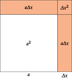

### Geometric interpretation of the average rate of change

The average rate of change of a function $y=f(x)$ in an interval $[a,a+\Delta x]$ is the slope of the *secant* line of $f$ through the points $(a,f(a))$ and $(a+\Delta x,f(a+\Delta x))$.

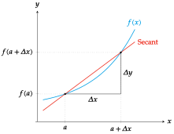

### Instantaneous rate of change

Often is interesting to study the rate of change of a function, not in an interval, but in a point.

Knowing the tendency of change of a function in an instant can be used to predict the value of the function in next instants.

> **Definition - Instantaneous rate of change and derivative**.  The *instantaneous rate of change* of a function $f$ in a point $a$, is the limit of the average rate of change of $f$ in the interval $[a,a+\Delta x]$, when $\Delta x$ tends to 0, and is denoted
\\[\textrm{IRC}\;f (a)=\lim_{\Delta x\rightarrow 0} \textrm{ARC}\; f[a,a+\Delta x]=\lim_{\Delta x\rightarrow 0}\frac{\Delta y}{\Delta x}=\lim_{\Delta x\rightarrow 0}\frac{f(a+\Delta x)-f(a)}{\Delta x}\\]
When this limit exists, the function $f$ is said to be *derivable* or *differentiable* at the point $a$, and its value is called *derivative* of $f$ at $a$, and denoted $f'(a)$ (Lagrange’s notation) or $\frac{df}{dx}(a)$ (Leibniz’s notation).

**Example - Area of a square**. Let’s take again the function $y=x^2$ that measures the area of a metallic square of side $x$.

If at any given time the side of the square is $a$, and we heat the square uniformly increasing the side, what is the tendency of change of the area in that moment?

$$\begin{aligned}
\textrm{IRC}\;f(a)&=\lim_{\Delta x\rightarrow 0}\frac{\Delta y}{\Delta x}=\lim_{\Delta x\rightarrow 0}\frac{f(a+\Delta x)-f(a)}{\Delta x} =\\
&=\lim_{\Delta x\rightarrow 0}\frac{2a\Delta x+\Delta x^2}{\Delta x}=\lim_{\Delta x\rightarrow 0} 2a+\Delta x= 2a.\end{aligned}
$$

Thus, \\[f'(a)=\frac{df}{dx}(a)=2a,\\] indicating that the area of the square tend to increase the double of the side.

### Interpretation of the derivative

The derivative of a function $f'(a)$ shows the growth rate of $f$ at point $a$:

-   $f'(a)>0$ indicates an increasing tendency ($y$ increases as $x$ increases).
-   $f'(a)<0$ indicates a decreasing tendency ($y$ decreases as $x$ increases).

**Example**. A derivative $f'(a)=3$ indicates that $y$ tends to increase triple of $x$ at point $a$. A derivative $f'(a)=-0.5$ indicates that $y$ tends to decrease half of $x$ at point $a$.

### Geometric interpretation of the derivative

We have seen that the average rate of change of a function $y=f(x)$ in an interval $[a,a+\Delta x]$ is the slope of the secant line, but when $\Delta x$ tends to $0$, the secant line becomes the tangent line.

The instantaneous rate of change or derivative of a function $y=f(x)$ at $x=a$ is the slope of the *tangent line* to $f$ at point $(a,f(a))$. Thus, the equation of the tangent line to $f$ at the point $(a,f(a))$ is \\[y-f(a) = f'(a)(x-a) \Leftrightarrow y = f(a)+f'(a)(x-a)\\]

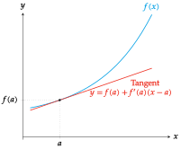

### Kineamtic applications: Linear motion

Assume that the function $y=f(t)$ describes the position of an object moving in the real line at every time $t$. Taking as reference the coordinates origin $O$ and the unitary vector $\mathbf{i}=(1)$, we can represent the position of the moving object $P$ at every moment $t$ with a vector $\vec{OP}=x\mathbf{i}$ where $x=f(t)$.

**Observation**. It also makes sense when $f$ measures other magnitudes as the temperature of a body, the concentration of a gas, or the quantity of substance in a chemical reaction at every moment $t$.

### Kinematic interpretation of the average rate of change

In this context, if we take the instants $t=t_0$ and $t=t_0+\Delta t$, both in $\mbox{Dom}(f)$, the vector \\[\mathbf{v}_m=\frac{f(t_0+\Delta t)-f(t_0)}{\Delta t}\\] is known as the *average velocity* of the trajectory $f$ in the interval $[t_0, t_0+\Delta t]$.

**Example**. A vehicle makes a trip from Madrid to Barcelona. Let $f(t)$ be the function that determine the position of the vehicle at every moment $t$. If the vehicle departs from Madrid (km 0) at 8:00 and arrive to Barcelona (km 600) at 14:00, then the average velocity of the vehicle in the path is \\[\mathbf{v}_m=\frac{f(14)-f(8)}{14-8}=\frac{600-0}{6} = 100 km/h.\\]

### Kinematic interpretation of the derivative

In the same context of the linear motion, the derivative of the function $f(t)$ at the moment $t_0$ is the vector \\[\mathbf{v}=f'(t_0)=\lim_{\Delta t\rightarrow 0}\frac{f(t_0+\Delta t)-f(t_0)}{\Delta t},\\]
that is known, as long as the limit exists, as the *instantaneous velocity* or simply *velocity* of the trajectory $f$ at moment $t_0$.

That is, the derivative of the object position with respect to time is a vector field that is called *velocity along the trajectory $f$*.

**Example**. Following with the previous example, what indicates the speedometer at any instant is the modulus of the instantaneous velocity vector at that moment.

## Algebra of derivatives

### Properties of the derivative

If $y=c$, is a constant function, then $y'=0$ at any point.

If $y=x$, is the identity function, then $y'=1$ at any point.

If $u=f(x)$ and $v=g(x)$ are two differentiable functions, then

-   $(u+v)'=u'+v'$

-   $(u-v)'=u'-v'$

-   $(u\cdot v)'=u'\cdot v+ u\cdot v'$

-   $\left(\dfrac{u}{v}\right)'=\dfrac{u'\cdot v-u\cdot v'}{v^2}$

### Derivative of a composite function

> **Theorem - Chain rule**. If the function $y=f\circ g$ is the composition of two functions $y=f(z)$ and $z=g(x)$, then \\[(f\circ g)'(x)=f'(g(x))g'(x).\\]

It’s easy to proof this using the Leibniz notation \\[\frac{dy}{dx}=\frac{dy}{dz}\frac{dz}{dx}=f'(z)g'(x)=f'(g(x))g'(x).\\]

**Example**. If $f(z)=\sin z$ and $g(x)=x^2$, then $f\circ g(x)=\sin(x^2)$. Applying the chain rule the derivative of the composite function is
\\[(f\circ g)'(x)=f'(g(x))g'(x) = \cos(g(x)) 2x = \cos(x^2)2x.\\]

On the other hand, $g\circ f(z)= (\sin z)^2$, and applying the chain rule again, its derivative is
\\[(g\circ f)'(z)=g'(f(z))f'(z) = 2f(z)\cos z = 2\sin z\cos z.\\]

### Derivative of the inverse of a function

> **Theorem - Derivative of the inverse function**.  Given a function $y=f(x)$ with inverse $x=f^{-1}(y)$, then \\[\left(f^{-1}\right)'(y)=\frac{1}{f'(x)}=\frac{1}{f'(f^{-1}(y))},\\]
provided that $f$ is differentiable at $f^{-1}(y)$ and $f'(f^{-1}(y))\neq 0$.

It’s easy to proof this using the Leibniz notation \\[\frac{dx}{dy}=\frac{1}{dy/dx}=\frac{1}{f'(x)}=\frac{1}{f'(f^{-1}(y))}\\]

**Example**. The inverse of the exponential function $y=f(x)=e^x$ is the natural logarithm $x=f^{-1}(y)=\ln y$, so that we can compute the derivative of the natural logarithm using the previous theorem and we get \\[\left(f^{-1}\right)'(y)=\frac{1}{f'(x)}=\frac{1}{e^x}=\frac{1}{e^{\ln y}}=\frac{1}{y}.\\]

Sometimes is easier to apply the chain rule to compute the derivative of the inverse of a function. In this example, as $\ln x$ is the inverse of $e^x$, we know that $e^{\ln x}=x$, so that differentiating both sides and applying the chain rule to the left side we get \\[(e^{\ln x})'=x' \Leftrightarrow e^{\ln x}(\ln(x))' = 1 \Leftrightarrow (\ln(x))'=\frac{1}{e^{\ln x}}=\frac{1}{x}.\\]

## Fucntion approximation

### Approximating a function with the derivative

The tangent line to a function $f(x)$ at $x=a$ can be used to approximate $f$ in a neighbourhood of $a$.

Thus, the increment of a function $f(x)$ in an interval $[a,a+\Delta x]$ can be approximated multiplying the derivative of $f$ at $a$ by the increment of $x$ \\[\Delta y \approx f'(a)\Delta x\\]

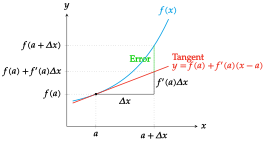

**Example - Area of a square**. In the previous example of the function $y=x^2$ that measures the area of a metallic square of side $x$, if the side of the square is $a$ and we increment it a quantity $\Delta x$, then the increment on the area will be approximately \\[\Delta y \approx f'(a)\Delta x = 2a\Delta x.\\]
In the figure below we can see that the error of this approximation is $\Delta x^2$, and is smaller than $\Delta x$ when $\Delta x$ tends to 0.

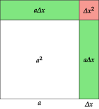

### Approximating a function by a polynomial

Another useful application of the derivative is the approximation of functions by polynomials.

Polynomials are functions easy to calculate (sums and products) with very good properties:

-   Defined in all the real numbers.
-   Continuous.
-   Differentiable of all orders with continuous derivatives.

**Goal** Approximate a function $f(x)$ by a polynomial $p(x)$ near a value $x=x_0$.

### Approximating a function by a polynomial of order 0

A polynomial of order 0 has equation
\\[p(x) = c_0,\\]
where $c_0$ is a constant.

As the polynomial should coincide with the function at $x_0$, it must satisfy
\\[p(x_0) = c_0 = f(x_0).\\]

Therefore, the polynomial of order 0 that best approximate $f$ near $x_0$ is
\\[p(x) = f(x_0).\\]

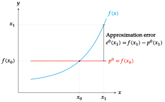

### Approximating a function by a polynomial of order 1

A polynomial of order 1 has equation
\\[p(x) = c_0+c_1x,\\] but it can also be expressed \\[p(x) = c_0+c_1(x-x_0).\\]

Among all the polynomials of grade 1, the one that best approximate $f(x)$ near $x_0$ is that that meets the following conditions

1.  $p$ and $f$ coincide at $x_0$: $p(x_0) = f(x_0)$,
2.  $p$ and $f$ have the same rate of change at $x_0$: $p'(x_0) = f'(x_0)$.

The last condition guarantee that $p$ and $f$ have approximately the same tendency, but it requires the function $f$ to be differentiable at $x_0$.

Imposing the previous conditions we have

1.  $p(x)=c_0+c_1(x-x_0) \Rightarrow p(x_0)=c_0+c_1(x_0-x_0)=c_0=f(x_0)$,
2.  $p'(x)=c_1 \Rightarrow p'(x_0)=c_1=f'(x_0)$.

Therefore, the polynomial of order 1 that best approximates $f$ near $x_0$ is
\\[p(x) = f(x_0)+f '(x_0)(x-x_0),\\]
which turns out to be the tangent line to $f$ at $(x_0,f(x_0))$.

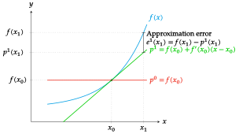

### Approximating a function by a polynomial of order 2

A polynomial of order 2 is a parable with equation \\[p(x) = c_0+c_1x+c_2x^2,\\] but it can also be expressed
\\[p(x) = c_0+c_1(x-x_0)+c_2(x-x_0)^2.\\]

Among all the polynomials of grade 2, the one that best approximate $f(x)$ near $x_0$ is that that meets the following conditions

1.  $p$ and $f$ coincide at $x_0$: $p(x_0) = f(x_0)$,
2.  $p$ and $f$ have the same rate of change at $x_0$: $p'(x_0) = f'(x_0)$.
3.  $p$ and $f$ have the same concavity at $x_0$: $p''(x_0)=f''(x_0)$.

The last condition requires the function $f$ to be differentiable twice at $x_0$.

Imposing the previous conditions we have

1.  $p(x)=c_0+c_1(x-x_0) \Rightarrow p(x_0)=c_0+c_1(x_0-x_0)=c_0=f(x_0)$,
2.  $p'(x)=c_1 \Rightarrow p'(x_0)=c_1=f'(x_0)$.
3.  $p''(x)=2c_2 \Rightarrow p''(x_0)=2c_2=f''(x_0) \Rightarrow c_2=\frac{f''(x_0)}{2}$.

Therefore, the polynomial of order 2 that best approximates $f$ near $x_0$ is
\\[p(x) = f(x_0)+f'(x_0)(x-x_0)+\frac{f''(x_0)}{2}(x-x_0)^2.\\]

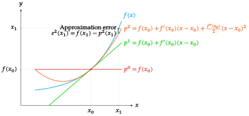

### Approximating a function by a polynomial of order $n$

A polynomial of order $n$ has equation
\\[p(x) = c_0+c_1x+c_2x^2+\cdots +c_nx^n,\\] but it can also be expressed \\[p(x) = c_0+c_1(x-x_0)+c_2(x-x_0)^2+\cdots +c_n(x-x_0)^n.\\]

Among all the polynomials of grade 2, the one that best approximate $f(x)$ near $x_0$ is that that meets the following $n+1$ conditions

1.  $p(x_0) = f(x_0)$,
2.  $p'(x_0) = f'(x_0)$,
3.  $p''(x_0)=f''(x_0)$,
4.  $\cdots$
5.  $p^{(n)}(x_0)=f^{(n)}(x_0)$.

The successive derivatives of $p$ are

$$
\begin{aligned}
p(x) &= c_0+c_1(x-x_0)+c_2(x-x_0)^2+\cdots +c_n(x-x_0)^n,\\
p'(x)& = c_1+2c_2(x-x_0)+\cdots +nc_n(x-x_0)^{n-1},\\
p''(x)& = 2c_2+\cdots +n(n-1)c_n(x-x_0)^{n-2},\\
\vdots\ \
\\
p^{(n)}(x)&= n(n-1)(n-2)\cdots 1 c_n=n!c_n.
\end{aligned}
$$

Imposing the previous conditions we have

1.  $p(x_0) = c_0+c_1(x_0-x_0)+c_2(x_0-x_0)^2+\cdots +c_n(x_0-x_0)^n=c_0=f(x_0)$,
2.  $p'(x_0) = c_1+2c_2(x_0-x_0)+\cdots +nc_n(x_0-x_0)^{n-1}=c_1=f'(x_0)$,
3.  $p''(x_0) = 2c_2+\cdots +n(n-1)c_n(x_0-x_0)^{n-2}=2c_2=f''(x_0)\Rightarrow c_2=f''(x_0)/2$,
4.  $\cdots$
5.  $p^{(n)}(x_0)=n!c_n=f^{(n)}(x_0)=c_n=\frac{f^{(n)}(x_0)}{n!}$.

### Taylor polynomial of order $n$

> **Definition - Taylor polynomial**. Given a function $f(x)$ differentiable $n$ times at $x_0$, the *Taylor polynomial* of order $n$ of $f$ at $x_0$ is the polynomial with equation
>
$$
\begin{aligned}
p_{f,x_0}^n(x) &= f(x_0) + f'(x_0)(x-x_0) + \frac{f''(x_0)}{2}(x-x_0)^2 + \cdots + \frac{f^{(n)}(x_0)}{n!}(x-x_0)^n = \\
&= \sum_{i=0}^{n}\frac{f^{(i)}(x_0)}{i!}(x-x_0)^i.
\end{aligned}
$$

The Taylor polynomial of order $n$ of $f$ at $x_0$ is the $n$th degree polynomial that best approximates $f$ near $x_0$, as is the only one that meets the previous conditions.

**Example**.

Let’s approximate the function $f(x)=\log x$ near the value $1$ by a polynomial of order $3$.

The equation of the Taylor polynomial of order $3$ of $f$ at $x_0=1$ is \\[p_{f,1}^3(x)=f(1)+f'(1)(x-1)+\frac{f''(1)}{2}(x-1)^2+\frac{f'''(1)}{3!}(x-1)^3.\\] The derivatives of $f$ at $1$ up to order $3$ are

$$
\begin{array}{lll}
f(x)=\log x & \quad & f(1)=\log 1 =0,\\
f'(x)=1/x & & f'(1)=1/1=1,\\
f''(x)=-1/x^2 & & f''(1)=-1/1^2=-1,\\
f'''(x)=2/x^3 & & f'''(1)=2/1^3=2.
\end{array}
$$

And substituting into the polynomial equation we get \\[p_{f,1}^3(x)=0+1(x-1)+\frac{-1}{2}(x-1)^2+\frac{2}{3!}(x-1)^3= \frac{2}{3}x^3-\frac{3}{2}x^2+3x-\frac{11}{6}.\\]

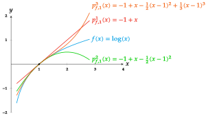

### Maclaurin polynomial of order $n$

The Taylor polynomial equation simplifies when the polynomial is calculated at $0$. This special case of Taylor polynomial at $0$ is known as the *Maclaurin polynomial*.

> **Definition - Maclaurin polynomial**. Given a function $f(x)$ differentiable $n$ times at $0$, the *Maclaurin polynomial* of order $n$ of $f$ is the polynomial with equation
>
$$
\begin{aligned}
p_{f,0}^n(x)&=f(0)+f'(0)x+\frac{f''(0)}{2}x^2+\cdots +\frac{f^{(n)}(0)}{n!}x^n = \\ &=\sum_{i=0}^{n}\frac{f^{(i)}(0)}{i!}x^i.
\end{aligned}
$$

**Example**. et’s approximate the function $f(x)=\sin x$ near the value $0$ by a polynomial of order $3$.

The Maclaurin polynomial equation of order $3$ of $f$ is \\[p_{f,0}^3(x)=f(0)+f'(0)x+\frac{f''(0)}{2}x^2+\frac{f'''(0)}{3!}x^3.\\]
The derivatives of $f$ at $0$ up to order $3$ are

$$\begin{array}{lll}
f(x)=\sin x & \quad & f(0)=\sin 0 =0,\\
f'(x)=\cos x & & f'(0)=\cos 0=1,\\
f''(x)=-\sin x & & f''(0)=-\sin 0=0,\\
f'''(x)=-\cos x & & f'''(0)=-\cos 0=-1.
\end{array}
$$

And substituting into the polynomial equation we get
\\[p_{f,0}^3(x)=0+1\cdot x+\frac{0}{2}x^2+\frac{-1}{3!}x^3= x-\frac{x^3}{6}.\\]

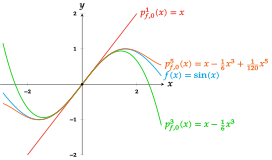

### Maclaurin polynomials of elementary functions

$$
\renewcommand{\arraystretch}{2.5}
\begin{array}{cc}
\hline
f(x) & p_{f,0}^n(x) \\
\hline
\sin x & \displaystyle x - \frac{x^3}{3!} + \frac{x^5}{5!} - \cdots + (-1)^k\frac{x^{2k-1}}{(2k-1)!} \mbox{ if $n=2k$ or $n=2k-1$}\\
\cos x &  \displaystyle 1 - \frac{x^2}{2!} + \frac{x^4}{4!} - \cdots + (-1)^k\frac{x^{2k}}{(2k)!} \mbox{ if $n=2k$ or $n=2k+1$}\\
\arctan x &  \displaystyle x - \frac{x^3}{3} + \frac{x^5}{5} - \cdots + (-1)^k\frac{x^{2k-1}}{(2k-1)} \mbox{ if $n=2k$ or $n=2k-1$}\\
e^x & \displaystyle 1 + x + \frac{x^2}{2!} + \frac{x^3}{3!} + \cdots + \frac{x^n}{n!}\\
\log(1+x) & \displaystyle x - \frac{x^2}{2} + \frac{x^3}{3} - \cdots + (-1)^{n-1}\frac{x^n}{n}\\
\hline
\end{array}
$$

### Taylor remainder and Taylor formula

Taylor polynomials allow to approximate a function in a neighborhood of a value $x_0$, but there is always an error in the approximation.

> **Definition - Taylor remainder**. Given a function $f(x)$ and its Taylor polynomial of order $n$ at $x_0$, $p_{f,x_0}^n(x)$, the *Taylor remainder* of order $n$ of $f$ at $x_0$ is de difference between the function and the polynomial, \\[r_{f,x_0}^n(x)=f(x)-p_{f,x_0}^n(x).\\]

The Taylor remainder measures the error int the approximation of $f(x)$ by the Taylor polynomial and allow us to express the function as the Taylor polynomial plus the Taylor remainder \\[f(x)=p_{f,x_0}^n(x) + r_{f,x_0}^n(x).\\] This expression is known as *Taylor formula* of order $n$ or $f$ at $x_0$.

It can be proved that
\\[\lim_{h\rightarrow 0}\frac{r_{f,x_0}^n(x_0+h)}{h^n}=0,\\]
which means that the remainder $r_{f,x_0}^n(x_0+h)$ is much less than $h^n$.

## Analysis of functions

### Analysis of functions: increase and decrease

The main application of derivatives is to determine the variation (increase or decrease) of functions. For that we use the sign of the first derivative.

> **Theorem**. Let $f(x)$ be a function with first derivative in an interval $I\subseteq \mathbb{R}$.
>
- If $\forall x\in I\ f'(x)\geq 0$ then $f$ is increasing on $I$.
- If $\forall x\in I\ f'(x)\leq 0$ then $f$ is decreasing on $I$.

If $f'(x_0)=0$ then $x_0$ is known as a *stationary point* and the function in non-increasing and non-decreasing at that point.

**Example** The function $f(x)=x^3$ is increasing on $\mathbb{R}$ as $\forall x\in \mathbb{R}\ f'(x)\geq 0$.

**Observation**. A function can be increasing or decreasing on an interval and not have first derivative.

**Example**. Let’s analyze the increase and decrease of the function $f(x)=x^4-2x^2+1$. Its first derivative is $f'(x)=4x^3-4x$.

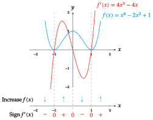

### Analysis of functions: relative extrema

As a consequence of the previous result we can also use the first derivative to determine the relative extrema of a function.

> **Theorem - First derivative test**. Let $f(x)$ be a function with first derivative in an interval $I\subseteq \mathbb{R}$ and let $x_0\in I$ be a stationary point of $f$ ($f'(x_0)=0$).
>
- If $f'(x)>0$ on an open interval extending left from $x_0$ and $f'(x)<0$ on an open interval extending right from $x_0$, then $f$ has a *relative maximum* at $x_0$.
- If $f'(x)<0$ on an open interval extending left from $x_0$ and $f'(x)>0$ on an open interval extending right from $x_0$, then $f$ has a *relative minimum* at $x_0$.
- If $f'(x)$ has the same sign on both an open interval extending left from $x_0$ and an open interval extending right from $x_0$, then $f$ has an *inflection point* at $x_0$.

**Observation**. A vanishing derivative is a necessary but not sufficient condition for the function to have a relative extrema at a point.

**Example**. The function $f(x)=x^3$ have derivative $f'(x)=3x^2$ and have a stationary point at $x=0$. However it doesn’t have a relative extrema at that point, but an inflection point.

**Example**. Consider again the function $f(x)=x^4-2x^2+1$ and let’s analyze its relative extrema now. Its first derivative is $f'(x)=4x^3-4x$.

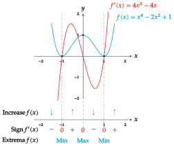

### Analysis of functions: concavity

The concavity of a function can be determined by de second derivative.

> **Theorem**. Let $f(x)$ be a function with second derivative in an interval $I\subseteq \mathbb{R}$.
>
- If $\forall x\in I\ f''(x)\geq 0$ then $f$ is concave up (convex) on $I$.
- If $\forall x\in I\ f''(x)\leq 0$ then $f$ is concave down (concave) on $I$.

**Example**. The function $f(x)=x^2$ has second derivative $f''(x)=2>0$ $\forall x\in \mathbb{R}$, so it is concave up in all $\mathbb{R}$.

**Observation**. A function can be concave up or down and not have second derivative.

**Example**. Let’s analyze the concavity of the same function of previous examples $f(x)=x^4-2x^2+1$. Its second derivative is $f''(x)=12x^2-4$.

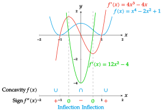
