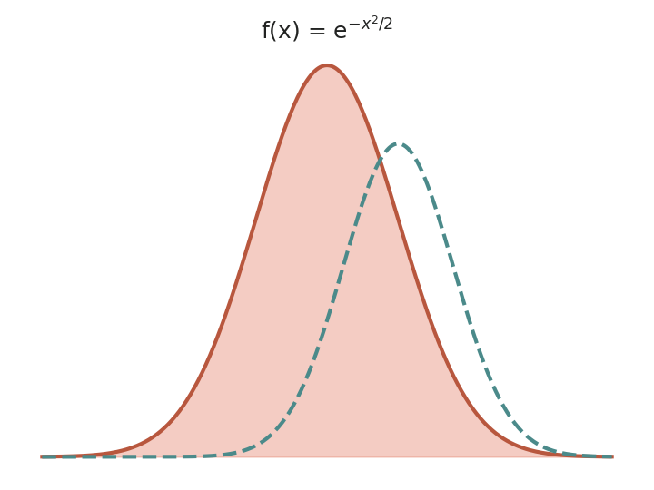

::: {.hero-container}
::: {.hero-image}
::: {.hero-text}
[Learn with Alf]{.title-top style="display:block;"}
[Open educational resources]{.title-byline style="display:block;"}
[Mathematics, Statistics, Programming, Data Science and AI for Higher Education]{.title-subbyline style="display:block;"}

[<i class="bi bi-mortarboard-fill"></i> Start learning](teaching/index.qmd){.hero-cta}
:::

{.hero-logo fig-alt="Aprende con Alf logo"}
:::
:::

<!-- ================= TEACHING (purple band) ================= -->

::: {.column-screen .band .purple}
::: {.home-column-image .col-left}
[{.home-img fig-alt="Gaussian bell curve plot"}](teaching/index.qmd)
:::

::: {.home-column-text .col-right}

<h1 class="heading-home" style="color:#fff;">Teaching</h1>
[Lecture notes, exercises and labs for my courses]{style="color:#fff; font-style:italic;"}

::: {.category-row}
::: {.category-column}

<h4><a class="white" href="teaching/statistics/index.html">Statistics</a></h4>
:::
::: {.category-column}

<h4><a class="white" href="teaching/python/index.html">Python</a></h4>
:::
::: {.category-column}

<h4><a class="white" href="teaching/index.html">All</a></h4>
:::
:::
:::
:::

<!-- ================= BLOG (white band) ================= -->

::: {.column-screen .band}
::: {.home-column-image .col-right}
[{.home-img fig-alt="Bar chart"}](post/index.qmd)
:::

::: {.home-column-text .col-left}

<h1 class="heading-home">Blog</h1>
[Articles, tutorials and news]{style="font-style:italic;"}

::: {.category-row}
::: {.category-column}

<h4><a class="dark" href="post/index.html#category=Handbook">Handbooks</a></h4>
:::
::: {.category-column}

<h4><a class="dark" href="post/index.html#category=News">News</a></h4>
:::
::: {.category-column}

<h4><a class="dark" href="post/index.html">All</a></h4>
:::
:::
:::
:::

<!-- ================= PUBLICATIONS (purple band) ================= -->

::: {.column-screen .band .purple}
::: {.home-column-image .col-left}
[{.home-img fig-alt="Scatter plot with regression line"}](publications/index.qmd)
:::

::: {.home-column-text .col-right}

<h1 class="heading-home" style="color:#fff;">Publications</h1>
[Research articles on Biostatistics and Machine Learning]{style="color:#fff; font-style:italic;"}

::: {.category-row}
::: {.category-column style="width:50%;"}

<h4><a class="white" href="publications/index.html">Highlights</a></h4>
:::
::: {.category-column style="width:50%;"}

<h4><a class="white" href="publications/index.html">Full list</a></h4>
:::
:::
:::
:::

<!-- ================= PROJECTS (white band) ================= -->

::: {.column-screen .band}
::: {.home-column-text style="width:60%; margin:0 auto; float:none;"}

<h1 class="heading-home">Projects</h1>
[Software and tools I develop and maintain]{style="font-style:italic;"}

::: {.category-row}
::: {.category-column style="width:100%;"}

<h4><a class="dark" href="projects/index.html">View projects</a></h4>
:::
:::
:::
:::

<!-- ================= VALUES ================= -->

::: {.column-screen}
::: {.column-page}

<h1><i class="bi bi-heart-fill" style="color:#6f5499;"></i> Our values</h1>

:::

::: {.values-row}
::: {.value-card}
### <i class="bi bi-unlock-fill"></i> Openness {.value-title}
All materials are published as Open Educational Resources, free and reusable by anyone.
:::
::: {.value-card}
### <i class="bi bi-patch-check-fill"></i> Rigor {.value-title}
Content is reviewed and updated continuously to offer clear, well-grounded explanations.
:::
::: {.value-card}
### <i class="bi bi-clipboard-data-fill"></i> Hands-on learning {.value-title}
Every topic comes with solved exercises and examples using real data to learn by doing.
:::
:::
:::
