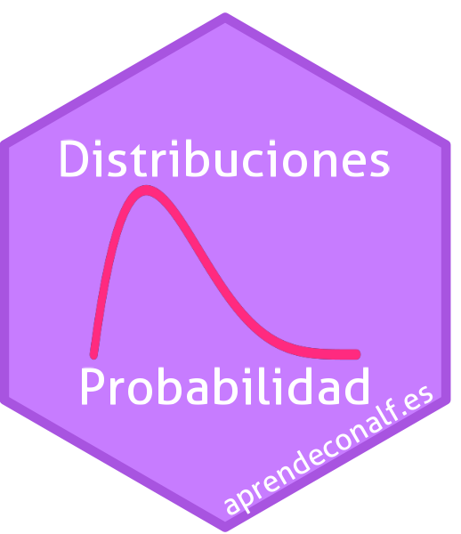

{.featured-image fig-alt="Probability Distributions"}

[Access the application](https://nube.aprendeconalf.es/shiny/distribuciones/){.btn .btn-purple role="button"}

## What is Probability Distributions?

Probability Distributions is an interactive web application that lets you visualize the main discrete and continuous probability distributions, exploring how their probability (or density) function and their distribution function change as their parameters are modified.

The distributions that can be visualized in the application are:

**Discrete distributions**

- Binomial
- Negative binomial
- Geometric
- Hypergeometric
- Poisson

**Continuous distributions**

- Uniform
- Beta
- Normal
- Exponential
- Gamma
- Chi-squared
- Student's t
- Fisher's F
