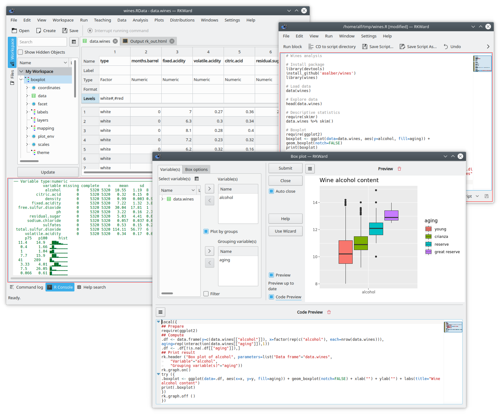
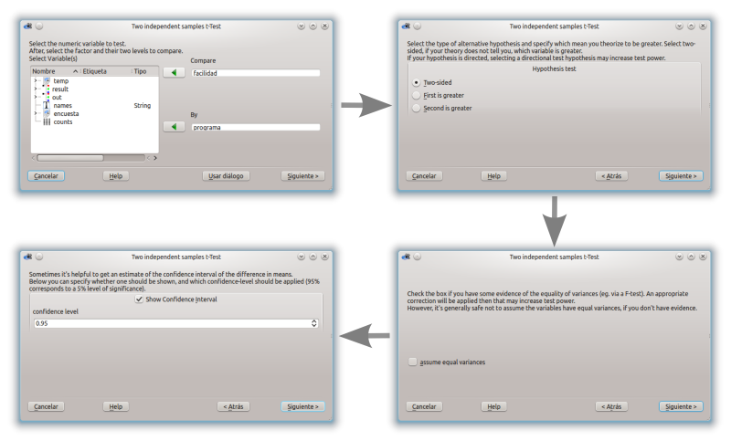
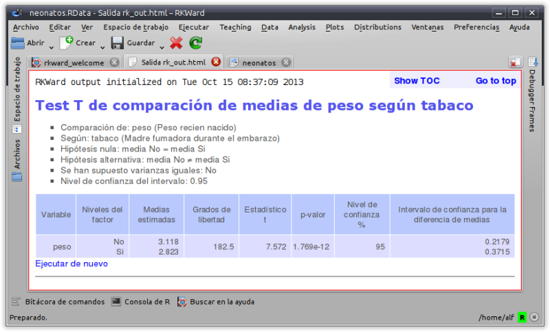
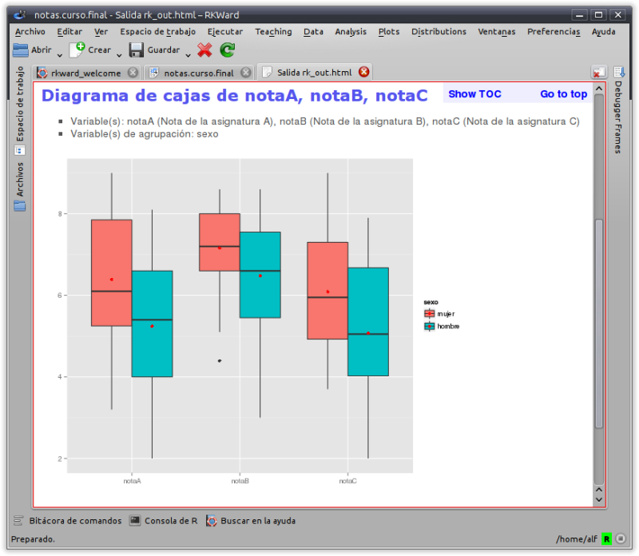
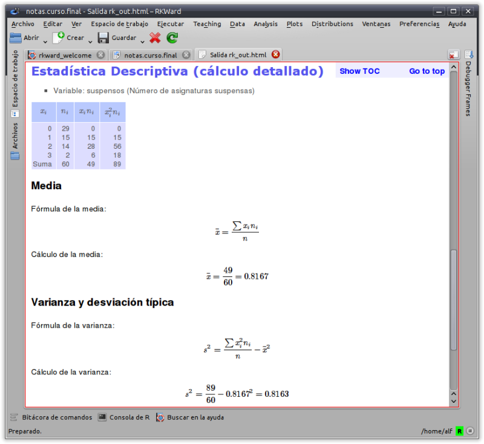

{.featured-image fig-alt="rkTeaching logo"}

## What is rkTeaching?

rkTeaching is an [R](http://www.r-project.org/) package that provides a plugin for the [RKWard](http://rkward.sourceforge.net/) graphical interface, adding new menus and dialog boxes specially designed for teaching Statistics.

The package has been developed and is maintained by Alfredo Sánchez Alberca <asalber@ceu.es> from the Department of Mathematics at the Universidad San Pablo CEU in Madrid.

If you find any bug or have any suggestion, please send it to the author by email or report it as an [issue on Github](https://github.com/asalber/rkTeaching_es/issues).



## Installation

### Installation on Windows

For Windows users there is an installer that includes R, RKWard and rkTeaching.

- [Download the latest version (R version 4.3, RKWard version 0.8, rkTeaching version 1.3.0)](https://drive.google.com/file/d/1Zrj3zU3ztSFsgGttcEHp9CV8ECSTG5qL/view?usp=drive_link)

- [Download the previous version (R version 3.6.2, RKWard version 0.7.1b, rkTeaching version 1.3.0)](https://drive.google.com/file/d/17eWedHkSI1f0pIjAra94HOwagchr-h7T/view?usp=sharing)

Once downloaded, just run the file to unzip it.
When run, a dialog box will appear asking for the drive and installation directory, and it is important to install it in the root folder of drive C, i.e. in the location `C:\`. After this a `RKWard` folder will be created, and inside it the bin folder where the `rkward.exe` file is located, which must be run to start RKWard.

The following video shows the installation process.



### Installation on Mac OS

To install the software on Mac OS platforms, each program must be installed separately in the following order:

1.  **Install R**. R can be downloaded from the page [https://cran.r-project.org/](https://cran.r-project.org/bin/macosx/).
    It is recommended to install version 4.3 for MacOs. Depending on the computer's processor, you should select the `arm65` version for computers with a silicon chip (M1-3) or the `x86` version for computers with an Intel chip.

    -  [R version 4.3 for MacOs with silicon chip (M1-3)](https://cran.r-project.org/bin/macosx/big-sur-arm64/base/R-4.3.3-arm64.pkg)
    -  [R version 4.3 for MacOs with Intel chip (x86)](https://cran.r-project.org/bin/macosx/big-sur-x86_64/base/R-4.3.3-x86_64.pkg)

1.  **Install RKWard**. RKWard can be downloaded from the page <https://rkward.kde.org/>.
You should select the distribution corresponding to Mac Os (<https://rkward.kde.org/RKWard_on_Mac.html>) and follow the installation instructions specified there.
It is important to make sure you have a version of Mac OS X 10.15 or higher, since RKWard does not work with earlier versions.

    If there is any error during installation, check the possible solutions at (<http://rkward.sourceforge.net/wiki/RKWard_on_Mac#Troubleshooting>)

1.  **Install the packages rkTeaching depends on**. To install rkTeaching you must first install the R packages it depends on.
To do this, run R from the command line, or start RKWard and go to the R Console tab and enter the following commands:

    ```R
    install.packages(c("R2HTML","car","e1071","Hmisc", "ez", "multcomp", "psych", "probs", "tidyverse", "knitr", "kableExtra", "remotes"))
    ```

1.  **Install rkTeaching**. The best way to install rkTeaching from this repository is using the R package `remotes`.
To do this, enter the following commands in the R console:

    ```R
    library(remotes)
    install_github("rkward-community/rk.Teaching")
    ```

    The following video shows the installation process.

    

#### Installation on MacOs using WMware Fusion

If the above procedure does not work, it is possible to install a virtual machine with RKWard already installed using the WMware Fusion software. To do this, follow these steps:

1.  **Install WMware Fusion**. WMware Fusion is virtualization software that allows you to install Windows or Linux operating systems on a Mac. [Download WMware Fusion](https://www.techspot.com/downloads/2755-vmware-fusion-mac.html) and follow the installation instructions.

2.  Download the virtual machine with RKWard already installed.

    - [Download virtual machine with RKWard version 0.8 and rkTeaching 1.4](https://ceu365-my.sharepoint.com/:u:/g/personal/asalber_ceu_es/EaRxOdvlm-pEo9ZemESsKgABH2LSM4IyWuhsOm2O4iVCRQ?e=RJtxER)
    - [Download virtual machine with RKWard version 0.7 and rkTeaching 1.3](https://ceu365-my.sharepoint.com/:u:/g/personal/asalber_ceu_es/EcK0P2-es1pOl-3HtRYHn4sBswcpiil5q6QwVp01i0o0yA?e=fWtpe0)

3.  Start WMware Fusion and open the downloaded virtual machine. The virtual machine will start with RKWard already installed and ready to use.

### Installation on Linux

To install the software on Linux platforms, each program must be installed separately in the following order:

1.  **Install R**. R can be downloaded from the page <http://cran.es.r-project.org/>.
You should select the distribution corresponding to Linux and follow the installation instructions specified there.
R version 3.0 or higher is required.

    On Debian and Ubuntu systems, it can be installed from the command line with the command:

    ```sh
    sudo apt-get install r-base
    ```

2.  **Install RKWard**. RKWard can be downloaded from the page <https://rkward.kde.org/>.
You should select the distribution corresponding to Linux and follow the installation instructions specified there.

    On Debian and Ubuntu systems, it can be installed from the command line with the command:

    ```sh
    sudo apt-get install rkward
    ```

    It is important to make sure the installed version is 0.7.2 or higher.

3. **Install the packages rkTeaching depends on**. To install rkTeaching you must first install the R packages it depends on.
To do this, run R from the command line, or start RKWard and go to the R Console tab and enter the following commands:

    ```R
    install.packages(c("R2HTML","car","e1071","Hmisc", "ez", "multcomp", "psych", "probs", "tidyverse", "knitr", "kableExtra", "remotes"))
    ```

4. **Install rkTeaching**. The best way to install rkTeaching from this repository is using the R package `remotes`.
To do this, enter the following commands in the R console:

    ```R
    library(remotes)
    install_github("rkward-community/rk.Teaching")
    ```

    The following video shows the installation process.

    

## Statistical procedures

Once installed, when RKWard starts a new `Teaching` menu will appear with the following statistical procedures:

- Data manipulation
  - Filter data
  - Compute variable
  - Recode variable
  - Weight data
  - Standardize variables
- Frequency distribution
  - Frequency tables
  - Two-way frequency tables
- Charts
  - Bar chart
  - Histogram
  - Pie chart
  - Box plot
  - Means plot
  - Interaction plot
  - Scatter plot
  - Line chart
  - Scatter plot matrix
- Descriptive statistics
  - Statistics
  - Statistics (detailed calculation)
- Regression
  - Linear regression
  - Nonlinear regression
  - Model comparison
  - Predictions
  - Correlation
- Parametric tests
  - Means
    - One-sample T test
    - Two independent samples T test
    - Two paired samples T test
    - ANOVA
    - Sample size calculation for the mean
    - Sample size calculation for the T test
    - Power calculation for a T test
  - Variances
    - Test for the variance of a population
    - Fisher's F test
    - Levene's test
  - Proportions
    - Test for one proportion
    - Test for two proportions
    - Sample size calculation for one proportion
- Non-parametric tests
  - Normality
    - Lilliefors test (Kolmogorov-Smirnov)
    - Shapiro-Wilk test
  - Mann-Whitney U test for two independent samples
  - Wilcoxon test for two paired samples
  - Kruskal-Wallis test for several independent samples
  - Friedman test for repeated measures
  - Chi-squared test of independence
  - Chi-squared goodness-of-fit test
- Agreement
  - Intraclass correlation coefficient
  - Cohen's Kappa
- Probability
  - Games of chance
    - Coins
      - Probability space
      - Coin toss
    - Dice
      - Probability space
      - Dice roll
    - Playing cards
      - Probability space
      - Card draw
    - Urns
      - Probability space
      - Urn draw
  - Building a probability space
  - Combining probability spaces
  - Repeating probability spaces
  - Probability calculation
- Probability distributions
  - Discrete distributions
    - Binomial
      - Probabilities
      - Quantiles
      - Probability plot
    - Poisson
      - Probabilities
      - Quantiles
      - Probability plot
  - Continuous distributions
    - Chi-squared
      - Probabilities
      - Quantiles
      - Probability plot
    - Fisher's F
      - Probabilities
      - Quantiles
      - Probability plot
    - Normal
      - Probabilities
      - Quantiles
      - Probability plot
    - Student's t
      - Probabilities
      - Quantiles
      - Probability plot
    - Continuous uniform
      - Probabilities
      - Quantiles
      - Probability plot
- Simulations
  - Law of rare events

## Features

- Menus and dialog boxes designed to make learning easier, removing all secondary options to achieve a simple and intuitive interface.

- Wizards that guide the user step by step and advise them through the statistical analyses.
  

- HTML outputs that present the results of the analyses and their interpretations in a clear and concise way.
  

- Simple charts based on the modern ggplot2 package.
  

- Ability to show the development of the calculations of some statistical procedures.
  

## Links

- [Source code](https://github.com/asalber/rkteaching)

rkTeaching is maintained by [asalber](https://github.com/asalber).

## How to cite rkTeaching?

Sánchez-Alberca, A. (2024). rkTeaching (version 1.4) [software]. Retrieved from: <https://aprendeconalf.es/proyectos/rkteaching>.
