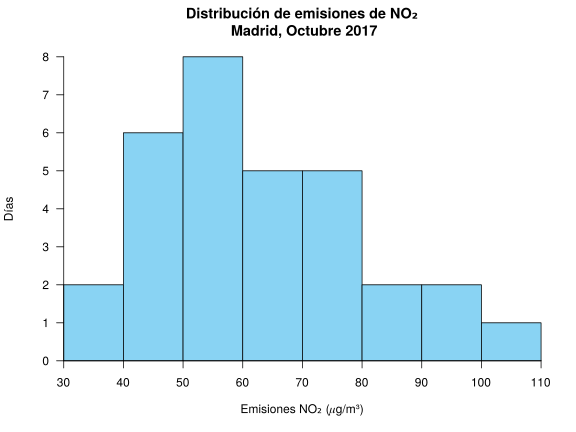

Titulación: Grado en Farmacia y Biotecnología  
Fecha: 27 de Noviembre de 2017

## Ejercicio 1

El siguiente diagrama muestra la distribución de emisiones de NO₂ (𝜇g/m³) en Madrid en los días de octubre de 2017.

1. La normativa europea sobre calidad del aire establece que el valor medio mensual no debe exceder de 40 𝜇g/m³. ¿Se ha cumplido la norma en el mes de Octubre? 
¿Es este un valor representativo de las mediciones tomadas en octubre?
2. El Ayuntamiento de Madrid ha decidido que se establecerán restricciones de velocidad en los accesos los días en los que se superen los 72 𝜇g/m³ y que además de estas restricciones se establecerán también restricciones al aparcamiento los días que se superen los 92 𝜇g/m³.
¿Qué porcentaje de días de octubre se establecieron solo restricciones de velocidad en los accesos?
3. De acuerdo con esta muestra de datos tomada durante el mes de octubre, ¿puede establecerse por la forma de la distribución de la muestra que la distribución de las emisiones en toda la ciudad sigue una distribución normal?
4. Además del nivel de NO₂, el Ayuntamiento también controla los niveles de SO₂, y se sabe que el nivel medio de esta sustancia durante el mes de octubre fue de 2.85 𝜇g/m³ con una desviación típica de 0.42 𝜇g/m³. 
Si un día hubo un nivel de NO₂ de 46 y un nivel de SO₂ de 2.24, ¿cuál de las dos sustancias tenía niveles más altos en referencia a sus mediciones?
5. Si el índice de calidad del aire (ICA) puede estimarse multiplicando el nivel de NO₂ por 0.95 y sumándole una cantidad fija de 30. 
¿Cuál fue el índice medio de la calidad del aire en Madrid el mes de octubre? 
¿Es un valor más o menos representativo que el nivel de emisiones medio de NO₂?
6. ¿Existen días atípicos en las emisiones de NO₂ del mes de octubre? Justificar la respuesta.

Utilizar las siguientes sumas para los cálculos: $\sum x_i=1945$ 𝜇g/m³, $\sum x_i^2=131575$ (𝜇g/m³)², $\sum (x_i-\bar x)^3=93995.838$ (𝜇g/m³)³ y $\sum (x_i-\bar x)^4=7766271.021$ (𝜇g/m³)⁴.

<button class="solution">Mostrar solución</button>

1. $\bar x=62.7419$ 𝜇g/m³, de manera que no se cumple el requisito. 
$s^2=307.8044$ (𝜇g/m³)², $s=17.5444$ 𝜇g/m³, $cv=0.2796$. Como el coeficiente de variación es menor que 0.3 hay poca variabilidad en los datos y la media es bastante representativa.  
2. $F(72)=0.7097$ y $F(92)=0.9161$, de manera que el porcentaje de días únicamente con restricciones de velocidad es $20.64\%$. 
3. $g_1=0.5615$ y $g_2=-0.3558$. Como ambos están entre -2 y 2, se puede asumir que la distribución de emisiones es normal. 
4. NO₂: $z(46)=-0.9543$.  
SO₂: $z(2.24)=-1.4524$.  
Así pues, las emisiones de NO₂ son relativamente mayores. 
5. Sea $y=0.95x+30$ el ICA. 
$\bar y=89.6048$, $s_y=16.6671$, $cv=0.186$. Como el coeficiente de variación es menor, la media del ICA es más representativa. 
6. $Q_1=49.5816$ 𝜇g/m³, $Q_3=74.0093$ 𝜇g/m³ y $IQR=24.4277$ 𝜇g/m³. 
Vallas: $F_1=12.94$ 𝜇g/m³ y $F_2=110.65$ 𝜇g/m³. Por tanto, no hay datos atípicos.

## Ejercicio 2
La siguiente tabla muestra las tasas de incidencia de gripe por cada 100.000 habitantes registradas al cabo de un número de días desde el comienzo de el estudio.

$$
\begin{array}{lrrrrrrrr}
  \hline
  \mbox{Días} & 1 & 5 & 8 & 12 & 20 & 26 & 38 & 44\\
  \mbox{Tasa de gripe} & 60 & 66 & 71 & 80 & 106 & 132 & 194 & 235\\
  \hline
\end{array}
$$

Se pide:

1. Calcular la tasa de incidencia de gripe a los 50 días desde el comienzo del estudio mediante un modelo de regresión lineal.
2. ¿Cuánto varía la tasa de incidencia de gripe cada día según el modelo lineal?
3. Calcular la tasa de incidencia de gripe a los 50 días desde el comienzo del estudio mediante un modelo de regresión exponencial.
4. ¿Cuál de las predicciones anteriores es más fiable?
Razonar la respuesta.

Utilizar las siguientes sumas para los cálculos ($X=$Días e $Y=$Tasa de gripe): 
$\sum x_i=154$, $\sum \log(x_i)=19.8494$, $\sum y_j=944$, $\sum \log(y_j)=37.2024$, 
$\sum x_i^2=4690$, $\sum \log(x_i)^2=60.2309$, $\sum y_j^2=140918$, $\sum \log(y_j)^2=174.8363$, 
$\sum x_iy_j=25182$, $\sum \log(x_i)y_j=2795.2484$, $\sum x_i\log(y_j)=772.3504$, $\sum \log(x_i)\log(y_j)=96.1974$.

<button class="solution">Mostrar solución</button>

1. Modelo lineal de la tasa de gripe sobre los días:  
$\bar x=19.25$ días, $s_x^2=215.6875$ días² .  
$\bar y=118$ personas, $s_y^2=3690.75$ personas².  
$s_{xy}=876.25$ días⋅personas.  
Recta de regresión de la tasa de gripe sobre los días: $y=39.7951 + 4.0626x$.  
$y(50) =242.9247$.  
2. $4.0626$ personas por día.  

3. $\overline{\log(y)}=4.6503$ log(personas), $s_{\log(y)}^2=0.2293$ log(personas)².  
$s_{x\log(y)}=7.0255$ días⋅log(personas).  
Modelo exponencial de la tasa de gripe sobre los días: $y=e^{4.0233 + 0.0326x}$.  
$y(50)=284.8357$. 
4. Coeficiente de determinación lineal de la tasa de gripe sobre los días $r^2=0.9645$.  
Coeficiente de determinación exponencial de la tasa de gripe sobre los días $r^2=0.9982$.  
Así pues, el modelo exponencial explica un poco mejor la evolución de la tasa de gripe con respecto a los días.   

