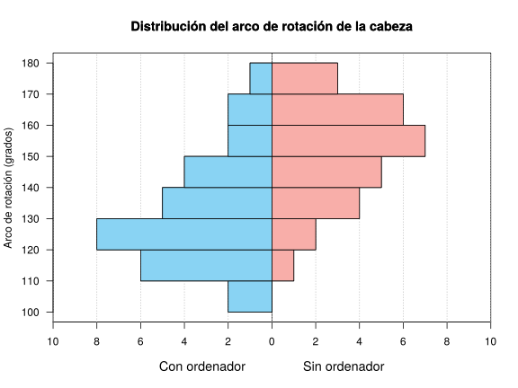
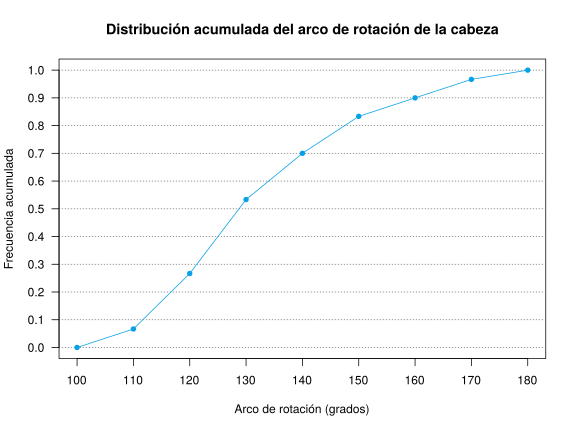

Grados: Fisioterapia  
Fecha: 9 de abril de 2018

## Ejercicio 1

En un estudio se ha medido el arco de rotación de la cabeza en personas que trabajan habitualmente con ordenador y en personas que no. 
Los resultados aparecen en el siguiente histograma.

Se pide:

1. Dibujar el polígono de frecuencias relativas acumuladas del arco de rotación de la cabeza en personas que trabajan con ordenador.
2. Si se considera que una persona con un arco de rotación menor o igual de 115 grados tiene movilidad reducida, ¿qué porcentaje personas que trabajan con ordenador tienen movilidad reducida?
3. ¿En qué distribución es más representativa la media del arco de rotación de la cabeza, en la de las personas que trabajan con ordenador o en las que no?
4. Calcular la media global del arco de rotación de la cabeza.
5. ¿Qué distribución es más asimétrica, la de las personas que trabajan con ordenador o la de las que no?
6. ¿Qué valor del arco de rotación de la cabeza es relativamente mayor, 150 grados en las personas que trabajan con ordenador o 170 grados en las que no?

Usar las siguientes sumas para los cálculos.
Con ordenador: $\sum x_i=3970$ grados, $\sum x_i^2=534750$ grados², $\sum (x_i-\bar x)^3=103662.2222$ grados³ y $\sum (x_i-\bar x)^4=7903715.5556$ grados⁴.  
Sin ordenador: $\sum x_i=4230$ grados, $\sum x_i^2=645900$ grados², $\sum (x_i-\bar x)^3=-42359.6939$ grados³ y $\sum (x_i-\bar x)^4=4101700.5284$ grados⁴.

<button class="solution">Mostrar solución</button>

1.

2. $F(115)=0.1667 \rightarrow 16.67%$ de los que trabajan con ordenador tienen movilidad reducida. 
3. Con ordenador: $\bar x=132.3333$ grados, $s_x^2=312.8889$ grados², $s_x=17.6887$ grados y $cv_x=0.1337$ 
Sin ordenador:  $\bar x=151.0714$ grados, $s_x^2=245.2806$ grados², $s_x=15.6614$ grados y $cv_x=0.1037$ 
La media de los que trabajan sin ordenador es más representativa que la de los que trabajan con ordenador ya que su coeficiente de variación es menor. 
4. $\bar x=141.3793$. 
5. Con ordenador $g_1=0.6243$ y sin ordenador $g_1=-0.3938$. Por tanto, la distribución de los que trabajan con ordenador es más asimétrica. 
6. Puntuaciones típicas: $z(150)=0.9988$ y $z(170)=1.2086$. Por tanto, un arco de rotación de 150 grados en los que trabajan con ordenador es relativamente menor que un arco de rotación de 170 en los que trabajan sin ordenador. 

## Ejercicio 2
La concentración de un fármaco en sangre $C$, medida en mg/dl, viene dada en función del tiempo $t$, en horas, según se recoge en la siguiente tabla:

$$
\begin{array}{lrrrrrrr}
\hline
\mbox{Tiempo} & 2 & 3 & 4 & 5 & 6 & 7 & 8\\
\mbox{Concentración} & 25 & 36 & 48 & 64 & 86 & 114 & 168\\
\hline
\end{array}
$$

Se pide: 

1. ¿Qué modelo de regresión te parece más fiable para predecir la concentración que habría a las $4.8$ horas, el lineal o el exponencial?
2. Realiza dicha predicción con el mejor modelo de los dos anteriores.
<!-- 3. Según el modelo logarítmico, ¿cuántas horas deben transcurrir para que la concentración sea de 100 mg/dl? -->

Usar las siguientes sumas para los cálculos:  
$\sum x_i=35$, $\sum \log(x_i)=10.6046$, $\sum y_j=541$, $\sum \log(y_j)=29.147$,  
$\sum x_i^2=203$, $\sum \log(x_i)^2=17.5205$, $\sum y_j^2=56937$, $\sum \log(y_j)^2=124.0131$,  
$\sum x_iy_j=3328$, $\sum x_i\log(y_j)=154.3387$, $\sum \log(x_i)y_j=951.6961$, $\sum \log(x_i)\log(y_j)=46.0805$.

<button class="solution">Mostrar solución</button>

1. Modelo lineal de Concentración sobre Tiempo:  
$\bar x=5$ horas, $s_x^2=4$ horas² .  
$\bar y=77.2857$ mg/dl, $s_y^2=2160.7755$ (mg/dl)².  
$s_{xy}=89$ horas⋅mg/dl.  
Coeficiente de determinación lineal de Concentración sobre Tiempo $r^2=0.9165$.  

Modelo exponencial de Concentración sobre tiempo:  
$\overline{\log(y)}=4.1639$ log(mg/dl), $s_{\log(y)}^2=0.3785$ log(mg/dl)².  
$s_{x\log(y)}=1.2291$ horas⋅log(mg/dl).  
Coeficiente de determinación exponencial de Concentración sobre Tiempo $r^2=0.9979$.  
Por tanto, el modelo exponencial explica mejor la relación entre la concentración y el tiempo ya que su coeficiente de determinación es mayor. 
2. Modelo exponencial de Concentración sobre Tiempo: $y=e^{2.6275 + 0.3073x}$.  
$y(4.8)=60.4853$ mg/dl.

