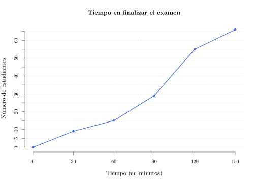

```{r global_options, include=FALSE}
library(knitr)
library(printr)
library(rk.Teaching)
options(digits=4, scipen=999)
opts_chunk$set(comment=NA, fig.width=8, fig.height=6, fig.path='img/', fig.align="center", dev="svg", digits=4, echo=FALSE, warning=FALSE, message=FALSE)
# Colors
col1 <- rgb(5,161,230,255,maxColorValue = 255) #0099CC
col1light <- rgb(137,211,243,255,maxColorValue = 255) #89D3F3
col2 <- rgb(238,50,36,255,maxColorValue = 255) #FF3333
col2light <- rgb(238,50,36,100,maxColorValue = 255) #FF3333
```

Titulación: Grado en Óptica  
Fecha: 18 de Diciembre de 2017

## Ejercicio 1

En un examen de estadística al que se han presentado 66 alumnos se ha contado el número de exámenes finalizados cada media hora, obteniendo el siguiente polígono:
```{r }
# Datos tiempo finalización examen
x <- rep(c(15,45,75,105,135),c(9,6,14,26,11))
# Histogram
# par(mar=c(4, 3, 3, 1) + 0.1, mgp=c(2, 1, 0))
# histNo2 <- hist(no2, main="Distribución de emisiones de NO₂\n Madrid, Octubre 2017", xlab="Emisiones NO₂ (𝜇g/m³)", ylab="Días", col=col1light, axes=F)
# axis(1, at = seq(30,110,10), pos=0)
# axis(2, at = seq(0,8,1), las=2, pos=30)
n <- length(x)
m <- mean(x)
s <- stdev(x)
g1 <- sum((x-m)^3)/(n*s^3)
g2 <- sum((x-m)^4)/(n*s^4)-3
```


Se pide: 

1. Construir la tabla de frecuencias del tiempo de finalización del examen.
2. ¿Cuánto tiempo tiene que pasar para que hayan finalizado el examen la mitad de los alumnos?
3. ¿Qué porcentaje de alumnos habrá terminado a los 100 minutos de examen?
4. ¿Cuál es el tiempo de duración del examen que mejor representa a los estudiantes de la muestra? 
¿Es un valor representativo? 
5. Según su simetría y apuntamiento, ¿se puede afirmar que la distribución del tiempo de duración del examen es normal? 
6. Se sabe que en otro examen diferente el tiempo medio de finalización es de 100 minutos y la desviación típica es 20 minutos. 
Un alumno tardó 110 minutos en el examen de Estadística y 122 minutos en este otro examen. 
¿Qué examen finalizó antes en términos relativos?

Utilizar las siguientes sumas para los cálculos: $\sum x_i=`r sum(x)`$ min, $\sum x_i^2=`r sum(x^2)`$ min², $\sum (x_i-\bar x)^3=`r sum((x-m)^3)`$ min³ y $\sum (x_i-\bar x)^4=`r sum((x-m)^4)`$ min⁴.

<div><button class="solution">Mostrar solución</button></div>
<div id="solution" style="display: none">
1. $$
\begin{array}{crrrrr}
\hline
X & x_i & n_i & f_i & N_i & Fi\\
0-30 & 15 & 9 & 0.1364 & 9 & 0.1364\\
30-60 & 45 & 6 & 0.0909 & 15 & 0.2273\\
60-90 & 75 & 14 & 0.2121 & 29 & 0.4394\\
90-120 & 105 & 26 & 0.3939 & 55 & 0.8333\\
120-150 & 135 & 11 & 0.1667 & 66 & 1\\
\hline
\end{array}
$$
2. $Me=94.6154$ min.<br/>
3. $F(100)=0.5708\Rightarrow 57.08\%$ of students.<br/>
4. $\bar x=`r m`$ min, $s^2=`r s^2`$ min², $s=`r s`$ min y $cv=`r s/m`$, luego la dispersión relativa con respecto a la media es moderada y la representatividad de la media también.<br/>
5. $g_1=`r g1`$, de manera que la distribución es asimétrica hacia la izquierda. $g_2=`r g2`$, de manera que la distribución es menos apuntada de lo normal (leptocúrtica). Como tanto $g_1$ como $g_2$ están entre -2 y 2 podemos asumir que la muestra proviene de una población normal.<br/>
6. Examen de Estadística: $z(110)=`r (110-m)/s`$. <br/>
Otro examen: $z(122)=`r (122-100)/20`$. <br/>
Así pues, terminó antes el examen de Estadística.<br/>
</div>

## Ejercicio 2

```{r}
edad <- c(25, 46, 76, 32, 18, 43, 40, 51, 68, 54, 47, 37)
distancia <- c(15, 28, 51, 23, 14, 28, 25, 36, 47, 42, 31, 29)
x <- edad
y <- distancia
``` 

En un estudio sobre la presbicia se tomó una muestra de pacientes y se midió la edad y la distancia mínima a la que eran capaces de leer una frase en cm.
Los resultados se muestran en la siguiente tabla:

$$
  \begin{array}{lrrrrrrrrrrrr}
    \hline
    \mbox{Edad} & 25 & 46 & 76 & 32 & 18 & 43 & 40 & 51 & 68 & 54 & 47 & 37\\
    \mbox{Distancia mínima de enfoque} & 15 & 28 & 51 & 23 & 14 & 28 & 25 & 36 & 47 & 42 & 31 & 29\\ 
    \hline
  \end{array}
$$

Se pide:

1. Calcular la recta de regresión de la distancia mínima de enfoque con respecto a la edad.
¿Cuánto aumenta la distancia mínima de enfoque por cada año que pasa?
2. Calcular el modelo de regresión logartímico de la distancia mínima de enfoque con respecto a la edad.
3. Utilizar el mejor modelo de regresión de los dos anteriores para predecir la distancia mínima de enfoque a los 65 años. ¿Es fiable esta predicción?
4. Si la prebicia se diagnostica cuando la distancia mínima de enfoque es de 35 cm, ¿a qué edad aparecerá la presbicia?

Utilizar las siguientes sumas para los cálculos ($X=$Edad e $Y=$Distancia):<br/>
$\sum x_i=`r sum(x)`$, $\sum \log(x_i)=`r sum(log(x))`$, $\sum y_j=`r sum(y)`$, $\sum \log(y_j)=`r sum(log(y))`$,
$\sum x_i^2=`r sum(x^2)`$, $\sum \log(x_i)^2=`r sum(log(x)^2)`$, $\sum y_j^2=`r sum(y^2)`$, $\sum \log(y_j)^2=`r sum(log(y)^2)`$,
$\sum x_iy_j=`r sum(x*y)`$, $\sum x_i\log(y_j)=`r sum(x*log(y))`$, $\sum \log(x_i)y_j=`r sum(log(x)*y)`$, $\sum \log(x_i)\log(y_j)=`r sum(log(x)*log(y))`$.

<div><button class="solution">Mostrar solución</button></div>
<div id="solution" style="display: none">
```{r}
m <- lm(y~x)
c <- coefficients(m)
```
1. Modelo de regresión de la distancia mínima de enfoque sobre la edad: <br/>
$\bar x=`r mean(x)`$ años, $s_x^2=`r variance(x)`$ años². <br/>
$\bar y=`r mean(y)`$ cm, $s_y^2=`r variance(y)`$ cm². <br/>
$s_{xy}=`r covariance(x,y)`$ años⋅cm. <br/>
Recta de regresión de la distancia mínima de enfoque sobre la edad: $y=`r c[1]` + `r c[2]`x$. <br/>
Por cada año que pasa la distancia mínima de enfoque aumenta `r c[2]` cm.<br/>
```{r}
z <- log(x)
m2 <- lm(y~z)
c2 <- coefficients(m2)
```
2. $\overline{\log(x)}=`r mean(z)`$ log(años), $s_{\log(x)}^2=`r variance(z)`$ log(años)². <br/>
$s_{\log(x)y}=`r covariance(z,y)`$ log(años)⋅cm. <br/>
Modelo de regresión logarítmico de la distancia mínima de enfoque sobre la edad: $y=`r c2[1]` + `r c2[2]`\log(x)$. <br/>
3. Coeficiente de determinación lineal: $r^2=`r summary(m)$r.squared`$. <br/>
Coeficiente de determinación logarítmico: $r^2=`r summary(m2)$r.squared`$. <br/>
Por tanto, el modelo lineal explica mejor la relación entre la distancia mínima de enfoque y la edad, ya que su coeficiente de determinación es mayor. <br/>
$y(65)=`r c[1]+c[2]*65`$ cm.<br/>
```{r}
m3 <- lm(x~y)
c3 <- coefficients(m3)
```
4. Recta de regresión de la edad sobre la distancia mínima de enfoque: $x=`r c3[1]` + `r c3[2]`y$. <br/>
$x(35)=`r c3[1]+c3[2]*35`$ años.
</div>
