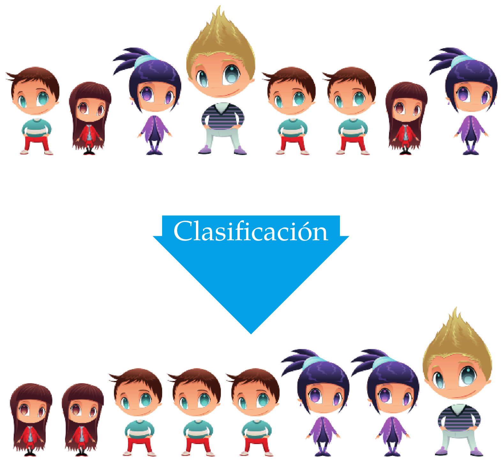

La estadística descriptiva es la parte de la estadística encargada de representar, analizar y resumir la información contenida en la muestra.

Tras el proceso de muestreo, es la siguiente etapa de todo estudio estadístico y suele consistir en:

1. Clasificar, agrupar y ordenar los datos de la muestra.

2. Tabular y representar gráficamente los datos de acuerdo a sus frecuencias.

3. Calcular medidas que resuman la información que contiene la muestra (_estadísticos muestrales_).

No tiene poder inferencial por lo que _nunca deben sacarse conclusiones sobre la población a partir de las medidas resumen que aporta la Estadística Descriptiva_.

# Distribución de frecuencias

El estudio de una variable estadística comienza por medir la variable en los individuos de la muestra y clasificar los valores obtenidos.

Existen dos formas de clasificar estos valores:

- **Sin agrupar**: Ordenar todos los valores obtenidos en la muestra de menor a mayor. Se utiliza con atributos y variables discretas con pocos valores diferentes.

- **Agrupados**: Agrupar los valores en clases (intervalos) y ordenar dichas clases de menor a mayor. Se utiliza con variables continuas y con variables discretas con muchos valores diferentes.

## Clasificación de la muestra

Consiste colocar juntos los valores iguales y ordenarlos si existe un orden entre ellos.

{: .img-center width="400px"}

# Recuento de frecuencias

{: .img-center width="400px"}

# Frecuencias muestrales

> **Definición - Frecuencias muestrales**. Dada una muestra de tamaño $n$ de una variable $X$, para cada valor de la variable $x_i$ observado en la muestra, se define
>
> - **Frecuencia Absoluta $n_i$**: Es el número de veces que el valor $x_i$ aparece en la muestra.
>
> - **Frecuencia Relativa $f_i$**: Es la proporción de veces que el valor $x_i$ aparece en la muestra.
>
$$f_i = \frac{n_i}{n}$$
>
> - **Frecuencia Absoluta Acumulada $N_i$**: Es el número de valores en la muestra menores o iguales que $x_i$.
>
$$N_i = n_1 + \cdots + n_i = N_{i-1}+n_i$$
>
> - **Frecuencia Relativa Acumulada $F_i$**: Es la proporción de valores en la muestra menores o iguales que $x_i$.
>
$$F_i = \frac{N_i}{n}$$

## Tabla de frecuencias

Al conjunto de valores observados en la muestra junto a sus respectivas frecuencias se le denomina **distribución de frecuencias** y suele representarse mediante una **tabla de frecuencias**.

| Valores de $X$ | Frecuencia Absoluta | Frecuencia Relativa | Frecuencia Absoluta Acumulada | Frecuencia Relativa Acumulada |
|:--------------:|:-------------------:|:-------------------:|:-----------------------------:|:-----------------------------:|
|     $x_1$      |        $n_1$        |        $f_1$        |             $N_1$             |             $F_1$             |
|    $\vdots$    |      $\vdots$       |      $\vdots$       |           $\vdots$            |           $\vdots$            |
|     $x_i$      |        $n_i$        |        $f_i$        |             $N_i$             |             $F_i$             |
|    $\vdots$    |      $\vdots$       |      $\vdots$       |           $\vdots$            |           $\vdots$            |
|     $x_k$      |        $n_k$        |        $f_k$        |             $N_k$             |             $F_k$             |

 

**Ejemplo - Variable cuantitativa y datos no agrupados**. El número de hijos en 25 familias es:

1, 2, 4, 2, 2, 2, 3, 2, 1, 1, 0, 2, 2, 0, 2, 2, 1, 2, 2, 3, 1, 2, 2, 1, 2

La tabla de frecuencias del número de hijos en esta muestra es

$$ \begin{array}{rrrrr}
\hline
x_i & n_i & f_i & N_i & F_i\\
\hline
0 & 2 & 0.08 & 2 & 0.08\\
1 & 6 & 0.24 & 8 & 0.32\\
2 & 14 & 0.56 & 22 & 0.88\\
3 & 2 & 0.08 & 24 & 0.96\\
4 & 1 & 0.04 & 25 & 1 \\
\hline
\sum & 25 & 1 \\
\hline
\end{array}
$$

**Ejemplo - Variable cuantitativa y datos agrupados**. Se ha medido la estatura (en cm) de 30 universitarios obteniendo:

179, 173, 181, 170, 158, 174, 172, 166, 194, 185, 
162, 187, 198, 177, 178, 165, 154, 188, 166, 171, 
175, 182, 167, 169, 172, 186, 172, 176, 168, 187.

La tabla de frecuencias de la estatura en a esta muestra es

$$ \begin{array}{crrrr}
\hline
x_i & n_i & f_i & N_i & F_i\newline
\hline
(150,160] & 2 & 0.07 & 2 & 0.07\newline
(160,170] & 8 & 0.27 & 10 & 0.34\newline
(170,180] & 11 & 0.36 & 21 & 0.70\newline
(180,190] & 7 & 0.23 & 28 & 0.93\newline
(190,200] & 2 & 0.07 & 30 & 1 \newline
\hline
\sum & 30 & 1 \newline
\hline
\end{array}
$$

## Construcción de clases

Cada intervalo de agrupación de datos se denomina **clase** y el centro del intervalo se llama **marca de clase**.

A la hora de agrupar los datos en clases hay que tener en cuenta lo siguiente:

- El número de intervalos no debe ser muy grande ni muy pequeño. Una regla orientativa es tomar un número de intervalos próximo a $\sqrt{n}$ o $\log_2(n)$.
- Los intervalos no deben solaparse y deben cubrir todo el rango de valores. Es indiferente si se abren por la izquierda y se cierran por la derecha o al revés.
- El valor más pequeño debe caer dentro del primer intervalo y el más grande dentro del último.

**Ejemplo - Variable cualitativa**. Los grupos sanguíneos de una muestra de 30 personas son:

A, B, B, A, AB, 0, 0, A, B, B, A, A, A, A, AB, A, A, A, B, 0, B, B, B, A, A, A, 0, A, AB, 0.

La tabla de frecuencias del grupo sanguíneo en esta muestra es

$$
\begin{array}{crr}
\hline
x_i & n_i & f_i \\
\hline
\mbox{0} & 5 & 0.16 \\
\mbox{A} & 14 & 0.47 \\
\mbox{B} & 8 & 0.27 \\
\mbox{AB} & 3 & 0.10 \\
\hline
\sum & 30 & 1 \\
\hline
\end{array}
$$

_Obsérvese que en este caso las frecuencias acumuladas no tienen sentido al no existir un orden enter los valores de la variable._

## Representaciones gráficas

La tabla de frecuencias también suele representarse gráficamente. Dependiendo del tipo de variable y de si se han agrupado o no los datos, se utilizan distintos tipos de gráficos:

- Diagrama de barras

- Histograma

- Diagrama de líneas o polígonos.

- Diagrama de sectores.

### Diagrama de barras

Un **diagrama de barras** consiste en un conjunto de barras, una para cada valor o categoría de la variable, dibujadas sobre unos ejes cartesianos.

Habitualmente los valores o categorías de la variable se representan en eje $X$, y las frecuencias en el eje $Y$.
Para cada valor o categoría se dibuja una barra con la altura correspondiente a su frecuencia. La anchura de la barra no es importante pero las barras deben aparecer claramente separadas unas de otras.

Dependiendo del tipo de frecuencia representada en el eje $Y$ se tienen diferentes tipos de diagramas de barras.

En ocasiones se dibuja un polígono, conocido como **polígono de frecuencias**, uniendo mediante segmentos los puntos más altos de cada barra.

**Ejemplo**. El diagrama de barras que aparece a continuación muestra la distribución de frecuencias absolutas del número de hijos en la muestra anterior.

El diagrama de barras que aparece a continuación muestra la distribución de frecuencias relativas del número de hijos en la muestra anterior junto al polígono de frecuencias.

El diagrama de barras que aparece a continuación muestra la distribución de frecuencias absolutas acumuladas del número de hijos en la muestra anterior.

Y el diagrama de barras que aparece a continuación muestra la distribución de frecuencias relativas acumuladas del número de hijos en la muestra anterior junto al polígono de frecuencias.

### Histograma

Un _histograma_ es similar a un diagrama de barras pero para datos agrupados.

Habitualmente las clases o intervalos de agrupación se representan en el
eje $X$, y las frecuencias en el eje $Y$.
Para cada clase se dibuja una barra de altura la correspondiente
frecuencia. A diferencia del diagrama de barras, la anchura del la barra
coincide con la anchura de las clases y no hay separación entre dos
barras consecutivas.

Dependiendo del tipo de frecuencia representada en el eje $Y$ existen
distintos tipos de histogramas.

Al igual que con el diagrama de barras, se puede dibujar un _polígono de frecuencias_ uniendo los puntos centrales más altos de cada barra con segmentos.

**Ejemplo**. El siguiente histograma muestra la distribución de frecuencias absolutas de las estaturas.

El siguiente histograma muestra la distribución de frecuencias relativas con el polígono de frecuencias.

El polígono de frecuencias acumuladas (absolutas o relativas) se conoce como **ojiva**.

**Example**. El histograma y la ojiva siguientes muestran la distribución de frecuencias relativas acumuladas de estaturas.

Observese que en la ojiva se unen los vértices superiores derechos de cada barra con segmentos, en lugar de los puntos centrales, ya que no se consigue alcanzar la frecuencia acumulada correspondiente a la clase hasta que no se alcanza el final del intervalo.

### Diagrama de sectores

Un _diagrama de sectores_ consiste en un círculo divido en porciones, uno por cada valor o categoría de la variable.
Cada porción se conoce como _sector_ y su ángulo o área es proporcional a la correspondiente frecuencia del valor o categoría.

Los diagramas de sectores pueden representar frecuencias absolutas o relativas, pero no pueden representar frecuencias acumuladas, y se utilizan sobre todo con atributos nominales.
Para atributos ordinales o variables cuantitativas es mejor utilizar diagramas de barras, ya es más fácil percibir las diferencias en una dimensión (altura de las barras) que en dos dimensiones (áreas de los sectores).

**Example**. El diagrama de sectores siguiente muestra la distribución de frecuencias relativas de los grupos sanguíneos.

### Datos atípicos

Uno de los principales problemas de las muestras son los **datos atípicos**, que son valores de la variable que se diferencian mucho del resto de los valores en la muestra.

{: .img-center width="400px"}

Es muy importante detectar los datos atípicos antes de realizar cualquier análisis de los datos, pues suelen distorsionar los resultados.

Aparecen siempre en los extremos de la distribución, y pueden detectarse con un diagrama de caja y bigotes (tal y como veremos más adelante).

## Tratamiento de los datos atípicos

Cuando trabajemos con muestras grandes, los datos atípicos tienen menor influencia y pueden dejarse en la muestra.

Cuando trabajemos con muestras pequeñas tenemos varias opciones:

- Eliminar el dato atípico si se trata de un error.
- Sustituir el dato atípico por el menor o el mayor valor de la distribución que no es atípico si no se trata de un error y el dato atípico no concuerda con la distribución teórica.
- Dejar el dato atípico si no es un error, y cambiar el modelo de distribución teórico para adecuarlo a los datos atípicos.

# Estadísticos muestrales

La tabla de frecuencias sintetiza la información de la variable estudiada en la muestra, pero en muchas ocasiones es insuficiente para describir determinados aspectos de la distribución, como por ejemplo, cuáles son los valores más representativos de la muestra, cómo es la variabilidad de los datos, qué datos pueden considerarse atípicos, o cómo es la simetría de la distribución.

Para describir esos aspectos de la distribución muestral se utilizan unas medidas resumen llamadas **estadísticos muestrales**.

De acuerdo al aspecto de las distribución que miden, existen diferentes tipos de estadísticos:

**Estadísticos de Posición**: Miden los valores en torno a los que se agrupan los datos o que dividen la distribución en partes iguales.

**Estadísticos de Dispersión**: Miden la heterogeneidad de los datos.

**Estadísticos de Forma**: Miden aspectos de la forma que tiene la distribución de los datos, como la simetría o el apuntamiento.

## Estadísticos de posición

Pueden ser de dos tipos:

**Estadísticos de Tendencia Central**: Determinan valores alrededor de los cuales se concentran los datos, habitualmente en el centro de la distribución. Estas medidas suelen utilizarse como valores representativos de la muestra. Las más importantes son:

-   Media aritmética

-   Mediana

-   Moda

**Estadísticos de Posición no centrales**: Dividen la distribución en partes con el mismo número de datos. Las más importantes son:

- Cuartiles.

- Deciles.

- Percentiles.

### Media aritmética

>**Definición - Media aritmética muestral $\bar{x}$**. La _media aritmética muestral_ de una variable $X$ es la suma de los valores observados en la muestra dividida por el tamaño muestral
>
$$\bar{x} = \frac{\sum x_i}{n}$$

A partir de la tabla de frecuencias puede calcularse con la fórmula

$$\bar{x} &= \frac{\sum x_in_i}{n} = \sum x_i f_i$$

En la mayoría de los casos, la media aritmética es la medida que mejor representa a la muestra.

_**¡Atención!** No puede calcularse para variables cualitativas._

**Ejemplo - Datos no agrupados**. Utilizando los datos de la muestra del número de hijos en las familias, la media aritmétia es

$$
\begin{aligned}
\bar{x} &= \frac{1+2+4+2+2+2+3+2+1+1+0+2+2}{25}+\\ &+\frac{0+2+2+1+2+2+3+1+2+2+1+2}{25} = \frac{44}{25} = 1.76 \mbox{hijos}.
\end{aligned}
$$

o bien, desde la tabla de frecuencias

$$
\begin{array}{rrrrr}
\hline
x_i & n_i & f_i & x_in_i & x_if_i\\
\hline
0 & 2 & 0.08 & 0 & 0\\
1 & 6 & 0.24 & 6 & 0.24\\
2 & 14 & 0.56 & 28 & 1.12\\
3 & 2  & 0.08 & 6 & 0.24\\
4 & 1 & 0.04 & 4 & 0.16 \\
\hline
\sum & 25 & 1 & 44 & 1.76 \\
\hline
\end{array}

$$
\bar{x} = \frac{\sum x_in_i}{n} = \frac{44}{25}= 1.76 \mbox{ children}\qquad \bar{x}=\sum{x_if_i} = 1.76 \mbox{ hijos}.
$$

Esto significa que el valor que mejor representa el número de hijos en las familias de la muestra es 1.76 hijos.

**Ejemplo - Datos agrupados**. Utilizando los datos de la muestra de estaturas, la media es

$$
\bar{x} &= \frac{179+173+\cdots+187}{30} = 175.07 \mbox{ cm}.
$$

o bien, desde la tabla de frecuencias utilizando las marcas de clase $x_i$:

$$
\begin{array}{crrrrr}
\hline
X & x_i & n_i & f_i & x_in_i & x_if_i\\
\hline
(150,160] & 155 & 2 & 0.07 & 310 & 10.33\\
(160,170] & 165 & 8 & 0.27 & 1320 & 44.00\\
(170,180] & 175 & 11 & 0.36 & 1925 & 64.17\\
(180,190] & 185 & 7 & 0.23 & 1295 & 43.17\\
(190,200] & 195 & 2 & 0.07 & 390 & 13 \\
\hline
\sum &  & 30 & 1 & 5240 & 174.67 \\
\hline
\end{array}
$$

$$
\bar{x} = \frac{\sum x_in_i}{n} = \frac{5240}{30}= 174.67 \mbox{ cm} \qquad \bar{x}=\sum{x_if_i} = 174.67 \mbox{ cm}.
$$

 Obsérvese que al calcular la media desde la tabla de frecuencias el resultado difiere ligeramente del valor real obtenido directamente desde la muestra, ya que los valores usados en los cálculos nos son los datos reales sino las marcas de clase.

### Media ponderada

En algunos casos, los valores de la muestra no tienen la misma importancia. En este caso la importancia o _peso_ de cada valor de la muestra debe tenerse en cuenta al calcular la media.

> **Definición - Media ponderada muestral $\bar{x}_p$**. Dada una muestra de valores $x_1,\ldots, x_n$ donde cada valor $x_i$ tiene asociado un peso $p_i$, la _media ponderada muestral_ de la variable $X$ es la suma de los productos de cada valor observado en la muestra por su peso, dividida por la suma de todos los pesos
>
$$\bar{x}_p = \frac{\sum x_ip_i}{\sum p_i}$$

A partir de la tabla de frecuencias puede calcularse con la fórmula

$$\bar{x}_p &= \frac{\sum x_ip_in_i}{\sum p_i}$$

**Ejemplo**. Supóngase que un estudiante quiere calcular una medida que represente su rendimiento en el curso. La nota obtendida en cada asignatura y sus créditos son

| Asignatura  | Créditos | Nota |
|:-----------:|:--------:|------|
| Matemáticas |    6     | 5    |
|  Economía   |    4     | 3    |
|   Química   |    8     | 6    |

La media aritmética vale
$$\bar{x} = \frac{\sum x_i}{n} = \frac{5+3+6}{3}= 4.67 \text{ puntos}.$$

Sin embargo, esta nota no representa bien el rendimiento académico del alumno ya que no todas las asignaturas tienen la misma importancia ni requieren el mismo esfuerzo para aprobar. Las asignaturas con más créditos requieren más trabajo y deben tener más peso en el cálculo de la media.

Es más lógico usar la media ponderada como medida del rendimiento del estudiante, tomando como pesos los créditos de cada asignatura

$$
\bar{x}_p = \frac{\sum x_ip_i}{\sum p_i} = \frac{5\cdot 6+3\cdot 4+6\cdot 8}{6+4+8}= \frac{90}{18} = 5 \text{ puntos}.
$$

### Mediana

> **Definición - Mediana muestral $Me$**. La _mediana muestral_ de una variable $X$ es el valor de la variable que está en el medio de la muestra ordenada.

La mediana divide la distribución de la muestra en dos partes iguales, es decir, hay el mismo número de valores por debajo y por encima de la mediana. Por tanto, tiene frecuencias acumuladas $N_{Me}= n/2$ y $F_{Me}= 0.5$.

_**¡Atención!** No puede calcularse para variables nominales._

Con datos no agrupados pueden darse varios casos:

- Tamaño muestral impar: La mediana es el valor que ocupa la posición $\frac{n+1}{2}$.
- Tamaño muestral par: La mediana es la media de los valores que ocupan las posiciones $\frac{n}{2}$ y $\frac{n}{2}+1$.

**Ejemplo**. Utilizando los datos del número de hijos de las familias, el tamaño muestral es 25, que es impar, y la mediana es el valor que ocupa la posición $\frac{25+1}{2} = 13$ de la muestra ordenada.

$$0,0,1,1,1,1,1,1,2,2,2,2,\fbox{2},2,2,2,2,2,2,2,2,2,3,3,4$$ y la mediana es 2 hijos.

Y la mediana es 2 hijos.

Si se trabaja con la tabla de frecuencias, la mediana es el valor más pequeño con una frecuencia acumulada mayor o igual a $13$, o con una frecuencia relativa acumulada mayor o igual que $0.5$.

$$
\begin{array}{rrrrr}
\hline
x_i & n_i & f_i & N_i & F_i\\
\hline
0 & 2 & 0.08 & 2 & 0.08\\
1 & 6 & 0.24 & 8 & 0.32\\
\color{red}2 & 14 & 0.56 & 22 & 0.88\\
3 & 2  & 0.08 & 24 & 0.96\\
4 & 1 & 0.04 & 25 & 1 \\
\hline
\sum & 25 & 1 \\
\hline
\end{array}
$$

#### Cálculo de la mediana con datos agrupados

Con datos agrupados la mediana se calcula interpolando en el polígono de frecuencias relativas acumuladas para el valor 0.5.

Ambas expresiones son iguales ya que el ángulo $\alpha$ es el mismo, y resolviendo la ecuación se tiene la siguiente fórmula para calcular la mediana

$$
Me=l_i+\frac{0.5-F_{i-1}}{F_i-F_{i-1}}(l_i-l_{i-1})=l_i+\frac{0.5-F_{i-1}}{f_i}a_i
$$

**Ejemplo - Datos agrupados**. Utilizando los datos de la muestra de las estaturas de estudiantes, la mediana cae en la clase (170,180].

Interponlando en el intervalo (170,180] se tiene

Igualando ambas expresiones y resolviendo la ecuación se obtiene

$$
Me= 170+\frac{0.5-0.34}{0.7-0.34}(180-170)=170+\frac{0.16}{0.36}10=174.54 \mbox{ cm}.
$$

Esto significa que la mitad de los estudiantes tienen estaturas menores o iguales que 174.54 cm y la otra mitad mayores o iguales.

## Moda

> **Definición - Moda muestral $Mo$**. La _moda muestral_ de una variable $X$ es el valor de la variable más frecuente en la muestra.

Con datos agrupados la _clase modal_ es la clase con mayor frecuencia en la muestra.

Puede calcularse para todos los tipos de variables (cuantitativas y cualitativas).

Las distribuciones pueden tener más de una moda.

**Ejemplo**. Utilizando los datos de la muestra del número de hijos en las familias, el valor con mayor frecuencia es 2, y por tanto la moda es $Mo=2$.

$$
\begin{array}{rr}
\hline
x_i & n_i \\
\hline
0 & 2 \\
1 & 6 \\
\color{red} 2 & 14 \\
3 & 2  \\
4 & 1 \\
\hline
\end{array}
$$

Utilizando los datos de la muestra de estaturas de estudiantes, la clase con la mayor frecuencia es $(170,180]$, que es la clase modal $Mo=(170,180]$.

$$
\begin{array}{cr}
\hline
X & n_i \\
\hline
(150,160] & 2 \\
(160,170] & 8 \\
\color{red}{(170,180]} & 11 \\
(180,190] & 7 \\
(190,200] & 2 \\
\hline
\end{array}
$$

### ¿Qué estadístico de tendencia central usar?

En general, siempre que puedan calcularse conviene tomarlas en el siguiente orden:

1. Media. La media utiliza más información que el resto ya que para calcularla se tiene en cuenta la magnitud de los datos.

2. Mediana. La mediana utiliza menos información que la media, pero más que la moda, ya que para calcularla se tiene en cuenta el orden de los datos.

3. Moda. La moda es la que menos información utiliza ya que para calcularla sólo se tienen en cuenta las frecuencias absolutas.

Pero, ¡hay que tener cuidado con los datos atípicos!, ya que la media puede distorsionarse cuando hay datos atípicos. En tal caso es mejor utilizar la mediana como valor más representativo.

**Ejemplo**. Si una muestra de número de hijos de 7 familias es

0, 0, 1, 1, 2, 2, 15,

entonces, $\bar{x}=3$ hijos y $Me=1$ hijo.

_¿Qué medida representa mejor el número de hijos en la muestra?_

### Medidas de posición no centrales

Las medidas de posición no centrales o _cuantiles_ dividen la distribución en partes iguales.

Los más utilizados son:

**Cuartiles**: Dividen la distribución en 4 partes iguales. Hay tres cuartiles: $C_1$ (25% acumulado), $C_2$ (50% acumulado), $C_3$ (75% acumulado).

**Deciles**: Dividen la distribución en 10 partes iguales. Hay 9 deciles: $D_1$ (10% acumulado),..., $D_9$ (90% acumulado).

**Percentiles**: Dividen la distribución en 100 partes iguales. Hay 99 percentiles: $P_1$ (1% acumulado),..., $P_{99}$ (99% acumulado).

Obsérvese que hay una correspondencia entre los cuartiles, los deciles y los percentiles. Por ejemplo, el primer cuartil coincide con el percentil 25, y el cuarto decil coincide con el percentil 40.

Los cuantiles se calculan de forma similar a la mediana. La única diferencia es la frecuencia relativa acumulada que corresponde a cada cuantil.

**Ejemplo**. Utilizando los datos de la muestra del número de hijos de las familias, la frecuencia relativa acumulada era

$$
\begin{array}{rr}
\hline
x_i & F_i \\
\hline
0 & 0.08\\
1 & 0.32\\
2 & 0.88\\
3 & 0.96\\
4 & 1\\
\hline
\end{array}
$$

$$
\begin{aligned}
F_{C_1}=0.25 &\Rightarrow Q_1 = 1 \text{ hijos},\\
F_{C_2}=0.5 &\Rightarrow Q_2 = 2 \text{ hijos},\\
F_{C_3}=0.75 &\Rightarrow Q_3 = 2 \text{ hijos},\\
F_{D_4}=0.4 &\Rightarrow D_4 = 2 \text{ hijos},\\
F_{P_{92}}=0.92 &\Rightarrow P_{92} = 3 \text{ hijos}.
\end{aligned}$$

## Estadísticos de dispersión

La _dispersión_ se refiere a la heterogeneidad o variabilidad de los datos. Asi pues, los estadísticos de dispersión mide la variabilidad global de los datos, o con respecto a una medida de tendencia central.

Para las variables cuantitativas, las más empleadas son:

- Recorrido.

- Rango Intercuartílico.

- Varianza.

- Desviación Típica.

- Coeficiente de Variación.

### Recorrido

> **Recorrido muestral $Re$**. El _recorrido muestral_ de una variable $X$ se define como la diferencia entre el máximo y el mínimo de los valores en la muestra.
>
$$Re = \max_{x_i} -\min_{x_i}$$

El recorrido mide la máxima variación que hay entre los datos muestrales. No obstante, es muy sensible a datos atípicos ya que suelen aparecer justo en los extremos de la distribución, por lo que no se suele utilizar mucho.

### Rango intercuartílico

Para evitar el problema de los datos atípicos en el recorrido, se puede utilizar el primer y tercer cuartil en lugar del mínimo y el máximo.

> **Definición - Rango intercuartílico muestral $RI$**. El _rango intercuartílico muestral_ de una variable $X$ se define como la diferencia entre el tercer y el primer cuartil de la muestra.
>
$$RI = C_3 -C_1$$

## Diagrama de caja y bigotes

La dispersión de una variable suele representarse gráficamente mediante un _diagrama de caja y bigotes_, que representa cinco estadísticos descriptivos (mínimo, cuartiles y máximo) conocidos como los _cinco números_. Consiste en una caja, dibujada desde el primer al tercer cuartil, que representa el rango intercuartílico, y dos segmentos, conocidos como _bigotes_ inferior y superior. A menudo la caja se divide en dos por la mediana.  

Este diagrama es muy útil y se utiliza para muchos propósitos:

-   Sirve para medir la dispersión de los datos ya que representa el rango y el rango intercuartílico.

-   Sirve para detectar datos atípicos, que son los valores que quedan fuera del intervalo definido or los bigotes.

-   Sirve para medir la simetría de la distribución, comparando la longitud de las cajas y de los bigotes por encima y por debajo de la mediana.

**Ejemplo**. El diagrama siguiente muestra el diagrama de caja y bigotes del peso de una muestra de recién nacidos.

Para construir el diagrama de caja y bigotes hay que seguir los siguientes pasos:

1. Calcular los cuartiles.

2. Dibujar una caja de manera que el extremo inferior caiga sobre el primer cuartil y el extremo superior sobre el tercer cuartil.

3. Dividir la caja con una línea que caiga sobre el segundo cuartil.

4. Para los bigotes inicialmente se calculan dos valores llamados _vallas_ $v_1$ y $v_2$. La valla inferior es el primer cuartil menos una vez y media el rango intercuartílico, y la valla superior es el tercer cuartil más una vez y media el rango intercuartílico.

  $$
  \begin{aligned}
  v_1&=Q_1-1.5\,\text{IQR}\\
  v_2&=Q_3+1.5\,\text{IQR}
  \end{aligned}
  $$

  Las valls definen el intervalo donde los datos se consideran normales. Cualquier valor fuera de ese intervalo se considera un dato atípico. El bigote superior se dibuja desde el borde inferior de la caja hasta el menor valor de la muestra que es mayor o igual a la valla inferior, y el bigote superior se dibuja desde el borde superior de la caja hasta el mayor valor de la muestra que es menor o igual a la valla superior.

5. Finalmente, si en la muestra hay algún dato atípico, se dibuja un punto para cada uno de ellos.

**Ejemplo**. El diagrama de caja y bigotes de la muestra del número de hijos de las familias se muestra a continuación.

## Desviaciones respecto de la media

Otra forma de medir la variabilidad de una variable es estudiar la concentración de los valores en torno a algún estadístico de tendencia central como por ejemplo la media.

Para ello se suele medir la distancia de cada valor a la media. A ese valor se le llama

(-1,-0.5)(7,1.5) (0,0)(6,0) (1,0)(5,0) (3,0) (3,-0.2)

$\bar{x}$

(1,-0.2)

$x_i$

(5,-0.2)

$x_j$

(1,0.5)(3,0.5) (2,0.7)

$x_i-\bar{x}$

(2,1.2)

Desviación $-$

(3,0.5)(5,0.5) (4,0.7)

$x_j-\bar{x}$

(4,1.2)

Desviación
$+$

Si las desviaciones son grandes la media no será tan representativa como cuando la desviaciones sean pequeñas.

(-1,-0.5)(7,1.6) (0,1.6)(6,1.6) (0.1,1.6)(0.2,1.6)(0.4,1.6)(0.5,1.6)(0.8,1.6)(5,1.6)(5.3,1.6)(5.4,1.6)(5.7,1.6)(5.8,1.6) (3,1.6) (3,1.4)

$\bar{x}$

(-2.5,1.6)

Más
dispersión

(6.3,1.6)

$\bar x$ menos representativa

(0,0.2)(6,0.2) (1.5,0.2)(2,0.2)(2.2,0.2)(2.5,0.2)(2.8,0.2)(3.3,0.2)(3.5,0.2)(3.9,0.2)(4.1,0.2)(4.4,0.2) (3,0.2) (3,0)

$\bar{x}$

(-2.5,0.2)

Menos
dispersión

(6.3,0.2)

$\bar x$ más representativa

_¿En qué muestra es más representativa la media?_

## Varianza y desviación típica

[Varianza $s^2$] La _varianza muestral_ de una variable $X$ se define como el promedio del cuadrado de las desviaciones de los valores de la muestra respecto de la media muestral. $$s^2 = \frac{\sum (x_i-\bar x)^2n_i}{n} = \sum (x_i-\bar x)^2f_i$$

También puede calcularse de manera más sencilla mediante la fórmula $$s^2 = \frac{\sum x_i^2n_i}{n} -\bar x^2= \sum x_i^2f_i-\bar x^2$$ La varianza tiene las unidades de la variable al cuadrado, por lo que para facilitar su interpretación se suele utilizar su raíz cuadrada:

[Desviación típica $s$] La _desviación típica muestral_ de una variable $X$ se define como la raíz cuadrada positiva de su varianza muestral. $$s = +\sqrt{s^2}$$

## Interpretación de la varianza y la desviación típica

Tanto la varianza como la desviación típica sirven para cuantificar la dispersión de los datos en torno a la media.

## Cálculo de la varianza y la desviación típica

### Ejemplo con datos no agrupados

Para el número de hijos se puede calcular la varianza a partir de la tabla de frecuencias añadiendo una columna con los cuadrados de los valores:

rrr

& &\ 0 & 2 & 0\ 1 & 6 & 6\ 2 & 14 & 56\ 3 & 2 & 18\ 4 & 1 & 16\ & 25 & 96\

$$s^2 = \frac{\sum x_i^2n_i}{n}-\bar x^2 = \frac{96}{25}-1.76^2= 0.7424 \mbox{ hijos}^2.$$ Y la desviación típica es $s=\sqrt{0.7424} = 0.8616$ hijos.

Comparado este valor con el recorrido, que va de 0 a 4 hijos se observa que no es demasiado grande por lo que se puede concluir que no hay mucha dispersión y en consecuencia la media de $1.76$ hijos representa bien a los matrimonios de la muestra.

## Cálculo de la varianza y la desviación típica

### Ejemplo con datos agrupados

En el ejemplo de las estaturas, al ser datos agrupados, el cálculo se realiza igual que antes pero tomando como valores de la variable las marcas de clase.

rrrr

& & &\ (150,160] & 155 & 2 & 48050\ (160,170] & 165 & 8 & 217800\ (170,180] & 175 & 11 & 336875\ (180,190] & 185 & 7 & 239575\ (190,200] & 195 & 2 & 76050\ & & 30 & 918350\

$$s^2 = \frac{\sum x_i^2n_i}{n}-\bar x^2 = \frac{918350}{30}-174.67^2= 102.06 \mbox{ cm}^2.$$ Y la desviación típica es $s=\sqrt{102.06} = 10.1$ cm.

Este valor es bastante pequeño, comparado con el recorrido de la variable, que va de 150 a 200 cm, por lo que la variable tiene poca dispersión y en consecuencia su media es muy representativa.

## Coeficiente de variación

Tanto la varianza como la desviación típica tienen unidades y eso dificulta a veces su interpretación y su comparación.

Afortunadamente es fácil definir a partir de ellas una medida de dispersión adimensional que es más fácil de interpretar.

[Coeficiente de variación muestral $cv$] El _coeficiente de variación muestral_ de una variable $X$ se define como el cociente entre su desviación típica muestral y el valor absoluto de su media muestral. $$cv = \frac{s}{|\bar x|}$$

El coeficiente de variación muestral mide la dispersión relativa de los valores de la muestra en torno a la media muestral.

Como no tiene unidades, es muy sencillo de interpretar: Cuanto mayor sea, mayor será la dispersión y menos representativa será la media.

También se utiliza para comparar la dispersión entre muestras distintas incluso si las variables tienen unidades diferentes.

## Coeficiente de variación

### Ejemplo

En el caso del número de hijos, como $\bar x=1.76$ hijos y $s=0.8616$ hijos, se tiene que el coefiente de variación vale $$cv = \frac{s}{|\bar x|} = \frac{0.8616}{|1.76|} = 0.49.$$ En el caso de las estaturas, como $\bar x=174.67$ cm y $s=10.1$ cm, se tiene que el coeficiente de variación vale $$cv = \frac{s}{|\bar x|} = \frac{10.1}{|174.67|} = 0.06.$$ Como se puede observar la dispersión relativa en la muestra de estaturas es mucho menor que en la del número de hijos, por lo que la media de las estaturas será más representativa que la media del número de hijos.

# Estadísticos de forma

## Estadísticos de forma

Son medidas que tratan de caracterizar aspectos de la forma de la distribución de una muestra.

Los aspectos más relevantes son:

Simetría: : Miden la simetría de la distribución de frecuencias en torno a la media.\ El estadístico más utilizado es el _Coeficiente de Asimetría de Fisher_.

Apuntamiento: : Miden el apuntamiento de la distribución de frecuencias.\ El estadístico más utilizado es el _Coeficiente de Apuntamiento o Curtosis_.

## Coeficiente de asimetría

[Coeficiente de asimetría muestral $g_1$] El _coeficiente de asimetría muestral_ de una variable $X$ se define como el promedio de las desviaciones de los valores de la muestra respecto de la media muestral, elevadas al cubo, dividido por la desviación típica al cubo. $$g_1 = \frac{\sum (x_i-\bar x)^3 n_i/n}{s^3} = \frac{\sum (x_i-\bar x)^3 f_i}{s^3}$$

El coeficiente de asimetría muestral mide el grado de simetría de los valores de la muestra con respecto a la media muestral, de manera que:

- $g_1=0$ indica que hay el mismo número de valores a la derecha y a la izquierda de la media (simétrica).

- $g_1<0$ indica que la mayoría de los valores son mayores que la media (asimétrica a la izquierda).

- $g_1>0$ indica que la mayoría de los valores son menores que la media (asimétrica a la derecha).

## Coeficiente de asimetría

### Ejemplo de distribución simétrica

## Coeficiente de asimetría

### Ejemplo de distribución asimétrica hacia la izquierda

## Coeficiente de asimetría

### Ejemplo de distribución asimétrica hacia la derecha

## Cálculo del coeficiente de asimetría

### Ejemplo con datos agrupados

Siguiendo con el ejemplo de las estaturas, podemos calcular el coeficiente de asimetría a partir de la tabla de frecuencias añadiendo una nueva columna con los cubos de las desviaciones a la media $\bar x = 174.67$ cm:

rrrrr

& & & &\ (150,160] & 155 & 2 & -19.67 & -15221.00\ (160,170] & 165 & 8 & -9.67 & -7233.85\ (170,180] & 175 & 11 & 0.33 & 0.40\ (180,190] & 185 & 7 & 10.33 & 7716.12\ (190,200] & 195 & 2 & 20.33 & 16805.14\ & & 30 & & 2066.81\

$$g_1 = \frac{\sum (x_i-\bar x)^3n_i/n}{s^3} = \frac{2066.81/30}{10.1^3} = 0.07.$$ Al estar tan próximo a 0, este valor indica que la distribución es prácticamente simétrica con respecto a la media.

## Coeficiente de apuntamiento o curtosis

[Coeficiente de apuntamiento muestral $g_2$] El _coeficiente de apuntamiento muestral_ de una variable $X$ se define como el promedio de las desviaciones de los valores de la muestra respecto de la media muestral, elevadas a la cuarta, dividido por la desviación típica a la cuarta y al resultado se le resta 3\. $$g_2 = \frac{\sum (x_i-\bar x)^4 n_i/n}{s^4}-3 = \frac{\sum (x_i-\bar x)^4 f_i}{s^4}-3$$

El coeficiente de apuntamiento muestral mide el grado de apuntamiento de los valores de la muestra con respecto a una distribución normal de referencia, de manera que:

- $g_2=0$ indica que la distribución tienen un apuntamiento normal (_mesocúrtica_).

- $g_2<0$ indica que la distribución tiene menos apuntamiento de lo normal (_platicúrtica_).

- $g_2>0$ indica que la distribución tiene más apuntamiento de lo normal (_leptocúrtica_).

## Coeficiente de apuntamiento o curtosis

### Ejemplo de distribución mesocúrtica

## Coeficiente de apuntamiento o curtosis

### Ejemplo de distribución platicúrtica

## Coeficiente de apuntamiento o curtosis

### Ejemplo de distribución leptocúrtica

## Cálculo del coeficiente de apuntamiento

### Ejemplo con datos agrupados

De nuevo para el ejemplo de las estaturas podemos calcular el coeficiente de asimetría a partir de la tabla de frecuencias añadiendo una nueva columna con las desviaciones a la media $\bar x = 174.67$ cm elevadas a la cuarta:

rrrrr

& & & &\ (150,160] & 155 & 2 & -19.67 & 299396.99\ (160,170] & 165 & 8 & -9.67 & 69951.31\ (170,180] & 175 & 11 & 0.33 & 0.13\ (180,190] & 185 & 7 & 10.33 & 79707.53\ (190,200] & 195 & 2 & 20.33 & 341648.49\ & & 30 & & 790704.45\

$$g_2 = \frac{\sum (x_i-\bar x)^4n_i/n}{s^4} - 3 = \frac{790704.45/30}{10.1^4}-3 = -0.47.$$ Como se trata de un valor negativo, aunque pequeño, podemos decir que la distribución es ligeramente platicúrtica.

## Interpretación de los coeficientes de asimetría y apuntamiento

Como se verá más adelante en la parte de inferencia, muchas de las pruebas estadísticas solo pueden aplicarse a poblaciones normales.

Las poblaciones normales se caracterizan por ser simétricas y mesocúrticas, de manera que, tanto el coeficiente de asimetría como el de apuntamiento pueden utilizarse para contrastar si los datos de la muestra provienen de una población normal.

En general, se suele rechazar la hipótesis de normalidad de la población cuando $g_1$ o $g_2$ estén fuera del intervalo $[-2,2]$.

En tal caso, lo habitual es aplicar alguna transformación a la variable para corregir la anormalidad.

# Transformaciones de variables

## Transformaciones de variables

En muchas ocasiones se suelen transformar los datos brutos para trabajar con unas unidades más cómodas, o bien para corregir alguna anormalidad de la distribución.

Por ejemplo, si estamos trabajando con estaturas medidas en metros y tenemos los siguientes valores: $$1.75\mbox{m}, 1.65\mbox{m}, 1.80\mbox{m},$$ podemos evitar los decimales multiplicando por 100, es decir, pasando de metros a centímetros: $$175\mbox{cm}, 165\mbox{cm}, 180\mbox{cm},$$ Y si queremos reducir la magnitud de los datos podemos restarles a todos el menor de ellos, en este caso, 165cm: $$10\mbox{cm}, 0\mbox{cm}, 15\mbox{cm},$$ Está claro que este conjunto de datos es mucho más sencillo que el original. En el fondo lo que se ha hecho es aplicar a los datos la transformación: $$Y= 100X-165$$

## Transformaciones lineales

Una de las transformaciones más habituales es la _transformación lineal_: $$Y=a+bX.$$ Se puede comprobar fácilmente que la media y la desviación típica de la variable resultante cumplen:

$$\begin{aligned} \bar y &= a+ b\bar x,\ s_{y} &= |b|s_{x}\end{aligned}$$

Además, el coeficiente de curtosis no se altera y el de asimetría sólo cambia de signo si $b$ es negativo.

## Transformación de tipificación y puntuaciones típicas

Una de las transformaciones lineales más habituales es la _tipificación_:

[Variable tipificada] La _variable tipificada_ de una variable estadística $X$ es la variable que resulta de restarle su media y dividir por su desviación típica. $$Z=\frac{X-\bar x}{s_{x}}$$

La tipificación es muy útil para eliminar la dependencia de una variable respecto de las unidades de medida empleadas.

Los valores tipificados se conocen como y miden el número de desviaciones típicas que dista de la media cada observación, lo cual es útil para comparar variables con distintas unidades.

Otra propiedad de la variable tipificada es que tiene media 0 y desviación típica 1: $$\bar z = 0 \qquad s_{z} = 1$$

## Transformación de tipificación y puntuaciones típicas

### Ejemplo

Las notas de 5 alumnos en dos asignaturas $X$ e $Y$ son: $$\begin{array}{rccccccccc} \mbox{Alumno:} & 1 & 2 & 3 & 4 & 5\ \cline{1-6} X: & 2 & 5 & 4 & \alert{8} & 6 & \qquad & \bar x = 5 & \quad s_x = 2\ Y: & 1 & 9 & \alert{8} & 5 & 2 & \qquad & \bar y = 5 & \quad s_y = 3.16\ \end{array}$$

_¿Han tenido el mismo rendimiento los alumnos que han sacado un 8?_

Podría parecer que ambos alumnos han tenido el mismo rendimiento puesto que tienen la misma nota, pero si queremos ver el rendimiento relativo al resto del grupo, tendríamos que tener en cuenta la dispersión de cada muestra y medir sus puntuaciones típicas: $$\begin{array}{cccccc} X: & -1.5 & 0 & -0.5 & \alert{1.5} & 0.5 \ Y: & -1.26 & 1.26 & \alert{0.95} & 0 & -0.95\ \end{array}$$ Es decir, el alumno que tiene un 8 en $X$ está $1.5$ veces la desviación típica por encima de la media de su grupo, mientras que el alumno que tiene un 8 en $Y$ sólo está $0.95$ desviaciones típicas por encima de su media. Así pues, el primer alumno tuvo un rendimiento superior al segundo.

## Transformación de tipificación y puntuaciones típicas

### Ejemplo

Siguiendo con el ejemplo anterior

_¿Cuál es el mejor alumno?_

Si simplemente se suman las puntuaciones de cada asignatura se tiene: $$\begin{array}{rccccc} \mbox{Alumno:} & 1 & 2 & 3 & 4 & 5\ \hline X: & 2 & 5 & 4 & 8 & 6 \ Y: & 1 & 9 & 8 & 5 & 2 \ \hline \sum & 3 & \alert{14} & 12 & 13 & 8 \end{array}$$ El mejor alumno sería el segundo.

Pero si se considera el rendimiento relativo tomando las puntuaciones típicas se tiene: $$\begin{array}{rccccc} \mbox{Alumno:} & 1 & 2 & 3 & 4 & 5\ \hline X: & -1.5 & 0 & -0.5 & 1.5 & 0.5 \ Y: & -1.26 & 1.26 & 0.95 & 0 & -0.95\ \hline \sum & -2.76 & 1.26 & 0.45 & \alert{1.5} & -0.45 \end{array}$$ Y el mejor alumno sería el cuarto.

## Transformaciones no lineales

La transformación $Y=X^2$ comprime la escala para valores pequeños y la expande para valores altos, de manera que es muy útil para corregir asimetrías hacia la izquierda.

## Transformaciones no lineales

Las transformaciones $Y=\sqrt x$, $Y= \log X$ y $Y=1/X$ comprimen la escala para valores altos y la expanden para valores pequeños, de manera que son útiles para corregir asimetrías hacia la derecha.

## Variables clasificadoras o factores

En ocasiones interesa describir el comportamiento de una variable, no para toda la muestra, sino para distintos grupos de individuos, como por ejemplo, estudiar las estaturas en hombres y mujeres por separado.

En tal caso se utiliza una nueva variable, llamada o , para dividir la muestra en grupos y posteriormente se realiza el estudio descriptivo de la variable principal en cada grupo.

## Variables clasificadoras

Usando la misma muestra de estaturas, pero teniendo en cuenta el sexo, tenemos:

lll

& 173, 158, 174, 166, 162, 177, 165, 154, 166, 182,\ & 169, 172, 170, 168.\ & 179, 181, 172, 194, 185, 187, 198, 178, 188, 171,\ & 175, 167, 186, 172, 176, 187.\
