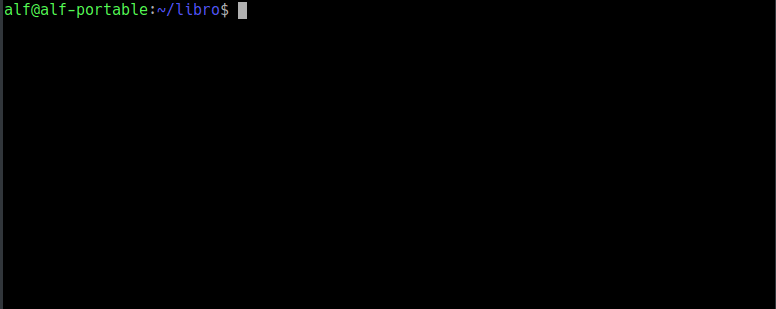

## Ejercicio 1

Crear un repositorio nuevo con el nombre `libro`.

<button class="solution">Mostrar solución</button>

<pre class="highlight"><code>&gt; mkdir libro
&gt; cd libro
&gt; git init
</code></pre>

<button class="resolution">Mostrar resolución</button>

## Ejercicio 2

1. Comprobar el estado del repositorio. 
2. Crear un fichero `indice.txt` con el siguiente contenido:
    
    > Capítulo 1: Introducción a Git  
    > Capítulo 2: Flujo de trabajo básico  
    > Capítulo 3: Repositorios remotos

3. Comprobar de nuevo el estado del repositorio.
4. Añadir el fichero a la zona de intercambio temporal.
5. Volver a comprobar una vez más el estado del repositorio.

<button class="solution">Mostrar solución</button>

<pre class="highlight"><code>&gt; git status
&gt; cat > indice.txt
Capítulo 1: Introducción a Git
Capítulo 2: Flujo de trabajo básico
Capítulo 3: Repositorios remotos
Ctrl+D
&gt; git status
&gt; git add indice.txt
&gt; git status
</code></pre>

<button class="resolution">Mostrar resolución</button>

## Ejercicio 3

Realizar un commit de los últimos cambios y ver el estado del repositorio.

<button class="solution">Mostrar solución</button>

<pre class="highlight"><code>&gt; git commit -m "Añadido índice del libro."
&gt; git status
</code></pre>

<button class="resolution">Mostrar resolución</button>

## Ejercicio 4

1. Cambiar el fichero `indice.txt` para que contenga lo siguiente:
    
    > Capítulo 1: Introducción a Git  
    > Capítulo 2: Flujo de trabajo básico
    > Capítulo 3: Gestión de ramas
    > Capítulo 4: Repositorios remotos

2. Mostrar los cambios con respecto a la última versión guardada en el repositorio.
3. Hacer un commit de los cambios.

<button class="solution">Mostrar solución</button>

<pre class="highlight"><code>&gt; cat > indice.txt
Capítulo 1: Introducción a Git
Capítulo 2: Flujo de trabajo básico
Capítulo 3: Gestión de ramas
Capítulo 4: Repositorios remotos
Ctrl+D
&gt; git diff
&gt; git add indice.txt
&gt; git commit
</code></pre>

<button class="resolution">Mostrar resolución</button>

## Ejercicio 5

## Ejercicio 6

## Ejercicio 7

## Ejercicio 8

## Ejercicio 9

## Ejercicio 10

