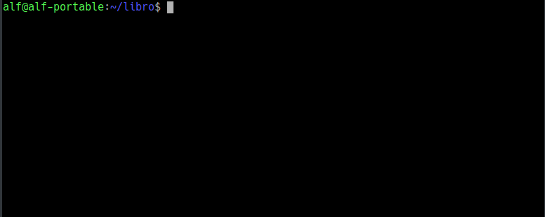

## Ejercicio 1
1. Eliminar la última línea del fichero `indice.txt` y guardarlo.
2. Comprobar el estado del repositorio.
3. Deshacer los cambios realizados en el fichero `indice.txt` para volver a la versión anterior del fichero.
4. Volver a comprobar el estado del repositorio.

<button class="solution">Mostrar solución</button>

<pre class="highlight"><code>&gt; nano indice.txt
# Eliminar la última línea y guardar el fichero.
&gt; git status
&gt; git checkout -- indice.txt
&gt; git status
</code></pre>

<button class="resolution">Mostrar resolución</button>

## Ejercicio 2

1. Eliminar la última línea del fichero `indice.txt` y guardarlo.
2. Añadir los cambios a la zona de intercambio temporal.
3. Comprobar de nuevo el estado del repositorio.
4. Quitar los cambios de la zona de intercambio temporal, pero mantenerlos en el directorio de trabajo.
5. Comprobar de nuevo el estado del repositorio.
6. Deshacer los cambios realizados en el fichero `indice.txt` para volver a la versión anterior del fichero.
7. Volver a comprobar el estado del repositorio.

<button class="solution">Mostrar solución</button>

<pre class="highlight"><code>&gt; nano indice.txt
# Eliminar la última línea y guardar el fichero.
&gt; git add .
&gt; git status
&gt; git reset indice.txt
&gt; git status
&gt; git checkout -- indice.txt
&gt; git status
</code></pre>

<button class="resolution">Mostrar resolución</button>

## Ejercicio 3

1. Eliminar la última línea del fichero `indice.txt` y guardarlo.
2. Eliminar el fichero `capitulos/capitulo3.txt`.
3. Añadir un fichero nuevo `captitulos/capitulo4.txt` vacío.
4. Añadir los cambios a la zona de intercambio temporal.
5. Comprobar de nuevo el estado del repositorio.
6. Quitar los cambios de la zona de intercambio temporal, pero mantenerlos en el directorio de trabajo.
7. Comprobar de nuevo el estado del repositorio.
8. Deshacer los cambios realizados para volver a la versión del repositorio.
9. Volver a comprobar el estado del repositorio.

<button class="solution">Mostrar solución</button>

<pre class="highlight"><code>&gt; nano indice.txt
# Eliminar la última línea y guardar el fichero.
&gt; rm capitulos/capitulo3.txt
&gt; touch capitulos/capitulo4.txt
&gt; git add .
&gt; git status
&gt; git reset
&gt; git status
&gt; git checkout -- .
&gt; git status
&gt; git clean -f
&gt; git status
</code></pre>

<button class="resolution">Mostrar resolución</button>

## Ejercicio 4

1. Eliminar la última línea del fichero `indice.txt` y guardarlo.
2. Eliminar el fichero `capitulos/capitulo3.txt`.
3. Añadir los cambios a la zona de intercambio temporal y hacer un commit con el mensaje "Borrado accidental."
4. Comprobar el historial del repositorio.
5. Deshacer el último commit pero mantener los cambios anteriores en el directorio de trabajo y la zona de intercambio temporal.
6. Comprobar el historial y el estado del repositorio.
7. Volver a hacer el commit con el mismo mensaje de antes.
8. Deshacer el último commit y los cambios anteriores del directorio de trabajo volviendo a la versión anterior del repositorio.
9. Comprobar de nuevo el historial y el estado del repositorio.

<button class="solution">Mostrar solución</button>

<pre class="highlight"><code>&gt; nano indice.txt
# Eliminar la última línea y guardar el fichero.
&gt; rm capitulos/capitulo3.txt
&gt; git commit -a "Borrado accidental."
&gt; git status
&gt; git log
&gt; git reset --soft HEAD~1
&gt; git status
&gt; git commit -m "Borrado accidental."
&gt; git status
&gt; git log
&gt; git reset --hard HEAD~1
&gt; git log
&gt; git status
</code></pre>

<button class="resolution">Mostrar resolución</button>

