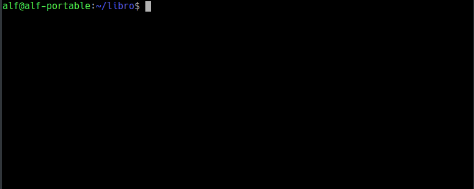

<i class="fas fa-exclamation-triangle" style="color:red"></i> Para hacer estos ejercicios es necesario haber hecho antes los  [ejercicios de creación y actualización de repositorios](/git/ejercicios/creacion-actualizacion-repositorios.html) o bien hacer un clon del repositorio remoto https://github.com/asalber/libro-git mediante la siguiente secuencia de comandos:

```
> git clone https://github.com/asalber/libro-git.git
> cd libro-git
> git reset --hard 8c808
> git remote remove origin
```

## Ejercicio 1
1. Mostrar el historial de cambios del repositorio.
2. Crear la carpeta `capitulos` y crear dentro de ella el fichero `capitulo1.txt` con el siguiente texto.
    > Git es un sistema de control de versiones ideado por Linus Torvalds.
3. Añadir los cambios a la zona de intercambio temporal.
4. Hacer un commit de los cambios con el mensaje "Añadido capítulo 1."
5. Volver a mostrar el historial de cambios del repositorio.

<div><button class="solution">Mostrar solución</button></div>
<div id="solution" style="display: none">
<pre class="highlight"><code>&gt; git log
&gt; mkdir capitulos
&gt; cat > capitulos/capitulo1.txt
Git es un sistema de control de versiones ideado por Linus Torvalds.
Ctrl+D
&gt; git add .
&gt; git commit -m "Añadido capítulo 1."
&gt; git log
</code></pre>
</div>

<div><button class="resolution">Mostrar resolución</button></div>
<div id="resolution" style="display: none">

</div>

## Ejercicio 2

1. Crear el fichero `capitulo2.txt` en la carpeta `capitulos` con el siguiente texto.
    > El flujo de trabajo básico con Git consiste en:
    1- Hacer cambios en el repositorio.
    2- Añadir los cambios a la zona de intercambio temporal.
    3- Hacer un commit de los cambios.
2. Añadir los cambios a la zona de intercambio temporal.
3. Hacer un commit de los cambios con el mensaje "Añadido capítulo 2."
4. Mostrar las diferencias entre la última versión y dos versiones anteriores.

<div><button class="solution">Mostrar solución</button></div>
<div id="solution" style="display: none">
<pre class="highlight"><code>&gt; cat > capitulos/capitulo2.txt
El flujo de trabajo básico con Git consiste en:
1- Hacer cambios en el repositorio.
2- Añadir los cambios a la zona de intercambio temporal.
3- Hacer un commit de los cambios.
Ctrl+D
&gt; git add .
&gt; git commit -m "Añadido capítulo 2."
&gt; git diff HEAD~2..HEAD
</code></pre>
</div>

<div><button class="resolution">Mostrar resolución</button></div>
<div id="resolution" style="display: none">

</div>

## Ejercicio 3

1. Crear el fichero `capitulo3.txt` en la carpeta `capitulos` con el siguiente texto.
    > Git permite la creación de ramas lo que permite tener distintas versiones del mismo proyecto y trabajar de manera simultanea en ellas.
2. Añadir los cambios a la zona de intercambio temporal.
3. Hacer un commit de los cambios con el mensaje "Añadido capítulo 3."
4. Mostrar las diferencias entre la primera y la última versión del repositorio.

<div><button class="solution">Mostrar solución</button></div>
<div id="solution" style="display: none">
<pre class="highlight"><code>&gt; cat > capitulos/capitulo3.txt
Git permite la creación de ramas lo que permite tener distintas versiones del mismo proyecto y trabajar de manera simultanea en ellas.
Ctrl+D
&gt; git add .
&gt; git commit -m "Añadido capítulo 3."
&gt; git log
&gt; git diff &lt;codigo hash de la primera version&gt;..HEAD
</code></pre>
</div>

<div><button class="resolution">Mostrar resolución</button></div>
<div id="resolution" style="display: none">

</div>

## Ejercicio 4

1. Añadir al final del fichero `indice.txt` la siguiente línea:
    
    > Capítulo 5: Conceptos avanzados

2. Añadir los cambios a la zona de intercambio temporal.
3. Hacer un commit de los cambios con el mensaje "Añadido capítulo 5 al índice.".
4. Mostrar quién ha hecho cambios sobre el fichero `indice.txt`.

<div><button class="solution">Mostrar solución</button></div>
<div id="solution" style="display: none">
<pre class="highlight"><code>&gt; echo "Capítulo 5: Conceptos avanzados" >> indice.txt
&gt; git add .
&gt; git commit -m "Añadido capítulo 5 al índice."
&gt; git annotate indice.txt
</code></pre>
</div>

<div><button class="resolution">Mostrar resolución</button></div>
<div markdown="0" id="resolution" style="display: none">

</div>
