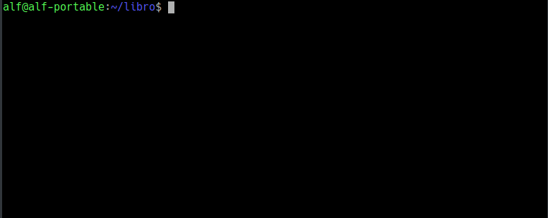

## Ejercicio 1
Crear una nueva rama `bibliografia` y mostrar las ramas del repositorio.

<button class="solution">Mostrar solución</button>

<pre class="highlight"><code>&gt; git branch bibliografia
&gt; git branch -av
</code></pre>

<button class="resolution">Mostrar resolución</button>

## Ejercicio 2

1. Crear el fichero `capitulos/capitulo4.txt` y añadir el texto siguiente
> En este capítulo veremos cómo usar GitHub para alojar repositorios en remoto.

2. Añadir los cambios a la zona de intercambio temporal.
3. Hacer un commit con el mensaje "Añadido capítulo 4."
4. Mostrar la historia del repositorio incluyendo todas las ramas.

<button class="solution">Mostrar solución</button>

<pre class="highlight"><code>&gt; cat > capitulos/capitulo4.txt
En este capítulo veremos cómo usar GitHub para alojar repositorios en remoto.
Ctrl+D
&gt; git add .
&gt; git commit -m "Añadido capítulo 4."
&gt; git log --graph --all --oneline
</code></pre>

<button class="resolution">Mostrar resolución</button>

## Ejercicio 3

1. Cambiar a la rama `bibliografia`.
2. Crear el fichero `bibliografia.txt` y añadir la siguiente referencia
> - Chacon, S. and Straub, B. Pro Git. Apress.

3. Añadir los cambios a la zona de intercambio temporal.
4. Hacer un commit con el mensaje "Añadida primera referencia bibliográfica."
5. Mostrar la historia del repositorio incluyendo todas las ramas.

<button class="solution">Mostrar solución</button>

<pre class="highlight"><code>&gt; git checkout bibliografia
&gt; cat > bibliografia.txt
- Chacon, S. and Straub, B. Pro Git. Apress.
Ctrl+D
&gt; git add .
&gt; git commit -m "Añadida primera referencia bibliográfica."
&gt; git log --graph --all --oneline
</code></pre>

<button class="resolution">Mostrar resolución</button>

## Ejercicio 4

1. Fusionar la rama `bibliografia` con la rama `master`.
2. Mostrar la historia del repositorio incluyendo todas las ramas.
3. Eliminar la rama `bibliografia`. 
4. Mostrar de nuevo la historia del repositorio incluyendo todas las ramas.

<button class="solution">Mostrar solución</button>

<pre class="highlight"><code>&gt; git checkout master
&gt; git merge bibliografia
&gt; git log --graph --all --oneline
&gt; git branch -d bibliografia
&gt; git log --graph --all --oneline
</code></pre>

<button class="resolution">Mostrar resolución</button>

## Ejercicio 5

1. Crear la rama `bibliografia`.
2. Cambiar a la rama `bibliografia`.
3. Cambiar el fichero `bibliografia.txt` para que contenga las siguientes referencias: 
> - Scott Chacon and Ben Straub. Pro Git. Apress.
> - Ryan Hodson. Ry's Git Tutorial. Smashwords (2014)

4. Añadir los cambios a la zona de intercambio temporal y hacer un commit con el mensaje "Añadida nueva referencia bibliográfica."
5. Cambiar a la rama `master`.
6. Cambiar el fichero `bibliografia.txt` para que contenga las siguientes referencias: 
> - Chacon, S. and Straub, B. Pro Git. Apress.
> - Loeliger, J. and McCullough, M. Version control with Git. O'Reilly.

7. Añadir los cambios a la zona de intercambio temporal y hacer un commit con el mensaje "Añadida nueva referencia bibliográfica."
8. Fusionar la rama `bibliografia` con la rama `master`.
9. Resolver el conflicto dejando el fichero `bibliografia.txt` con las referencias:
> - Chacon, S. and Straub, B. Pro Git. Apress.
> - Loeliger, J. and McCullough, M. Version control with Git. O'Reilly.
> - Hodson, R. Ry's Git Tutorial. Smashwords (2014)
10. Añadir los cambios a la zona de intercambio temporal y hacer un commit con el mensaje "Resuelto conflicto de bibliografía."
11. Mostrar la historia del repositorio incluyendo todas las ramas.

<button class="solution">Mostrar solución</button>

<pre class="highlight"><code>&gt; git branch bibliografia
&gt; git checkout bibliografia
&gt; cat > bibliografia.txt
- Scott Chacon and Ben Straub. Pro Git. Apress.
- Ryan Hodson. Ry's Git Tutorial. Smashwords (2014)
Ctrl+D
&gt; git commit -a -m "Añadida nueva referencia bibliográfica."
&gt; git checkout master
&gt; cat > bibliografia.txt
- Chacon, S. and Straub, B. Pro Git. Apress.
- Loeliger, J. and McCullough, M. Version control with Git. O'Reilly.
Ctrl+D
&gt; git commit -a -m "Añadida nueva referencia bibliográfica."
&gt; git merge bibliografia
&gt; git nano bibliografia
# Hacer los cambios indicados en el fichero
&gt; git commit -a -m "Solucionado conflicto bibliografía."
&gt; git log --graph --all --oneline
</code></pre>

<button class="resolution">Mostrar resolución</button>

