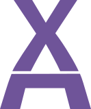
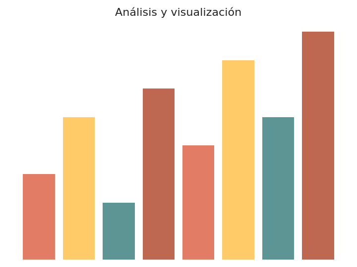
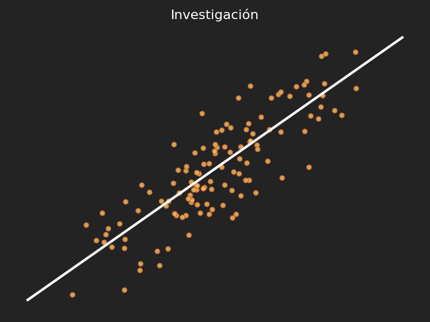

::: {.hero-container}
::: {.hero-image}
::: {.hero-text}
[Aprende con Alf]{.title-top style="display:block;"}
[Recursos educativos libres]{.title-byline style="display:block;"}
[Matemáticas, Estadística, Programación, Ciencia de Datos e IA para Educación Superior]{.title-subbyline style="display:block;"}

[<i class="bi bi-mortarboard-fill"></i> Empieza a aprender](docencia/index.qmd){.hero-cta}
:::

{.hero-logo fig-alt="Logotipo de Aprende con Alf"}
:::
:::

<!-- ================= DOCENCIA (banda teja) ================= -->

::: {.column-screen .band .rust}
::: {.home-column-image .col-left}
[{.home-img fig-alt="Gráfica de la campana de Gauss"}](docencia/index.qmd)
:::

::: {.home-column-text .col-right}

<h1 class="heading-home" style="color:#fff;">Docencia</h1>
[Apuntes, ejercicios y prácticas de mis asignaturas]{style="color:#fff; font-style:italic;"}

::: {.category-row}
::: {.category-column}

<h4><a class="white" href="docencia/estadistica/index.html">Estadística</a></h4>
:::
::: {.category-column}

<h4><a class="white" href="docencia/python/index.html">Python</a></h4>
:::
::: {.category-column}

<h4><a class="white" href="docencia/index.html">Todas</a></h4>
:::
:::
:::
:::

<!-- ================= BLOG (banda blanca) ================= -->

::: {.column-screen .band}
::: {.home-column-image .col-right}
[{.home-img fig-alt="Gráfico de barras"}](post/index.qmd)
:::

::: {.home-column-text .col-left}

<h1 class="heading-home">Blog</h1>
[Artículos, tutoriales y novedades]{style="font-style:italic;"}

::: {.category-row}
::: {.category-column}

<h4><a class="dark" href="post/index.html#category=Manual">Manuales</a></h4>
:::
::: {.category-column}

<h4><a class="dark" href="post/index.html#category=Noticias">Noticias</a></h4>
:::
::: {.category-column}

<h4><a class="dark" href="post/index.html">Todos</a></h4>
:::
:::
:::
:::

<!-- ================= PUBLICACIONES (banda oscura) ================= -->

::: {.column-screen .band .charcoal}
::: {.home-column-image .col-left}
[{.home-img fig-alt="Diagrama de dispersión con recta de regresión"}](publicaciones/index.qmd)
:::

::: {.home-column-text .col-right}

<h1 class="heading-home" style="color:#fff;">Publicaciones</h1>
[Artículos de investigación en Bioestadística y Aprendizaje Automático]{style="color:#fff; font-style:italic;"}

::: {.category-row}
::: {.category-column style="width:50%;"}

<h4><a class="white" href="publicaciones/index.html">Destacadas</a></h4>
:::
::: {.category-column style="width:50%;"}

<h4><a class="white" href="publicaciones/index.html">Lista completa</a></h4>
:::
:::
:::
:::

<!-- ================= PROYECTOS (banda blanca) ================= -->

::: {.column-screen .band}
::: {.home-column-text style="width:60%; margin:0 auto; float:none;"}

<h1 class="heading-home">Proyectos</h1>
[Software y herramientas que desarrollo y mantengo]{style="font-style:italic;"}

::: {.category-row}
::: {.category-column style="width:100%;"}

<h4><a class="dark" href="proyectos/index.html">Ver proyectos</a></h4>
:::
:::
:::
:::

<!-- ================= VALORES ================= -->

::: {.column-screen}
::: {.column-page}

<h1><i class="bi bi-heart-fill" style="color:#6f5499;"></i> Nuestros valores</h1>

:::

::: {.values-row}
::: {.value-card}
### <i class="bi bi-unlock-fill"></i> Apertura {.value-title}
Todos los materiales se publican como Recursos Educativos Libres, abiertos y reutilizables por cualquier persona.
:::
::: {.value-card}
### <i class="bi bi-patch-check-fill"></i> Rigor {.value-title}
Los contenidos se revisan y actualizan de forma continua para ofrecer explicaciones claras y bien fundamentadas.
:::
::: {.value-card}
### <i class="bi bi-clipboard-data-fill"></i> Aprendizaje práctico {.value-title}
Cada tema se acompaña de ejercicios resueltos y ejemplos con datos reales para aprender haciendo.
:::
:::
:::
