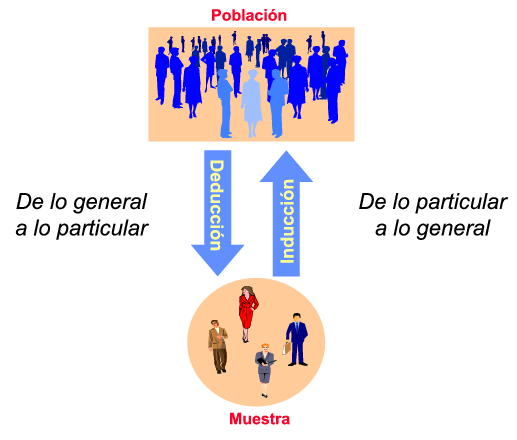
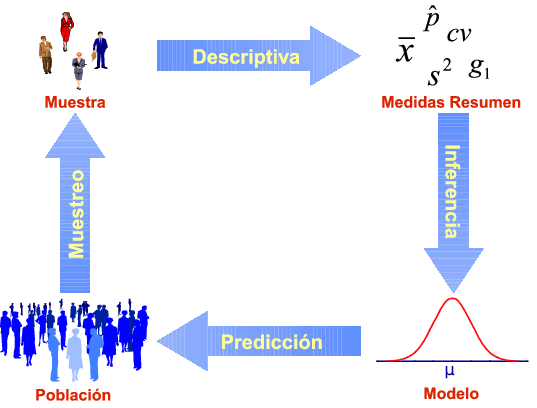

Introducción a la Estadística
=============================

La estadística como herramienta científica
------------------------------------------

### ¿Qué es la estadística?

[Estadística] La *estadística* es una rama de las matemáticas que se encarga de la recogida, análisis e interpretación de datos.

La estadística es imprescindible en cualquier disciplina científica o técnica donde se manejen datos, especialmente si son grandes volúmenes de datos, como por ejemplo, la física, la química, la medicina y las ciencias biosanitarias, pero también en la economía, la psicología o las ciencias sociales.

Pero, _¿por qué es necesaria la Estadística?_

### La variabilidad de nuestro mundo

El científico trata de estudiar el mundo que le rodea; un mundo que está lleno de variaciones que dificultan la determinación del comportamiento de las cosas.

La estadística actúa como disciplina puente entre la realidad del mundo y los modelos matemáticos que tratan de explicarla, proporcionando una metodología para evaluar las discrepancias entre la realidad y los modelos teóricos.

Esto la convierte en una herramienta indispensable en las ciencias aplicadas que requieran el análisis de datos y el diseño de experimentos.

Población y muestra
-------------------

### Población estadística

[Población] Una *población* es un conjunto de elementos definido por una o más características que tienen todos los elementos, y sólo ellos. Cada elemento de la población se llama *individuo*.

[Tamaño poblacional] El número de individuos de una población se conoce como *tamaño poblacional* y se representa como \(N\).

A veces, no todos los elementos de la población están accesibles para su estudio. Entonces se distingue entre:

Población Teórica:  
Conjunto de elementos a los que se quiere extrapolar los resultados del estudio.

Población Estudiada:  
Conjunto de elementos realmente accesibles en el estudio.

### Inconvenientes en el estudio de la población

El científico estudia un determinado fenómeno en una población para comprenderlo, obtener conocimiento sobre el mismo, y así poder controlarlo.

Pero, para tener un conocimiento completo de la población *es necesario estudiar todos los individuos de la misma*.

Sin embargo, esto no siempre es posible por distintos motivos:

-   El tamaño de la población es infinito, o bien es finito pero demasiado grande.

-   Las pruebas a que se someten los individuos son destructivas.

-   El coste, tanto de dinero como de tiempo, que supondría estudiar a todos los individuos es excesivo.

### Muestra estadística

Cuando no es posible o conveniente estudiar todos los individuos de la población, se estudia sólo una parte de la misma.

[Muestra] Una *muestra* es un subconjunto de la población.

[Tamaño muestral] Al número de individuos que componen la muestra se le llama *tamaño muestral* y se representa por \(n\).

Habitualmente, el estudio de una población se realiza a partir de muestras extraídas de dicha población.

Generalmente, el estudio de la muestra sólo aporta conocimiento aproximado de la población. Pero en muchos casos es *suficiente*.

### Determinación del tamaño muestral

Una de las preguntas más interesantes que surge inmediatamente es:

La respuesta depende de varios factores, como la variabilidad de la población o la fiabilidad deseada para las extrapolaciones que se hagan hacia la población. Por desgracia no se podrá responder hasta casi el final del curso.

En general, cuantos más individuos haya en la muestra, más fiables serán las conclusiones sobre la población, pero también será más lento y costoso el estudio.

### Determinación del tamaño muestral

#### Muestra pequeña de los píxeles de una imagen

¿De qué imagen se trata?

*¡Con una muestra pequeña es difícil averiguar el contenido de la imagen!*

### Determinación del tamaño muestral

#### Muestra mayor de los píxeles de una imagen

¿De qué imagen se trata?

*¡Con una muestra mayor es más fácil averiguar el contenido de la imagen!*

### Determinación del tamaño muestral

#### Población completa de los píxeles de una imagen

Y aquí está la población completa

*¡No es necesario conocer todos los píxeles para averiguar la imagen!*

### Tipos de razonamiento

### Tipos de razonamiento

Características de la deducción:  
Si las premisas son ciertas, garantiza la certeza de las conclusiones (es decir, si algo se cumple en la población, también se cumple en la muestra). Sin embargo,

Características de la inducción:  
No garantiza la certeza de las conclusiones (si algo se cumple en la muestra, puede que no se cumpla en la población, así que ¡cuidado con las extrapolaciones!), pero

La estadística se apoya fundamentalmente en el razonamiento inductivo ya que utiliza la información obtenida a partir de muestras para sacar conclusiones sobre las poblaciones.

Muestreo
--------

### Muestreo

[Muestreo] El proceso de selección de los elementos que compondrán una muestra se conoce como *muestreo*.

Para que una muestra refleje información fidedigna sobre la población global debe ser representativa de la misma.

### Modalidades de muestreo

Existen muchas técnicas de muestreo pero se pueden agrupar en dos categorías:

Muestreo Aleatorio  
Elección aleatoria de los individuos de la muestra. Todos tienen la misma probabilidad de ser elegidos (*equiprobabilidad*).

Muestreo No Aleatorio:  
Los individuos se eligen de forma no aleatoria.

Sólo las técnicas aleatorias evitan el sesgo de selección, y por tanto, garantizan la representatividad de la muestra extraída, y en consecuencia la validez de la inferencia.

Las técnicas no aleatorias no sirven para hacer generalizaciones, ya que no garantizan la representatividad de la muestra. Sin embargo, son menos costosas y pueden utilizarse en estudios exploratorios.

### Muestreo aleatorio simple

Dentro de las modalidades de muestreo aleatorio, el tipo más conocido es el *muestreo aleatorio simple*, caracterizado por:

-   Todos los individuos de la población tienen la misma probabilidad de ser elegidos para la muestra.

-   La selección de individuos es con reemplazamiento (y por tanto no se altera la población de partida).

-   Las sucesivas selecciones de un individuo son independientes.

La única forma de realizar un muestreo aleatorio es asignar un número a cada individuo de la población (*censo*) y realizar un sorteo aleatorio.

Variables estadísticas
----------------------

### Variables estadísticas y atributos

La característica objeto de estudio puede ser de dos tipos:

Atributos:  
De carácter cualitativo.

Variables estadísticas:  
De carácter cuantitativo.

A su vez, los atributos se dividen en:

Nominales:  
No existe un orden entre las modalidades.
Ejemplo: El color de ojos o de pelo.

Ordinales:  
Existe un orden entre las modalidades.
Ejemplo: El grado de gravedad de un paciente o la calificación de un curso.

Y las variables estadísticas en:

Discretas:  
Reciben valores aislados.
Ejemplo: El número de hijos o el número de coches.

Continuas:  
Pueden recibir cualquier valor de un intervalo.
Ejemplo: El peso o la estatura.

### La matriz de datos

Las variables o atributos a estudiar se medirán en cada uno de los individuos de la muestra, obteniendo un conjunto de datos que suele organizarse en forma de matriz que se conoce como .

En esta matriz cada columna contiene la información de una variable y cada fila la información de un individuo.

**Ejemplo**

|Nombre|Edad|Sexo|Peso|Estatura|
|José Luis Martínez|18|H|85|179|
|Rosa Díaz|32|M|65|173|
|Javier García|24|H|71|181|
|Carmen López|35|M|65|170|
|Marisa López|46|M|51|158|
|Antonio Ruiz|68|H|66|174|

Fases del análisis estadístico
------------------------------

### Fases del análisis estadístico

Normalmente un estudio estadístico pasa por las siguientes etapas:

1.  El estudio comienza por el diseño previo del mismo en el que se establezcan los objetivos del mismo, se determinen de las variables que se medirán en los individuos de la población y cuáĺ será el tamaño muestral requerido.

2.  A continuación se seleccionará una muestra representativa del tamaño establecido. De esto se encarga el **muestreo**.

3.  El siguiente paso consiste en estudiar las muestras extraídas y obtener resultados numéricos que resuman la información contenida en las mismas. De esto se encarga la **estadística descriptiva**.

4.  La información obtenida es proyectada sobre un modelo matemático que intenta reflejar el comportamiento de la población. Tras construir el modelo, se realiza una crítica del mismo para validarlo. De todo esto se encarga la **inferencia estadística**.

5.  Finalmente, el modelo validado nos permite hacer suposiciones y predicciones sobre la población de partida con cierta confianza.

### El ciclo estadístico

 
