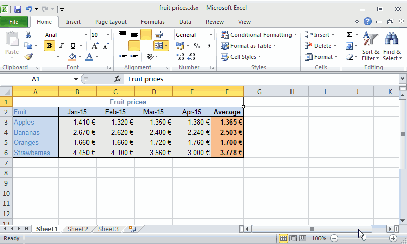

Content of cells can be formatted in many ways: changing the data type, the font family, the alignment, the color, the border, etc. Most formatting options are grouped in the *Format Cells* dialog. To show this dialog click the bottom right corner of the Font panel in the Home tab of the ribbon.

## Data types
Excel manages several data types. The most common are numbers, dates and times, and text. All available data types are in the `Number tab` of the Format Cells dialog. 

 

### Formatting numbers
By default cells with numeric content are of type *Number*, but there are other numeric types like *Currency* and *Accounting*. Number is used for general display of numbers, while Currency and Accounting are used for monetary values. In all cases you can specify the number of decimal places. For monetary values you can also specify the symbol for the currency (€ by default). 

**Example**. The next table shows the price of fruits during several months and the average price. The animation shows how to change the format of prices to currency type with 3 decimal places. 

 

### Formatting dates and times
By default cells with content following the pattern `day/month/year` are of type *Date*, but there are a lot of ways of formatting dates, like for example, `year-month-day` or `day-month_name-year` etc. 

**Example**. The next table shows the price of fruits during several months and the average price. The animation shows how to change the format of dates following the pattern Month-Year, with the three first letters of months and the two last digits of years. 

 

By default cells with content following the pattern `hours:minutes:seconds` are of type *Time*, but there are a several ways of formatting times.

### Formatting text
By default cells with non numeric content are of type *Text*. It's possible to apply this type even to numbers, like for example phone numbers. 

Text entered in a cell spreads to adjacent cells to the right if these cells have no content. To confine text to a certain width in the cell, select the cell and click the button `Wrap Text` in the Alignment section on the Home tab of the ribbon. 

## Align cell contents
By default numbers are aligned to the right and text to the left, but it's possible to change the alignment of cell contents in the `Alignment tab` of the Format Cells dialog.  

 

### Horizontal alignment
To change the horizontal alignment select Left, Right, Center or Justify in the Horizontal drop down list of the `Alignment tab`. You can also align the cell contents with the buttons of the Alignment panel in the Home tab of the ribbon. 

 

**Example**. The next table shows the price of fruits during several months and the average price. The animation shows how to align the average prices centered. 

 

### Vertical alignment
To change the vertical alignment select Top, Bottom, Center or Justify in the Vertical drop down list of the `Alignment tab`. You can also align the cell contents with the buttons of the Alignment panel in the Home tab of the ribbon. 

 

## Font properties
To format the font of cell contents select the font family, font style, font size and font color from the `Font tab` of the Format Cells dialog. You can also apply some effects like underline, superscript and subscript. 

 

It's also possible to change the font family, style, size and color from the Font panel in the Home tab of the ribbon, and also with the contextual toolbar that appears right-clicking the cell. 

**Example**. The next table shows the price of fruits during several months and the average price. The animation shows how to change the font family of all table to Arial, size 10 pt.

 

The next animation shows how to change the font style of average prices to bold and the color of fruits names to blue.

 

## Borders and background
To format the borders of cells select the line style and color, and click the borders where to apply that line in the table of the `Borders tab` in the Format Cells dialog. 

 

It's also possible to change the border of cells with the `Border button`  of the Font panel in the Home tab of the ribbon, and also with the contextual toolbar that appears right-clicking the cell. 

**Example**. The next table shows the price of fruits during several months and the average price. The animation shows how to put lines to some cell borders.

 

To format the background of cells select the background color and pattern style in the `Fill tab` of the Format Cells dialog. 

 

It's also possible to change the background color of cells with the `Background colour` button   of the Font panel in the Home tab of the ribbon, and also with the contextual toolbar that appears right-clicking the cell.  

**Example**. The next table shows the price of fruits during several months and the average price. The animation shows how set the background colour of some cells.

 

## Merge cells
To merge several cells in one, select the range of cells and click the button `Merge & Cener` in the Alignment section on the Home tab of the ribbon. If there are more than one cell with content in the range, merging will keep the upper-left most data only. By default content of merged cells is centered.

**Example**. The next table shows the price of fruits during several months and the average price. The animation shows how merge the cells of the first row and center the title. 
 

 

## Copy and paste format
To apply the format of a cell to others select the cell, click the `Format painter` button   to copy the cell format. Then then select the range of cells to paste the that format.

**Example**. The next table shows the price of fruits during several months and the average price. The animation shows how to apply the same format of the fruit rows to a new row for pineapples. 

 

## Conditional formatting
Excel allows to apply a format to a cell depending according to some rules. To set a new rule click the `Conditional Formatting` button and select `New Rule`. There are different types of rules:

- **Format all cells based on their value** Applies a format style based on the value of the cell. There are 4 types of styles: 
  - *2-Color Scale* Applies a colour in a continuous scale ranging from one colour for the minimum value or percentage to other colour for the maximum value or percentage.
	
	**Example**. The next table shows the price of fruits during several months and the average price. The animation shows how to apply to prices a colour background in a continuous scale from green (the minimum price) to red (the maximum price).

	

	
	

	 

  - *3-Color Scale* The same than 2-Color Scale but with a third intermediate colour in the scale.

  - *Data bar* Plots an horizontal bar in each cell with a with proportional to the value of the cell. 

	**Example**. The next table shows the price of fruits during several months and the average price. The animation shows how to apply to prices a data bar format.

	

	
	/div>
	 

  - *Icon Sets* Divide the distribution of selected cell values in several parts according to intervals or percentiles, assign an different icon to each part, and plot the corresponding icon in each cell.   

	**Example**. The next table shows the price of fruits during several months and the average price. The animation shows how to apply to prices an icon set format. The icon set has three icons: red is applied to values under the 33 percentile, yellow is applied to values between 33 and 67 percentiles, and green is applied to values over 67 percentile. 

	

	
	

	 

- **Format only cells that contain** Applies a format to the cell if satisfies a logical condition. 

**Example**. The next table shows the price of fruits during several months and the average price. The animation shows how to apply to prices higher than 2 € a red colour.

 

- **Format only top or bottom ranked values** Applies a format to a number or percentage of top or bottom values.

**Example**. The next table shows the price of fruits during several months and the average price. The animation shows how to apply to the three top higher prices a red colour.

 

- **Format only values that are above or below average** Applies a format to cells with values above or below the average of selected cells.

**Example**. The next table shows the price of fruits during several months and the average price. The animation shows how to apply a red colour to prices above the average and a green colour to prices below the average. 

 

- **Format only values that are above or below average** Applies a format to cells with values above or below the average of selected cells.

**Example**. The next table shows the price of fruits during several months and the average price. The animation shows how to apply a red colour to prices above the average and a green colour to prices below the average. 

 

## Predefined styles
Excel has a lot of predefined styles for formatting cells and tables. To apply a predefined cell style click `Cell Styles` button and select the desired style. It's possible to define new cell styles. For this select the cell with the format to define as a style, click `Cell Styles` button
and select `New Cell Style...` option. In the dialog that appears just give a name to the new style, press OK, and the new cell style will appear in the cell styles menu.

To apply a predefined table style click `Format as Table` button and select de desired style. It's also possible to define new table styles. For this click `Cell Styles` button and select `New Cell Style...` option. In the dialog that appears just give a name to the new style, define the table format (font, borders and fill), press OK, and the new table style will appear in the table styles menu.

