Spreadsheets are used mainly for doing calculations and one of the most powerful features of spreadsheets are calculation formulas. In this section we will see how to use them. 

## Enter formulas
To enter a formula in a cell always start typing an equal sign `=` and then the formula expression. 

Formula expressions can contain arithmetic operators: addition `+`, subtraction `-`, multiplication `*`, division `/` and powers `^` and named predefined functions like `SUM`, `EXP`, `SIN`, etc. This allow to use Excel as a calculator. When Excel evaluates expressions first evaluate named fórmulas, then powers, then products and quotients, and finally additions and subtractions, but it's possible to use parenthesis to force the evaluation of a subexpression before. 

**Example**. The next animation shows how to enter the formula 4+2 in cell A1, the fórmula 4-2 in cell B1, the fórmula 4\*2 in cell C1, the formula 4/2 in cell D1, the formula 4^2 in cell E1 and the formula ((4+1)*2)^3 in cell F1.

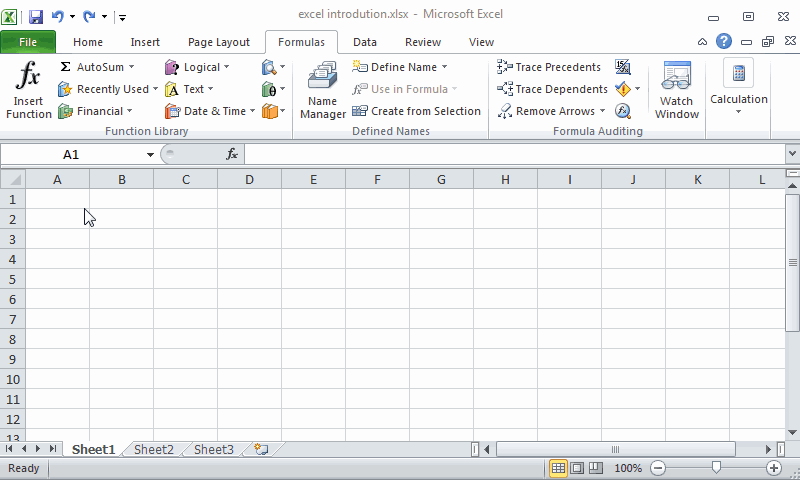

&nbsp;
  
  

## Using relative and absolutes cell references in formulas
Formula expressions can content references to cells. When Excel evaluates formulas it replace every cell reference by its content before doing the calculation.

**Example**. The next animation shows how to use the formula `=A1+B1` to add uExcel has a huge library of predefined functions that performs different calculations organised by categories.p the content of cells A1 and B1 in cell C1.

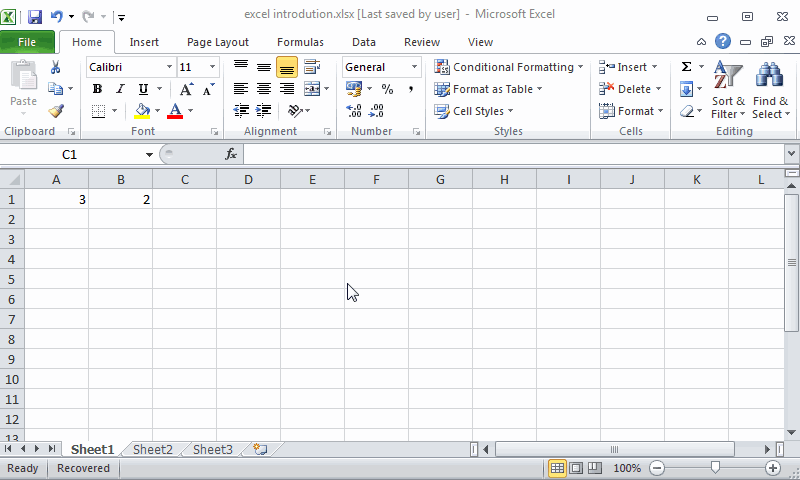

&nbsp;

References that are formed by the name of the cell or range are known as *relative references*, because referenced cells change When you copy a cell with a formula and paste in another cell. In general, when you copy a formula $n$ columns to the right and $m$ rows down, the referenced cells in the formulas will be updated by the cells $n$ columns to the right and $m$ rows down, an the same if you copy the cell to the left or top.    

**Example**. The next animation shows how to copy the formula `=A1+B1` in cell C1, with relative references to A1 and B1, to the cell E4, that is 2 columns to the right and 3 rows down. Observe how the formula in cell E4 is updated to `=C4+D4`. 

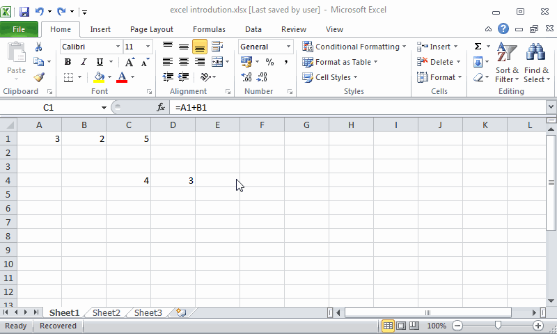

&nbsp;

A common way of copying the formula of a cell to adjacent cells is clicking the bottom-right corner of the cell and dragging the mouse pointer to the desired range of cells. 

**Example**. The next animation shows how to generate the first ten numbers of the Fibonacci serie. Cells A1 and B1 contains the two first numbers of the serie and cell C1 the formula `=A1+B1` that add the two first numbers up and gives the third number of the serie. For generating the rest of the serie it is enough to copy the formula of cell C1 to the range D1:J1. Observe how references in formulas of these cells are updated.  

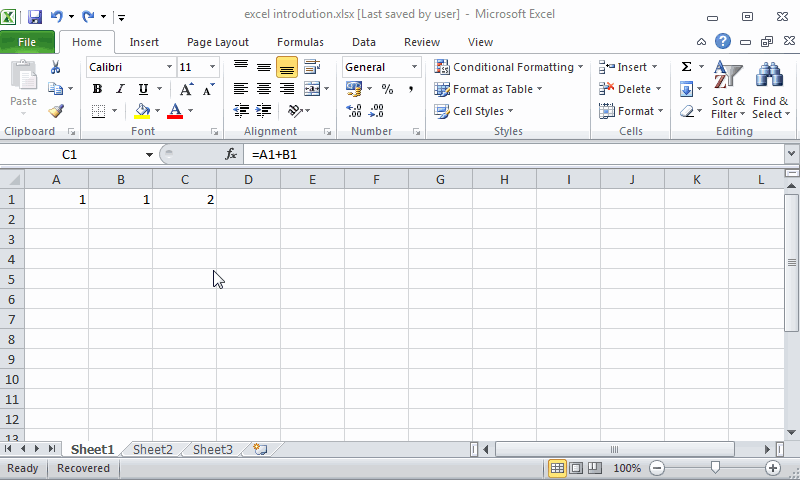

&nbsp;

Although relative references are very helpful in many cases, sometimes we need the references in a formula to remain fixed when copied elsewhere.  
In that case we need to use *absolute references*, that are like relative references but use the dollar symbol `$` to fix either the row, the column or both on any cell reference, by preceding the column or row with the dollar sign.

**Example**. The next animation shows how to calcule the IVA of a list of prices. Cells A2 to A5 contains the prices and cell F1 contains the IVA percentage. For calculating the IVA of firs price we use the formula `A2*F$4/100` where we fix the row of cell F4 because we wan it remain fixed when copying the formula down. Observe how the reference to cell F4 dosen't change when copying the formula down.   

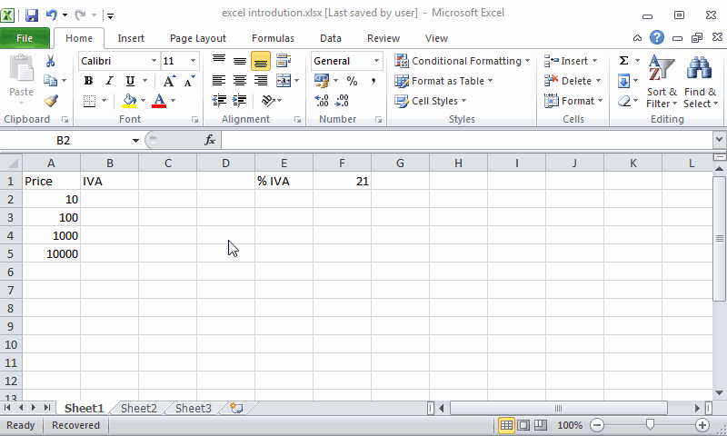

&nbsp;

**Example**. The next animation shows how to calcule the multiplication table using absolute references. 

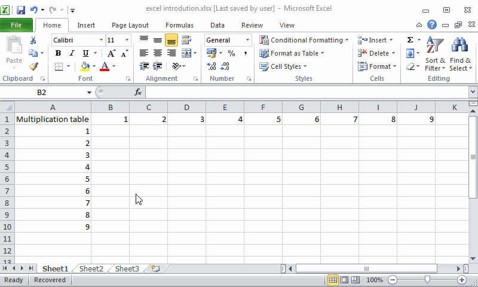

&nbsp;

Cell references are somewhat abstract, and don't really communicate anything about the data they contain. This makes formulas that involve multiple references difficult to understand. To overcome this difficulty Excel allows to give name to cells or ranges. To define a cell or range name, select or cell range and click the `Define Name` button of the `Defined Names` panel in the `Formulas` tab of the ribbon. In the dialog that appears give a name to the cell and click OK. Cell or range names must begin with a letter and can't include spaces. 

You can also set the name of a cell or range in the name box of the input bar. 

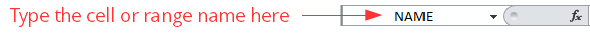

&nbsp;

After that you can use that cell o range name in any formula. Observe that references with names are always absolutes.  
   
**Example**. The next animation shows how to calcule the IVA of a list of prices using a cell name for the cell that contains the IVA percentage. 

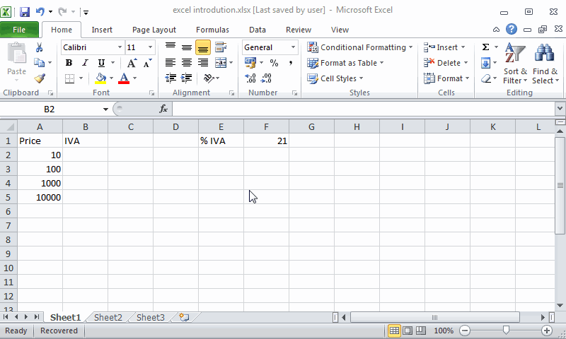

&nbsp;

## Basic functions
Excel has a huge library of predefined functions that performs different calculations organised by categories. There are three ways to to enter a function in a formula expression:

- Type it rawly if you know its name and syntax. 
- Select it from the buttons of the `Functions Library` panel in the `Formulas` tab of the ribbon. 

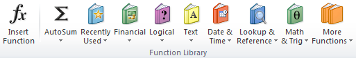

&nbsp;
  
- Click the `Insert Function` button 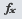 from the input bar. This will show you a dialog where you can type some key words for looking the desired function an select it. This dialog also shows help about the function and its syntax. 

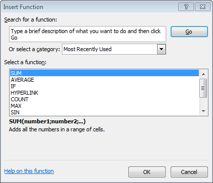

&nbsp;

### Sum function
The most common function is `SUM` that calculates the sum of numbers in one or several cell ranges. Its syntax is `SUM(range1;range2;...)` where *range1, range2*, etc. are the cell ranges to add up. 

**Example** The next animation shows how to calculate the sum of the subject grades for every student in a course. 

&nbsp;

### Count function 
The `COUNT` function counts the number of cells with numbers in a range.  Its syntax is `COUNT(range1;range2;...)` where *range1, range2*, etc. are the cell ranges to count. 

**Example** The next animation shows how to calculate the number of subjects grades for every student in a course. 

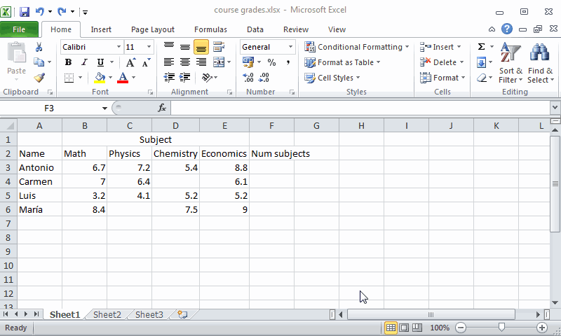

&nbsp;

### Average function
The `AVERAGE` function calculates the arithmetic mean of numbers in one or several cell ranges. Its syntax is `AVERAGE(range1;range2;...)` where *range1, range2*, etc. are the cell ranges to calculate their average. 

**Example** The next animation shows how to calculate the average grade for every student in a course. Observe that the average grade is well calculated even when there are blank cells in the range.  

&nbsp;

### Min function
The `Min` function calculates the minimum value of numbers in one or several cell ranges. Its syntax is `MIN(range1;range2;...)` where *range1, range2*, etc. are the cell ranges to calculate their minimum. 

**Example** The next animation shows how to calculate the minimum grade for every student in a course.

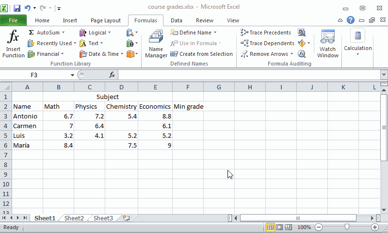

&nbsp;

### Max function
The `MAX` function calculates the maximum value of numbers in one or several cell ranges. Its syntax is `MAX(range1;range2;...)` where *range1, range2*, etc. are the cell ranges to calculate their maximum. 

**Example** The next animation shows how to calculate the maximum grade for every student in a course.

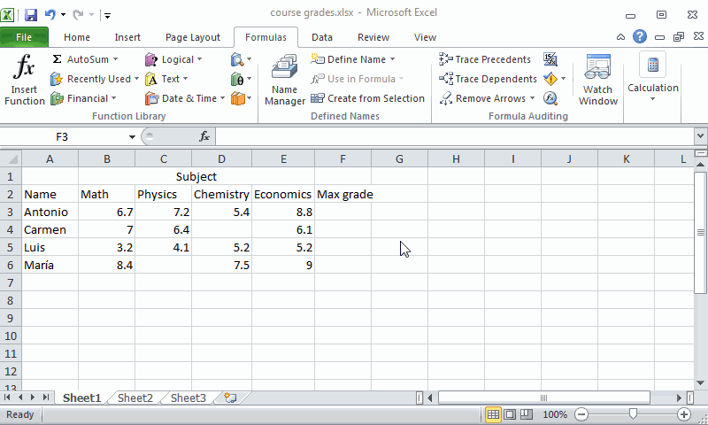

&nbsp;

## Logical functions
Logical functions are very useful to make decisions. 

### If function
The most important logical function is the `IF` functions, that checks whether a condition is met and returns a value if is true or another value if is false. Its syntax is `IF(condition;true_value;false_value)`, where *condition* is the logical condition to test, *true_value* is the returned value if the condition is true, and *false_value* is the returned value if the condition is false. 

In the logical condition expression you use logical operators like equal `=`, not equal `<>`, greater `>`, less, `<`, greater or equal `>=`, less or equal `<=`, etc. In the true or false value you can put numbers, text with double quotes dates, cell references or other formulas. 

**Example** The next animation shows how to decide if students pass or don't pass a course depending on whether the average grade is greater than or equal to 5.

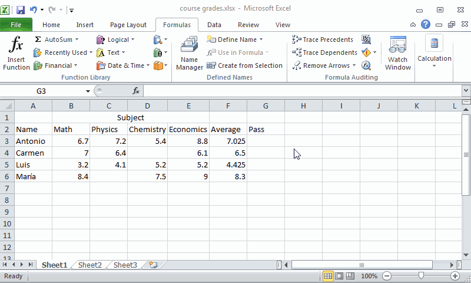

&nbsp;

## Database functions

## Statistical functions

## Financial functions

