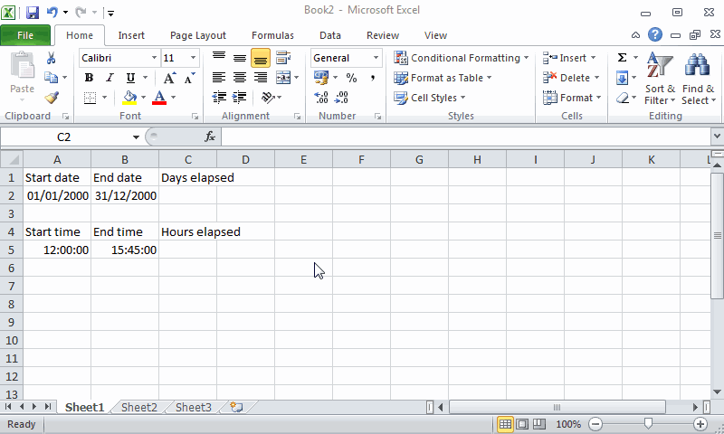
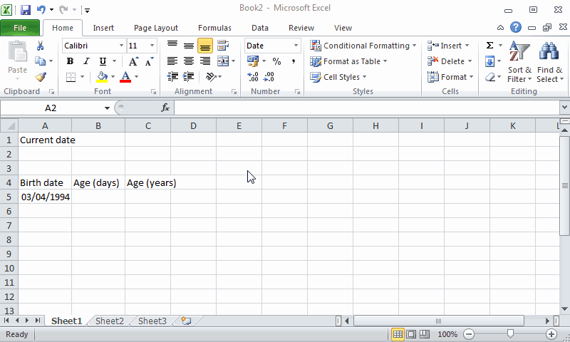
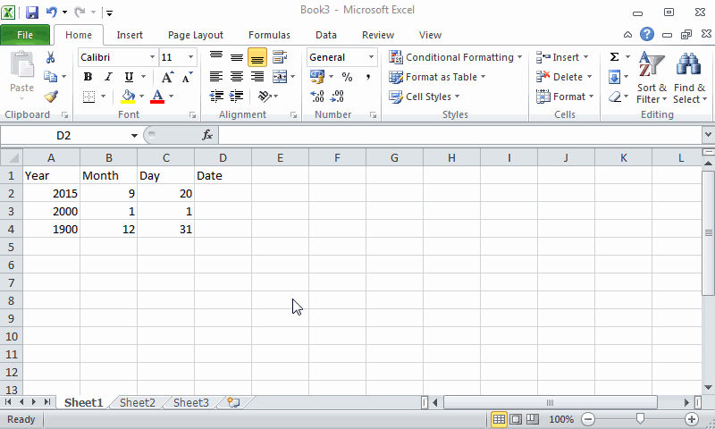
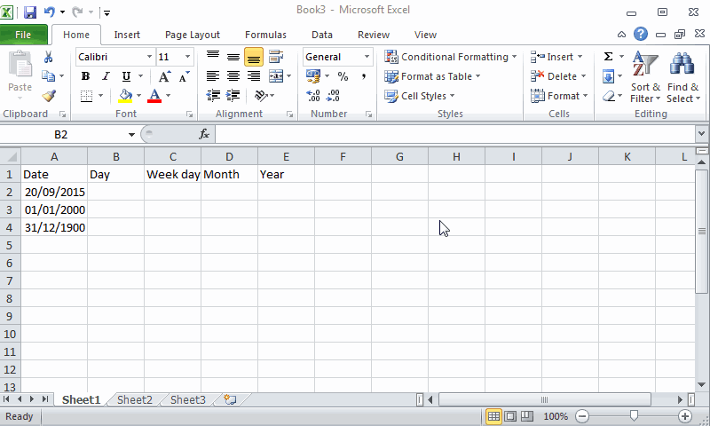
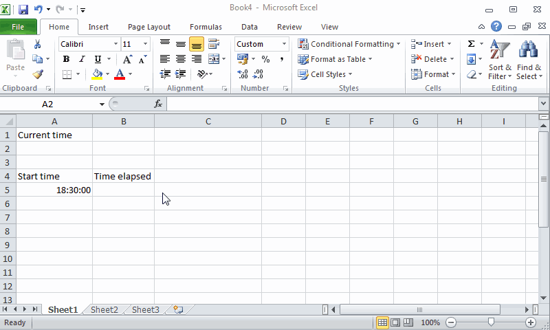
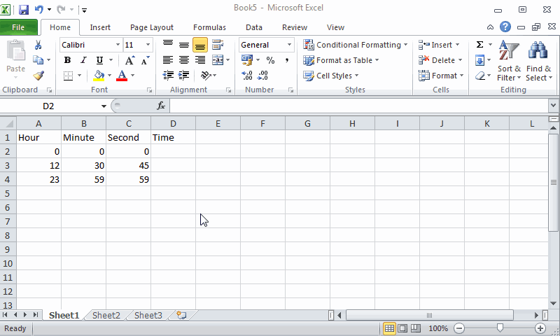
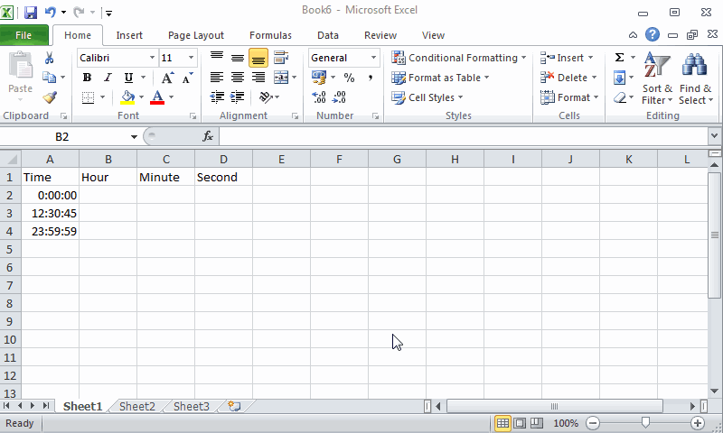

Spreadsheets are used mainly for doing calculations and one of the most powerful features of spreadsheets are calculation formulas. In this section we will see how to use them. 

## Enter formulas
To enter a formula in a cell always start typing an equal sign `=` and then the formula expression. 

Formula expressions can contain arithmetic operators: addition `+`, subtraction `-`, multiplication `*`, division `/` and powers `^` and named predefined functions like `SUM`, `EXP`, `SIN`, etc. This allow to use Excel as a calculator. When Excel evaluates expressions first evaluate named formulas, then powers, then products and quotients, and finally additions and subtractions, but it's possible to use parenthesis to force the evaluation of a subexpression before.

**Example** Assuming that cells A1, B1 and C1 contain the values 6,3 and 2 respectively, the next table shows some formulas and their respective results. 

| Formula  | Result |
|:--------:|:------:|
|A1+B1-C1  | 7      |
|A1+B1*C1  | 12     |
|(A1+B1)*C1| 18     |
|A1/B1-C1  | 0      |
|A1/(B1-C1)| 6      |
|A1+B1^C1  | 15     |
|(A1+B1)^C1| 81     | 

 

**Example**. The next animation shows how to enter the formula 4+2 in cell A1, the formula 4-2 in cell B1, the formula 4\*2 in cell C1, the formula 4/2 in cell D1, the formula 4^2 in cell E1 and the formula ((4+1)*2)^3 in cell F1.

&nbsp;
  

## Using relative and absolutes cell references in formulas
Formula expressions can content references to cells. When Excel evaluates formulas it replace every cell reference by its content before doing the calculation.

**Example**. The next animation shows how to use the formula `=A1+B1` to add uExcel has a huge library of predefined functions that performs different calculations organised by categories.p the content of cells A1 and B1 in cell C1.

&nbsp;

References that are formed by the name of the cell or range are known as *relative references*, because referenced cells change When you copy a cell with a formula and paste in another cell. In general, when you copy a formula $n$ columns to the right and $m$ rows down, the referenced cells in the formulas will be updated by the cells $n$ columns to the right and $m$ rows down, an the same if you copy the cell to the left or top.    

**Example**. The next animation shows how to copy the formula `=A1+B1` in cell C1, with relative references to A1 and B1, to the cell E4, that is 2 columns to the right and 3 rows down. Observe how the formula in cell E4 is updated to `=C4+D4`. 

&nbsp;

A common way of copying the formula of a cell to adjacent cells is clicking the bottom-right corner of the cell and dragging the mouse pointer to the desired range of cells. 

**Example**. The next animation shows how to generate the first ten numbers of the Fibonacci serie. Cells A1 and B1 contains the two first numbers of the serie and cell C1 the formula `=A1+B1` that add the two first numbers up and gives the third number of the serie. For generating the rest of the serie it is enough to copy the formula of cell C1 to the range D1:J1. Observe how references in formulas of these cells are updated.  

&nbsp;

Although relative references are very helpful in many cases, sometimes we need the references in a formula to remain fixed when copied elsewhere.  
In that case we need to use *absolute references*, that are like relative references but use the dollar symbol `$` to fix either the row, the column or both on any cell reference, by preceding the column or row with the dollar sign.

**Example**. The next animation shows how to calculate the IVA of a list of prices. Cells A2 to A5 contains the prices and cell F1 contains the IVA percentage. For calculating the IVA of first price we use the formula `A2*F$4/100` where we fix the row of cell F4 because we wan it remain fixed when copying the formula down. Observe how the reference to cell F4 dosen't change when copying the formula down.   

&nbsp;

**Example**. The next animation shows how to calculate the multiplication table using absolute references. 

&nbsp;

Cell references are somewhat abstract, and don't really communicate anything about the data they contain. This makes formulas that involve multiple references difficult to understand. To overcome this difficulty Excel allows to give name to cells or ranges. To define a cell or range name, select or cell range and click the `Define Name` button of the `Defined Names` panel in the `Formulas` tab of the ribbon. In the dialog that appears give a name to the cell and click OK. Cell or range names must begin with a letter and can't include spaces. 

You can also set the name of a cell or range in the name box of the input bar. 

&nbsp;

After that you can use that cell o range name in any formula. Observe that references with names are always absolutes.  
   
**Example**. The next animation shows how to calculate the IVA of a list of prices using a cell name for the cell that contains the IVA percentage. 

&nbsp;

## Basic functions
Excel has a huge library of predefined functions that performs different calculations organised by categories. There are three ways to to enter a function in a formula expression:

- Type it rawly if you know its name and syntax. 
- Select it from the buttons of the `Functions Library` panel in the `Formulas` tab of the ribbon. 

&nbsp;
  
- Click the `Insert Function` button  from the input bar. This will show you a dialog where you can type some key words for looking the desired function an select it. This dialog also shows help about the function and its syntax. 

&nbsp;

### SUM function
The most common function is `SUM` that calculates the sum of numbers in one or several cell ranges. Its syntax is `SUM(range1;range2;...)` where *range1, range2*, etc. are the cell ranges to add up. 

**Example** The next animation shows how to calculate the sum of the subject grades for every student in a course. 

&nbsp;

### COUNT function 
The `COUNT` function counts the number of cells with numbers in a range.  Its syntax is `COUNT(range1;range2;...)` where *range1, range2*, etc. are the cell ranges to count. 

**Example** The next animation shows how to calculate the number of subjects grades for every student in a course. 

&nbsp;

### MIN function
The `Min` function calculates the minimum value of numbers in one or several cell ranges. Its syntax is `MIN(range1;range2;...)` where *range1, range2*, etc. are the cell ranges to calculate their minimum. 

**Example** The next animation shows how to calculate the minimum grade for every student in a course.

&nbsp;

### MAX function
The `MAX` function calculates the maximum value of numbers in one or several cell ranges. Its syntax is `MAX(range1;range2;...)` where *range1, range2*, etc. are the cell ranges to calculate their maximum. 

**Example** The next animation shows how to calculate the maximum grade for every student in a course.

&nbsp;

## Logical functions
Logical functions are very useful to make decisions. 

### If function
The most important logical function is the `IF` functions, that checks whether a condition is met and returns a value if is true or another value if is false. Its syntax is `IF(condition;true_value;false_value)`, where *condition* is the logical condition to test, *true_value* is the returned value if the condition is true, and *false_value* is the returned value if the condition is false. 

In the logical condition expression you use logical operators like equal `=`, not equal `<>`, greater `>`, less, `<`, greater or equal `>=`, less or equal `<=`, etc. In the true or false value you can put numbers, text with double quotes dates, cell references or other formulas. 

**Example** The next animation shows how to use the IF function to decide if students pass or don't pass a course depending on whether the average grade is greater than or equal to 5.

&nbsp;

### And function
The `AND` function will return TRUE if all its arguments are true and FALSE if at least one argument is false. Its syntax is `AND(contidion1;condition2;...)`, where *condition1, condition2,* etc are logical conditions. 

The following table, known as a *truth table*, shows the returned value by the function according to the corresponding values of its arguments.

| A  | B  | AND(A;B) |
|:--:|:--:|:--------:|
|TRUE|TRUE|   TRUE   |
|TRUE|FALSE| FALSE   |
|FALSE|TRUE| FALSE   |
|FALSE|FALSE| FALSE  |

&nbsp;

**Example**. The next animation shows how to use the AND function to see which students have passed all the subjects of a course with a grade greater than or equal to 5. Observe that conditions that involve blank cells are always false. 

&nbsp;

### Or function
The `OR` function will return TRUE if one or more of its arguments are true and FALSE if all its arguments are false. Its syntax is `OR(contidion1;condition2;...)`, where *condition1, condition2,* etc are logical conditions. 

The following truth table shows the returned value by the function according to the corresponding values of its arguments.

| A  | B  | OR(A;B) |
|:--:|:--:|:--------:|
|TRUE|TRUE|   TRUE   |
|TRUE|FALSE| TRUE   |
|FALSE|TRUE| TRUE   |
|FALSE|FALSE| FALSE  |

&nbsp;

**Example**. The next animation shows how to use the OR function to see which students have not passed some subjects of a course with a grade greater than or equal to 5.

&nbsp;

### Not function
The `NOT` function will return TRUE if its argument is FALSE, and FALSE if its argument is TRUE. Its syntax is `NOT(contidion)`, where *condition* is a logical condition. 

The following truth table shows the returned value by the function according to the corresponding values of its argument.

| A  | NOT(A) |
|:--:|:--------:|
|TRUE|   FALSE  |
|FALSE|  TRUE   |

&nbsp;

## Date and time functions
Date and time functions performs operations with dates and times respectively.

Excel convert automatically any entry with with a date or time formats into a serial number. For dates, this serial number represents the number of days that have elapsed since the beginning of the twentieth century (so that January 1, 1900, is serial number 1; January 2, 1900, is serial number 2; and so on). For times, this serial number is a fraction that represents the number of hours, minutes, and seconds that have elapsed since midnight (so that  00:00:00 is serial number 0.00000000, 12:00:00 p.m. (noon) is serial number 0.50000000; 11:00:00 p.m. is 0.95833333; and so on).

### Time elapsed between two dates or times.   
To calculate the time elapsed between two dates or times, just enter a formula that subtracts the earlier date or time from the later date or time.
In the case of dates, Excel will return the number of days between these dates. If you want to express it in year units, just divide the number of days by 365.25. In the case of times, Excel will return the number of hours between these times. If you want to express it in days unit, just change the cell format to General. 

**Example**. The next animation shows how to calculate the time elapsed between two dates and two times.

&nbsp;

### TODAY function
The function `TODAY` returns the system date (usually the current date). Its syntax is `TODAY()` and this functions doesn't have arguments. 

**Example**. The next animation shows how to calculate current age of a person using the TODAY function.

&nbsp;

### DATE function 
The function `DATE` returns a date serial number for the date specified by the year, month, and day argument. Its syntax is `DATE(year,month,day)`, where *year* is the year, *month* is the month (in number) and *day* is the day.

**Example**. The next animation shows how to calculate the date given the year, moth and day.

&nbsp;

### DAY, WEEKDAY, MONTH and YEAR functions
The `DAY` function returns the day of the month of a date. Its' syntax is `DAY(date)`, where *date* is the serial number of the date. 

The `WEEKDAY` function returns the day of the week of a date. Its' syntax is `WEEKDAY(date;type)`, where *date* is the serial number of the date and *type* has three possible values (1: 1 equals Sunday and 7 Saturday, 2: 1 equals Monday and 7 equals Sunday; 3: 0 equals Monday and 6 equals Sunday).

The `MONTH` function returns the number of the month of a date. Its' syntax is `MONTH(date)`, where *date* is the serial number of the date. 

The `YEAR` function returns the year of a date. Its' syntax is `YEAR(date)`, where *date* is the serial number of the date. 

**Example**. The next animation shows how to calculate the day, week day, month and year of a date. 

&nbsp;

### NOW function
The function `NOW` returns the system time (usually the current time). Its syntax is `NOW()` and this functions doesn't have arguments. 

**Example**. The next animation shows how to calculate current age of a person using the TODAY function.

&nbsp;

### TIME function 
The function `TIME` returns a time serial number for the time specified by the hours, minutes and seconds argument. Its syntax is `TIME(hours,minutes,seconds)`, where *year* is the year, *month* is the month (in number) and *day* is the day.

**Example**. The next animation shows how to calculate the date given the year, moth and day.

&nbsp;

### HOUR, MINUTE and SECOND functions
The `HOUR` function returns the hour of a time. Its' syntax is `HOUR(time)`, where *time* is the serial number of the time. 

The `MINUTE` function returns the minute of a time. Its' syntax is `MINUTE(time)`, where *time* is the serial number of the time. 

The `SECOND` function returns the hour of a time. Its' syntax is `SECOND(time)`, where *time* is the serial number of the time. 

**Example**. The next animation shows how to calculate the hour, minute and second of a time. 

&nbsp;

## Database functions
See the section of [Database functions](office/excel/manual/databases.html#Databasefunctions) 

## Statistical functions

### AVERAGE function
The `AVERAGE` function calculates the arithmetic mean of numbers in one or several cell ranges. Its syntax is `AVERAGE(range1;range2;...)` where *range1, range2*, etc. are the cell ranges to calculate their average. 

**Example** The next animation shows how to calculate the average grade for every student in a course. Observe that the average grade is well calculated even when there are blank cells in the range.  

&nbsp;

## Financial functions
Excel contains a bunch of financial functions for determining such things as the present and future value of an investment; the payment, number of periods, or the principal or interest part of a payment on an loan or the rate of return on an investment.

# PV function
The `PV` function returns the present value of an investment, that is the total amount that a series of future payments is worth presently. Its syntax is `PV(rate,nper,pmt,fv,style)`.   

When using financial functions, keep in mind that the fv, pv, and pmt arguments can be positive or negative, depending on whether you’re receiving the money (as in the case of an investment) or paying out the money (as in the case of a loan). Also keep in mind that you want to express the rate argument in the same units as the nper argument, so that if you make monthly payments on a loan and you express the nper as the total number of monthly payments, as in 360 (30 x 12) for a 30-year mortgage, you need to express the annual interest rate in monthly terms as well. For example, if you pay an annual interest rate of 7.5 percent on the loan, you express the rate argument as 0.075/12 so that it is monthly as well.

For more sophisticated functions you can activate the Analysis ToolPak add-in, and you will get over 30 specialised financial functions. 

 

