Excel is a spreadsheet application that is part of Microsoft Office suite.

## What is a spreadsheet?
A spreadsheet is a program that allows to enter data and make calculations with them in a grid layout. 

## Excel 2010 main window
The next picture shows a screenshot of the Excel 2010 main window where the different parts of the window have been highlighted.
 

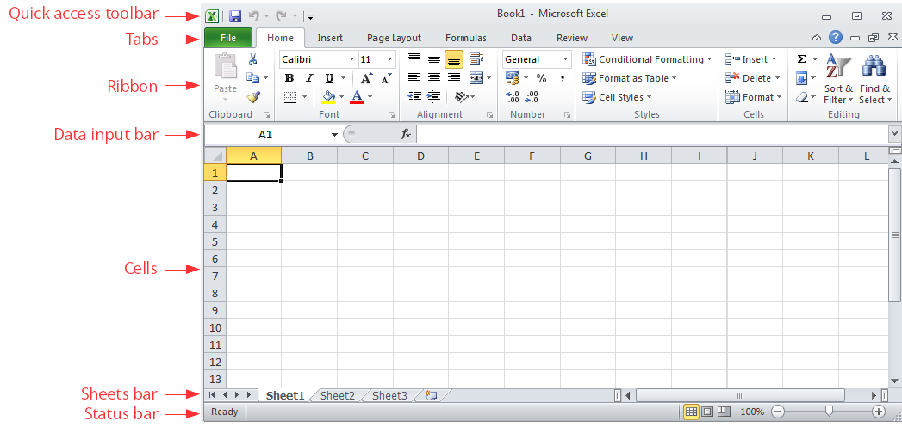

## Excel 2010 ribbon
The top ribbon of Excel 2010 contains a lot of buttons that performs different actions. These buttons are arranged in panels, and panels are arranged in tabs. The main ribbon tabs are: 

**File** – Performs file management tasks (new file, open file, save file, print file, etc.). It also contains general configuration options and help. 

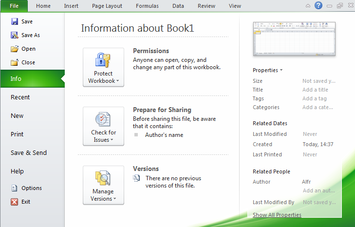

 

**Home** – Common tools (clipboard, fonts, alignment, numbers format, insert rows and columns, etc.)

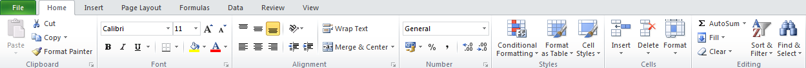

 

**Insert** – Insert objects in the sheet (tables, illustrations, charts, hyperlinks, text, equations, etc.) 

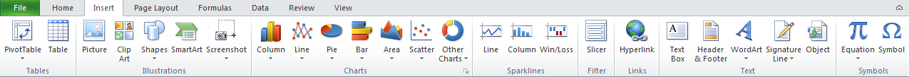

 

**Page Layout** – Configure the printing (page setup, scale, themes, etc. )

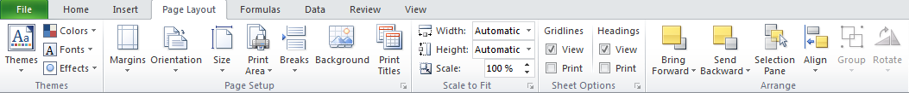

 

**Formulas** – Functions arranged in categories and formula auditing. 

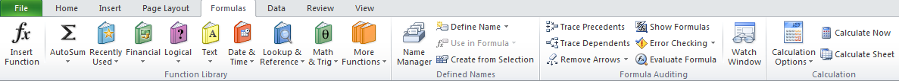

 

**Data** – Working with databases (import data, connection with databases, sort and filter data, data validation, etc.)

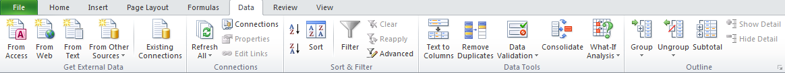

 

**Review** – Spelling, commenting, protecting and sharing sheets. 

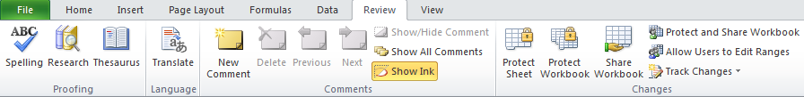

 

**View** – How Excel appears on screen (custom windows, grids lines, zoom, windows, etc. Does not affect printing).

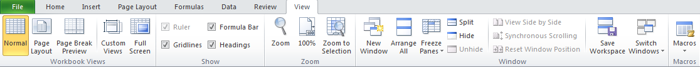

 

### Contextual tabs 
These tabs only appears in some contexts, as for example, when creating a chart or a picture. 

**Chart design** Allows to select the type of chart. 

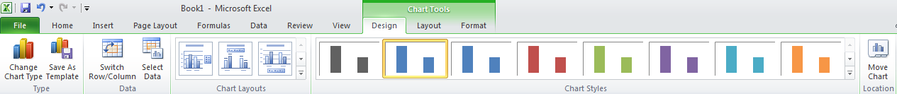

 
 

**Chart layout** Allows to insert and configure some parts of charts (title, axis, leyend, gridlines, etc.) 

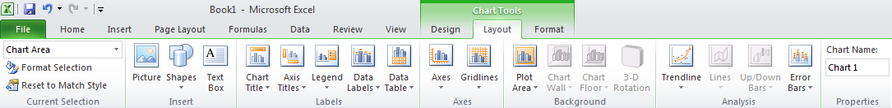

 

**Chart format** Allows to change the aspect of charts (height, width, font, colors, background, etc.)

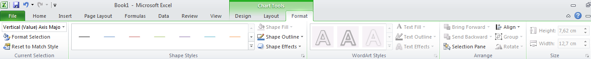

 

**Picture** Allows to modify images (borders, rotation, crop, color, filters, special effects, etc.)

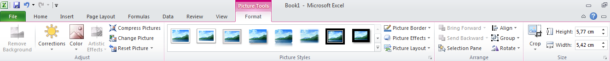

 

In addition to these tabs, users can create their own tabs and customise them with buttons as their convenience.  

There exists also a quick access toolbar just above the ribbon that can be customised with the most common buttons. 

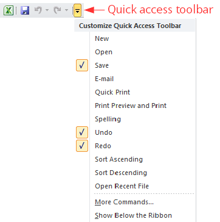

### Access dialogs
When you click the right bottom corner of any panel, the corresponding dialog is show where all the related options are available. 

**Example**. The next figure shows the font dialog with all the options related to fonts (font family, font style, font size, etc.)  

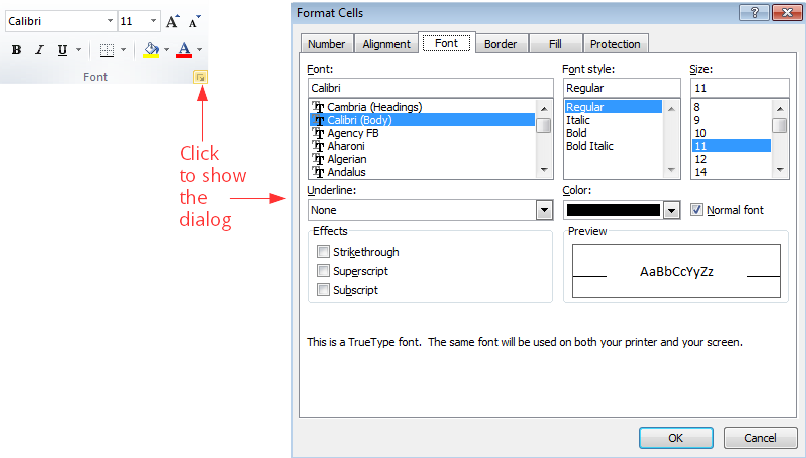

### Contextual menu
Clicking the right button of the mouse (right-clicking) a contextual menu is showed with some buttons or options to perform actions in that context. 
This menu has different options depending on the part of the windows that is clicked. 

**Example**. The next figure shows the contextual menu showed right-clicking any cell.

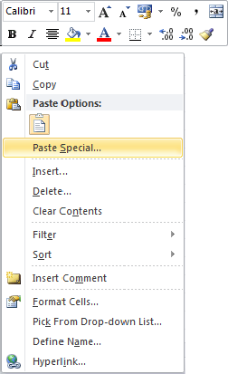

## Workbooks, worksheets, rows, columns and cells
An Excel file is a *workbook* with several *worksheets* that are two dimensional tables divided in *columns* and *rows*. The intersection of a column with a row is a *cell* that is where data are entered. Sheets have a maximum of 16,384 columns and 1,048,576 rows. 

Each worksheet has a name and are arranged in tabs at the bottom. Columns and rows have also names; columns are named with letters at the top of the column and rows with numbers to de left of the row. This way each cell is identified by the name of the worksheet, the name of the column and the name of the row where is located, and cells names follow the pattern `name-of-worksheet ! column-name row-name`. However, to refer to any cell in the active worksheet, the worksheet name may be omitted.

**Example**. The name of the selected cell in the next figure is `Sheet1!C4`.

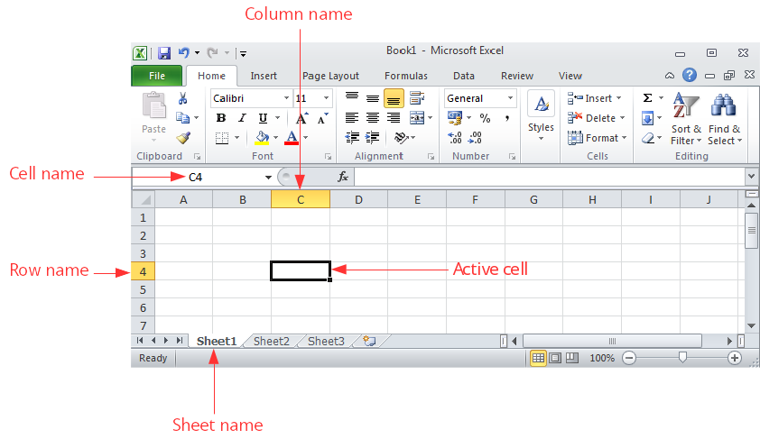

The names of rows and columns can not be changed, but worksheet names can be changed double-clicking it and typing the new name. 

### Ranges of cells 
A range of cells is a rectangular block of adjacent cells that is identified by top-left cell and the bottom-right cell separated by a colon, following the pattern `top-left-cell-name:bottom-right-cell-name`.

**Example**. In the next figure the range B3:E5 is selected. 

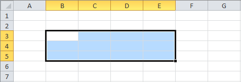

### Selecting cells, rows, columns, ranges and worksheets
To select a cell just click it. 
To select a row click the header of the row or press the keys `Shift+Spacebar`. 
To select a column click the header of the column or press the keys `Ctrl+Spacebar`.
To select a range click one corner cell and drag the mouse pointer over the desired cells. 
To select the whole worksheet click the top-left corner of the worksheet o press the keys `Ctrl+A`.  

## Data edition

### Insert data
Data are entered into the cells activating the cell (clicking it) and typing directly in the cell or in the input bar.

Excel has a smart autocomplete feature that proposes completing the data that is typed with some predictions.

### Delete data
To delete the content of a cell simply select the cell and press `Supr` key. It's also possible to delete the content of a range of cells in the same way.

### Remove cells, rows, columns and worksheets
To remove a whole cell (no only the content), right-click the cell and select the option `Delete...`. In the dialog that appears select `Shift cells left` if you want the cells to the left of the removed cell move to the left to fill the gap, or `Shift cells up` if you want the cells below the removed cell move up to fill the gap.

To remove a whole row, right-click the header of the row and select the option  `Delete...`.

To remove a whole column, right-click the header of the column and select the option  `Delete...`.

To remove a worksheet, right-click the tab with the name of the worksheet and select the option `Delete...`. 
*Warning: Removing worksheets can not be undone!*

### Insert cells, rows, columns and worksheets
To insert a new cell in a position, right-click the current cell in that position and select the option `Insert...`.  In the dialog that appears select `Shift cells right` if you want to move the cells to the right to make a gap for the new cell, or `Shift cells down` if you want to move the cells down to make a gap for the new cell. 

To insert a new row, right-click the header of the row above which you want to insert the new row and select `Insert`.  

To insert a new column, right-click the header of the column to the left of which you want to insert the new column and select `Insert`.  

To insert a new worksheet, right-click the tab with the name of the worksheet to the left of which you want to insert the new worksheet and select `Insert`.
In the dialog that appears select `Worksheet'.

### Cut, copy and paste
Like in many other Windows applications, you can use the clipboard to cut, copy and paste cells, rows, columns and ranges contents. 

To cut or copy a cell, row, column or range, right-click it and select the option `Cut` or `Copy` respectively, or press the keys `Ctrl+x` or `Ctrl+c` respectively. Both options copy the content of the cell, row, column or range to the clipboard, but the difference between cut and copy is that cut delete the content from the current cell, row, column or range, while copy no.

To paste the content of the clipboard in a new cell, row, column or range, select the cell or the first cell of the row, column or range and click the button `Paste` or press the keys `Ctrl+v`.

### Autofill 
An useful feature of Excel is the autofill of cells following a serie or pattern. In some cases, like for example dates, it is enough to write the content of the first cell and then click the bottom-right corner of the cell and drag the mouse pointer over the column or row to get the cells filled with the following dates. 

For number or text, this actions replicates the content of the first cell in the others. To autofill with a serie of numbers is necessary to enter the first two numbers of the serie in two consecutive cells, then select both cells, click the bottom-left corner and drag the mouse pointer over the column or row to get the cells filled with the numbers following the serie.     

**Example**. The next figure shows how to autofill cells with the serie of even numbers. 

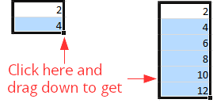

### Undo and redo
In the quick access toolbar there are buttons `Undo`  and `Redo` . The `Undo` button undoes the last data edition action performed and the `Redo` button reverses the last undone action. If you press the undo button several $n$ times, it undoes the last $n$ actions, and the same happens with the redo button.  

## Column and row sizing 
Columns width and rows height can be easily changed. To change the width of a column click the line between the column you want to size and the next column in the column header, and then drag the pointer mouse to increase or reduce the column width. If you double-click this line the column width will auto resize to the width of the widest cell content in the column. 

In a similar way, to change the height of a row click the line between the row you want to size and the next row in the row header, and then drag the pointer mouse to increase or reduce the row height. If you double-click this line the row height will auto resize to the height of the highest cell content in the row. 

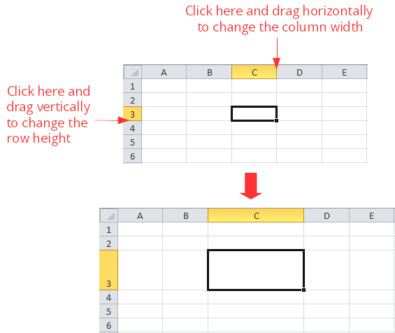

 
 

## File management
Data of workbooks are stored in files. Although Excel makes backups copies of your work regularly, is a good practice to save your work in files often. 

### Save a file
To save the content of a workbook in a file press the tab `File` and select the option `Save`. In the dialog that appears type the file name and select the storage unit and folder where to save the file. The default extension for Excel 2010 file names is *xlsx*. 

### Open a file
To open an Excel file press the tab `File` and select the option `Open`.
In the dialog that appears select the storage unit and folder where the file is saved and the file to open, an press the button `Open`.

### Create a new workbook
To create a new workbook press the tab `File` and select the option `New`. In the dialog that appears select `Blank workbook`. It's possible to create new workbooks from predefined templates. 

### Close a workbook
To close an open workbook press the tab `File` and select the option `Close`. If the last changes in the workbook haven't been saved, a warning will appear allowing you to save the file before to close it. 

## Getting help
One of the most useful features of Microsoft Office programs is the system of help that they have. To get help about any issue in Excel click the option `Help` in the Help tab of the ribbon, and then click `Microsoft Office Help`. This shows a browser where you can enter some key words and Excel will search topics related to these words and present the search results in a list. Clicking the desired topic will show you help info about that topic. 

**Example**. The next figure shows the help search results for the word "cell". 

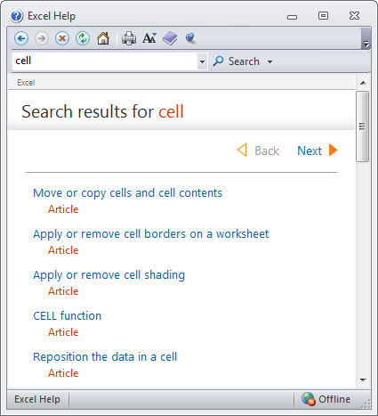

