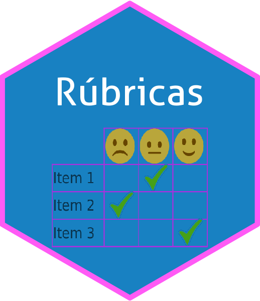

{.featured-image fig-alt="Captura de la aplicación Rúbricas"}

[Acceso a la aplicación](http://nube.aprendeconalf.es/shiny/evaluacion-rubrica/){.btn .btn-purple role="button"}

## ¿Qué es Rúbricas?

Rúbricas es una aplicación web basada en R y Shiny para la evaluación mediante rúbricas.

La aplicación permite:

1. Generar la rúbrica correspondiente a un examen o prueba de evaluación.
2. Cargar la lista de alumnos a partir de un fichero csv y generar una plantilla de corrección.
3. Cargar las correcciones desde la plantilla de corrección.
4. Generar la lista de notas de los alumnos.
5. Generar un resumen descriptivo de la distribución de notas.
6. Generar un informe personalizado con la corrección de cada alumno.

En el siguiente vídeo se puede ver una presentación más detallada de esta aplicación:



## Enlaces

- [Código fuente](https://github.com/asalber/evaluacion-rubrica)
- [Diapositivas](https://aprendeconalf.es/presentacion-rubricas-matematicas/)

## ¿Cómo citar Rúbricas?

Anemone, Gloria., Sánchez-Alberca, Alfredo. (2021). Rúbricas (version 1.0) [software]. Obtenido de: <https://aprendeconalf.es/proyectos/rubricas>.
