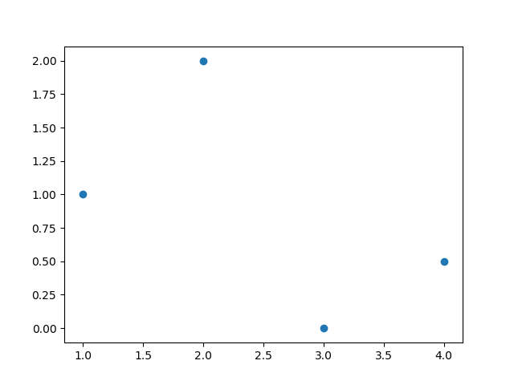
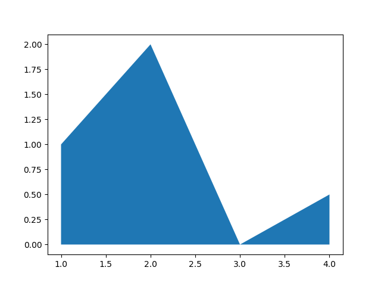
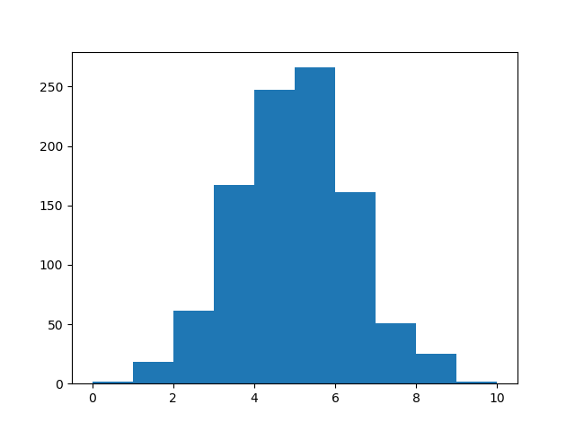
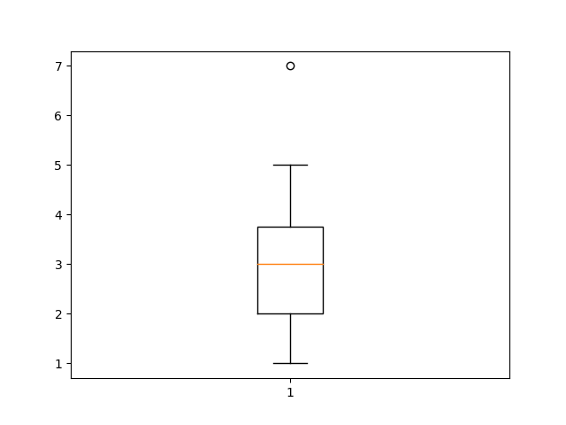
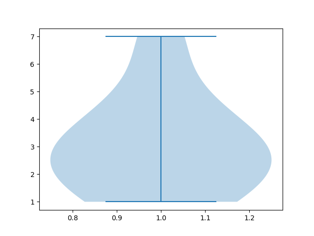

## La librería Matplotlib

[Matplotlib](https://matplotlib.org/) es una librería de Python especializada en la creación de gráficos en dos dimensiones.


### Tipos de gráficos

Permite crear y personalizar los tipos de gráficos más comunes, entre ellos:

- Diagramas de barras
- Histograma
- Diagramas de sectores
- Diagramas de caja y bigotes
- Diagramas de violín
- Diagramas de dispersión o puntos
- Diagramas de lineas
- Diagramas de areas
- Diagramas de contorno
- Mapas de color

y combinaciones de todos ellos.

En la siguiente [galería de gráficos](https://matplotlib.org/gallery/index.html) pueden apreciarse todos los tipos de gráficos que pueden crearse con esta librería.

### Creación de gráficos con matplotlib

Para crear un gráfico con matplotlib es habitual seguir los siguientes pasos:


1. Importar el módulo `pyplot`.

2. Definir la figura que contendrá el gráfico, que es la region (ventana o página) donde se dibujará. Para ello se utiliza la función `figure()`.

3. Definir los ejes sobre los que se dibujarán los datos. Para ello se utiliza la función `add_axes()` o bien `add_subplot()`.
  
4. Dibujar los datos sobre los ejes. Para ello se utilizan distintas funciones dependiendo del tipo de gráfico que se quiera.

5. Personalizar el gráfico. Para ello existen multitud de funciones que permiten añadir un título, una leyenda, una rejilla, cambiar colores o personalizar los ejes.

6. Guardar el gráfico. Para ello se utiliza la función `savefig()`.

7. Mostrar el gráfico. Para ello se utiliza la función `show()`.

```python
# Importar el módulo pyplot con el alias plt
import matplotlib.pyplot as plt
# Crear la figura
fig = plt.figure()
# Crear los ejes
ax = fig.add_subplot(111)
# Dibujar puntos
ax.scatter(x = [1, 2, 3], y = [3, 2, 1])
# Guardar el gráfico en formato png
plt.savefig('diagrama-dispersion.png')
# Mostrar el gráfico
plt.show()
```


### Diagramas de dispersión o puntos

- `scatter(x, y)`: Dibuja un diagrama de puntos con las coordenadas de la lista `x` en el eje X y las coordenadas de la lista `y` en el eje Y. [<i class="fa fa-info-circle" aria-hidden="true"></i>](https://matplotlib.org/api/_as_gen/matplotlib.pyplot.scatter.html#matplotlib.pyplot.scatter)

```python
import matplotlib.pyplot as plt
fig = plt.figure()
ax = fig.add_subplot(111)
ax.scatter([1, 2, 3, 4], [1, 2, 0, 0.5])
plt.show()
```



### Diagramas de líneas

- `plot(x, y)`: Dibuja un polígono con los vértices dados por las coordenadas de la lista `x` en el eje X y las coordenadas de la lista `y` en el eje Y. [<i class="fa fa-info-circle" aria-hidden="true"></i>](https://matplotlib.org/api/_as_gen/matplotlib.pyplot.plot.html#matplotlib.pyplot.plot)

```python
import matplotlib.pyplot as plt
fig = plt.figure()
ax = fig.add_subplot(111)
ax.plot([1, 2, 3, 4], [1, 2, 0, 0.5])
plt.show()
```


### Diagramas de areas

- `fill_between(x, y)`: Dibuja el area bajo el polígono con los vértices dados por las coordenadas de la lista `x` en el eje X y las coordenadas de la lista `y` en el eje Y. [<i class="fa fa-info-circle" aria-hidden="true"></i>](https://matplotlib.org/api/_as_gen/matplotlib.pyplot.fill_between.html#matplotlib.pyplot.fill_between)

```python
import matplotlib.pyplot as plt
fig = plt.figure()
ax = fig.add_subplot(111)
ax.fill_between([1, 2, 3, 4], [1, 2, 0, 0.5])
plt.show()
```



### Diagramas de barras verticales

- `bar(x, y)`: Dibuja un diagrama de barras verticales donde `x` es una lista con la posición de las barras en el eje X, e `y` es una lista con la altura de las barras en el eje Y. [<i class="fa fa-info-circle" aria-hidden="true"></i>](https://matplotlib.org/api/_as_gen/matplotlib.pyplot.bar.html#matplotlib.pyplot.bar)

```python
import matplotlib.pyplot as plt
fig = plt.figure()
ax = fig.add_subplot(111)
ax.bar([1, 2, 3], [3, 2, 1])
plt.show()
```


### Diagramas de barras horizontales

- `barh(x, y)`: Dibuja un diagrama de barras horizontales donde `x` es una lista con la posición de las barras en el eje Y, y `x` es una lista con la longitud de las barras en el eje X. [<i class="fa fa-info-circle" aria-hidden="true"></i>](https://matplotlib.org/api/_as_gen/matplotlib.pyplot.barh.html#matplotlib.pyplot.barh)

```python
import matplotlib.pyplot as plt
fig = plt.figure()
ax = fig.add_subplot(111)
ax.barh([1, 2, 3], [3, 2, 1])
plt.show()
```


### Histogramas

- `hist(x, bins)`: Dibuja un histograma con las frecuencias resultantes de agrupar los datos de la lista `x` en las clases definidas por la lista `bins`. [<i class="fa fa-info-circle" aria-hidden="true"></i>](https://matplotlib.org/api/_as_gen/matplotlib.pyplot.hist.html#matplotlib.pyplot.hist)

```python
import numpy as np
import matplotlib.pyplot as plt
fig = plt.figure()
ax = fig.add_subplot(111)
x = np.random.normal(5, 1.5, size=1000)
ax.hist(x, np.arange(0, 11))
plt.savefig('histograma.png')
plt.show()
```



### Diagramas de sectores

- `pie(x)`: Dibuja un diagrama de sectores con las frecuencias de la lista `x`. [<i class="fa fa-info-circle" aria-hidden="true"></i>](https://matplotlib.org/api/_as_gen/matplotlib.pyplot.pie.html#matplotlib.pyplot.pie)

```python
import matplotlib.pyplot as plt
fig = plt.figure()
ax = fig.add_subplot(111)
ax.pie([5, 4, 3, 2, 1]
plt.savefig('diagrama-sectores.png')
plt.show()
```


### Diagramas de caja y bigotes

- `boxplot(x)`: Dibuja un diagrama de caja y bigotes con los datos de la lista `x`. [<i class="fa fa-info-circle" aria-hidden="true"></i>](https://matplotlib.org/api/_as_gen/matplotlib.pyplot.boxplot.html#matplotlib.pyplot.boxplot)

```python
import matplotlib.pyplot as plt
fig = plt.figure()
ax = fig.add_subplot(111)
ax.boxplot([1, 2, 1, 2, 3, 4, 3, 3, 5, 7])
plt.savefig('diagrama-sectores.png')
plt.show()
```



### Diagramas de violín

- `violinplot(x)`: Dibuja un diagrama de violín con los datos de la lista `x`. [<i class="fa fa-info-circle" aria-hidden="true"></i>](https://matplotlib.org/api/_as_gen/matplotlib.pyplot.violinplot.html#matplotlib.pyplot.violinplot)

```python
import matplotlib.pyplot as plt
fig = plt.figure()
ax = fig.add_subplot(111)
ax.violinplot([1, 2, 1, 2, 3, 4, 3, 3, 5, 7])
plt.savefig('diagrama-sectores.png')
plt.show()
```



### Diagramas de contorno

- `contourf(x, y, z)`: Dibuja un diagrama de contorno con las curvas de nivel de la superficie dada por los puntos con las coordenadas de las listas `x`, `y` y `z` en los ejes X, Y y Z respectivamente. [<i class="fa fa-info-circle" aria-hidden="true"></i>](https://matplotlib.org/api/_as_gen/matplotlib.pyplot.contourf.html#matplotlib.pyplot.contourf)

```python
import matplotlib.pyplot as plt
fig = plt.figure()
ax = fig.add_subplot(111)
x = np.linspace(-3.0, 3.0, 100)
y = np.linspace(-3.0, 3.0, 100)
x, y = np.meshgrid(x, y)
z = np.sqrt(x**2 + 2*y**2)
ax.contourf(x, y, z)
plt.show()
```


### Mapas de color

- `imshow(x)`: Dibuja un mapa de color a partir de una matriz (array bidimensiona) `x`. [<i class="fa fa-info-circle" aria-hidden="true"></i>](https://matplotlib.org/api/_as_gen/matplotlib.pyplot.imshow.html#matplotlib.pyplot.imshow)

```python
import matplotlib.pyplot as plt
fig = plt.figure()
ax = fig.add_subplot(111)
x = np.random.random((16, 16))
ax.imshow(x)
plt.show()
```


- `hist2d(x, y)`: Dibuja un mapa de color que simula un histograma bidimensional, donde los colores de los cuadrados dependen de las frecuencias de las clases de la muestra dada por las listas `x` e `y`. [<i class="fa fa-info-circle" aria-hidden="true"></i>](https://matplotlib.org/api/_as_gen/matplotlib.pyplot.hist2d.html#matplotlib.pyplot.hist2d)

```python
import matplotlib.pyplot as plt
fig = plt.figure()
ax = fig.add_subplot(111)
x, y = np.random.multivariate_normal(mean=[0.0, 0.0], cov=[[1.0, 0.4], [0.4, 0.5]], size=1000).T
ax.hist2d(x, y)
plt.show()
```


<!-- TODO ### Colores

### Líneas

### Títulos

### Ejes

### Leyenda

### Regilla

### Texto

### Márgenes -->