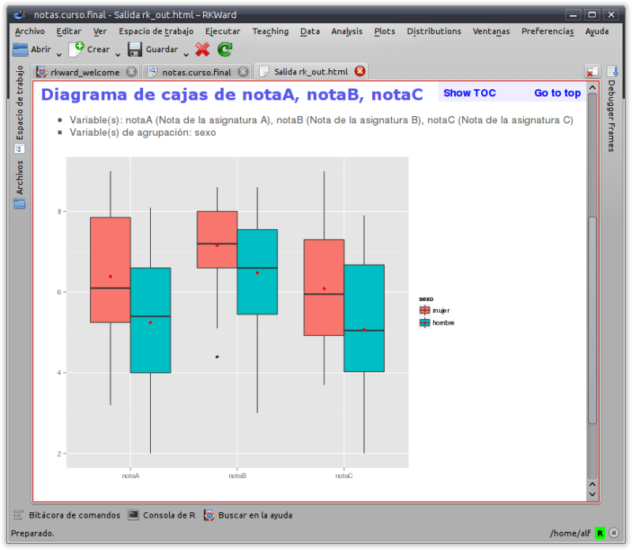
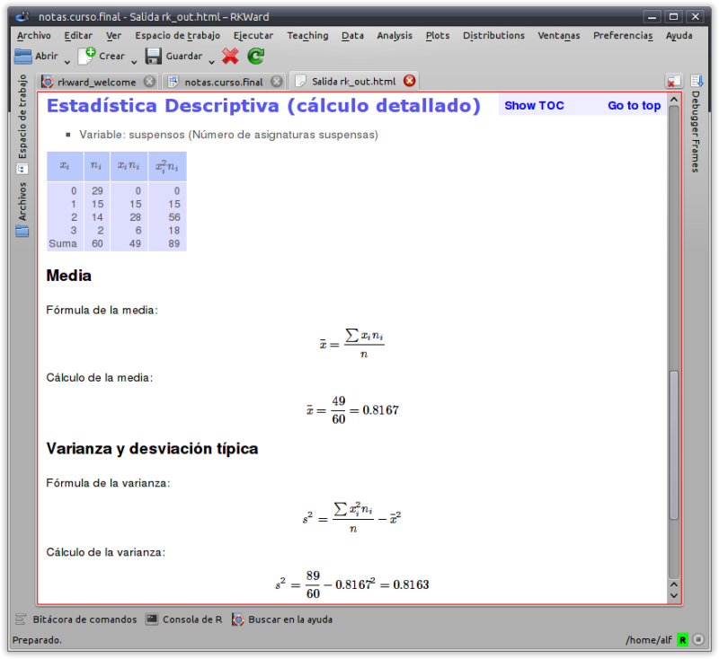

# English version ([Versión en español debajo](#spanish))

## What is rkTeaching?

rkTeaching is an [R](http://www.r-project.org/) package that provides a plugin for the graphical user interface [RKWard](http://rkward.sourceforge.net/) adding new menus and dialog specially 
designed for teaching and learning Statistics.

This package has been developed and is maintained by Alfredo Sánchez Alberca <asalber@ceu.es> in the Departament of Applied Math and Statistics of the San Pablo CEU of Madrid.

If you find out some error or have a suggestion, please, let me know it by email or opening an [issue on Github](https://github.com/rkward-community/rk.Teaching/pulls).

## Installation

### Installation on Windows

For Windows users there is a bundle that include R, RKWard and rk.Teaching.

[Download last version (R versión 3.4, RKWard versión 0.7.0, rk.Teaching versión 1.3.0)](https://drive.google.com/open?id=1gMcEvrmOUcvmdtsARfAyPOVIioC2dftD)

Once the file is downloaded, all you have to do is to execute it. 
It will ask for the installation unit and directory. 
It is recommended to install it on the root of unit C, that ist C:\. 
The installation creates a folder rkward into the installation directory with a shortcut to start the program. 

The following video tutorial shows the installation process (in Spanish).

<iframe src="//www.youtube.com/embed/BrqFyfNO9RM" width="640" height="360" allowfullscreen frameborder="0"></iframe> 

### Installation on Mac OS

To install the software on Mac OS systems, you must take the following steps:

1. **Install R**. R can be downloaded from the web <https://cran.r-project.org/>. 
You have to select the Mac OS distribution and follow the instructions there.
It is required an R version 3.4 or higher.

2. **Install RKWard**. RKWard can be downloaded from the web <http://rkward.sourceforge.net>.
You have to select the Mac Os distribution (<https://download.kde.org/stable/rkward/0.7.0/mac/RKWard-binary-0.7.0b_OSX10.11_KF5-5.42.0_needs_CRAN_R-3.5.0.pkg>) and follow the instructions there.
It is required a Mac Os version 10.11 or higher.

    The following video tutorial shows the installation process.

    <iframe src="//www.youtube.com/embed/2t4zUOlgPG8" width="640" height="360" frameborder="0"> </iframe>

    If there is some error during the installation process, check for the possible solutions (<http://rkward.sourceforge.net/wiki/RKWard_on_Mac#Troubleshooting>)

3. **Install the packages that rk.Teaching depends on**. The rk.Teaching package depends on several packages that should be installed first.
To install this packages you must run RKWard, open the R console and type the following commands:

    <pre><code>install.packages(c("R2HTML","car","e1071","Hmisc","plyr","ggplot2","ez"),dep=TRUE)</code></pre>

4. **Install rk.Teaching**. To install the rk.Teaching package you must type the following commands in the R console:

    <pre><code>install.packages("devtools", dep=TRUE) 
    library(devtools) 
    install_github("rkward-community/rk.Teaching", ref="develop")
    </code></pre>

    The following video tutorial shows the installation process (in Spanish).

    <iframe src="//www.youtube.com/embed/vQa4umDJko8" width="640" height="360" frameborder="0"> </iframe> 

### Installation on Linux

To install the software in Mac OS systems, you must take the following steps:

1. **Install R**. R can be downloaded from the web <https://cran.r-project.org/>. 
You have to select the Linux distribution and follow the instructions there.
It is required an R version 3.4 or higher.

    With Debian based distributions like Ubuntu, you can install R from the command line typing the command:

    <pre><code>sudo apt-get install rbase</code></pre>

2. **Install RKWard**. RKWard can be downloaded from the web <http://rkward.sourceforge.net>. 
You have to select the Linux distribution and follow the instructions there. 

    With Debian based distributions like Ubuntu, you can install R from the command line typing the command:

    <pre><code>sudo apt-get install rkward</code></pre>
 
    It is important to install versión 0.7 or higher.

3. **Install the packages that rk.Teaching depends on**. The rk.Teaching package depends on several packages that should be installed first.
To install this packages you must run RKWard, open the R console and type the following commands:

    <pre><code>install.packages(c("R2HTML","car","e1071","Hmisc","plyr","ggplot2","ez"),dep=TRUE)</code></pre>

4. **Install rk.Teaching**. To install the rk.Teaching package you must type the following commands in the R console:

    <pre><code>install.packages("devtools", dep=TRUE) 
    library(devtools) 
    install_github("rkward-community/rk.Teaching", ref="develop")
    </code></pre>

    The following video tutorial shows the installation process (in Spanish).

    <iframe src="//www.youtube.com/embed/vQa4umDJko8" width="640" height="360" frameborder="0"> </iframe>

## Statistical procedures

Once installed a new menu `Teaching` will appear in RKWard with the following statistical procedures:

- Data manipulation:
  - Fiter data
  - Calculate variable
  - Recoding variable
  - Weight data
- Frequency distributions:
  - Frequency tabulation
  - Bidimensional frequency tabulation
- Plots:
  - Bar graph
  - Histogram
  - Pie graph
  - Box graph
  - Means graph
  - Interaction graph
  - Scatterplot
- Descriptive statistics
  - Statistics
  - Detailed calculation
- Regression:
  - Linear Regression
  - Non linear regression
  - Regression model comparison
  - Regression prediction
- Parametric tests:
  - Means:
    - T test for one sample
    - T test for two independent samples
    - T test for two paired samples
    - ANOVA
    - Sample size calculation for mean estimation
  - Variances:
    - Fisher test for two samples
    - Levene test for multiple samples
  - Proportions:
    - Test for one proportion
    - Test for two proportions
    - Sample size calculation for proportion estimation
- Non parametric tests:
  - Normality tests: Shapiro-Wilk, Kolmogorov
  - U Mann-Whitney test
  - Wilcoxon test
  - Friedman test
  - Kruskal-Wallis test
  - Chi-square test
- Concordance
  - Intraclass correlation coefficient
  - Cohen's kappa
- Probability:
  - Random games:
    - Coins
    - Dice
    - Cards
    - Urn
  - Build probability space
  - Combine probability spaces
  - Repeat probability space
  - Calculate probability 
- Probability distributions
    - Discrete:
      - Binomial
      - Geometric
      - Hypergeometric
      - Poisson
    - Continous:
      - Uniform
      - Normal
      - Chi-square
      - Student's T
      - Fisher's F
- Simulations:
  - Law of rare events

## Functionality

- Menus and dialogs specially designed to easy the learning, ruling out non-common options to get an simplified and intutive interface.

- All the dialogs have a wizard that guide the user step by step through the statistical procedure.
  

- HTML output tha presents the results of the analysis in a clear and concise way.
    

- Charts based in the modern [ggplot2](http://ggplot2.org/) package.
  

- Computation formulas and details available for some statistical procedures.
  

rk.Teaching is maintained by [asalber](https://github.com/asalber).

## How to cite rk.Teaching?

Sánchez-Alberca, A. (2014). rk.Teaching (version 1.2) [software]. Get from: http://aprendeconalf.es/rkteaching.

# Versión en Español

## ¿Qué es rkTeaching?

rk.Teaching es un paquete de [R](http://www.r-project.org/) que proporciona un plugin para la interfaz gráfica [RKWard](http://rkward.sourceforge.net/) añadiendo nuevos menús y cuadros de diálogo especialmente diseñados para la enseñanza de Estadística.

El paquete ha sido desarrollado y es mantenido por Alfredo Sánchez Alberca <asalber@ceu.es> del Departamento de Matemáticas de la Universidad San Pablo CEU de Madrid.

Si descubre algún error o tiene cualquier sugerencia, por favor, envíeselo por correo al autor o bien indíquelo como un [issue en Github](https://github.com/asalber/rkTeaching_es/issues).

## Instalación

### Instalación en Windows

Para usuarios de plataformas Windows existe un programa de instalación que incluye R, RKWard y rk.Teaching.

[Descarga la última versión (R versión 3.2.3, RKWard versión 0.6.5, rk.Teaching versión 1.3.0)](https://drive.google.com/file/d/0B5yGMNeKDyLdaFMyd2J5YzdZcVE/view?usp=sharing)

[Descarga la versión anterior (R version 3.0.0, RKWard version 0.6.1 y rk.Teaching versión 1.2.0)](https://drive.google.com/file/d/0B5yGMNeKDyLdUjlZcldDaFV6R1E/view?usp=sharing)

Una vez descargado el fichero, sólo hay que ejecutarlo para descomprimirlo. 
Al ejecutarse aparecerá un cuadro de diálogo donde preguntará por la unidad y el directorio de instalación y es importante indicar que se instale en la carpeta raíz del disco duro C, es decir en la dirección C:\, tras esto se creará una carpeta rkward dentro de la cual habrá un acceso directo que permitirá arrancar RKWard.

El siguiente vídeo muestra el proceso de instalación.

<iframe src="//www.youtube.com/embed/BrqFyfNO9RM" width="640" height="360" allowfullscreen frameborder="0"></iframe> 

### Instalación en Mac Os

Para instalar el sotware en plataformas Mac Os debe instalarse cada programa por separado con el siguiente orden:

1. **Instalar R**. R puede descargarse desde la página <https://cran.r-project.org/>. 
Debe seleccionarse la distribución correspondiente a Mac Os y seguir las instrucciones de instalación que allí se especifican.
Es necesario que la versión de R sea la 3.5 o superior.

2. **Instalar RKWard**. RKWard puede descargarse desde la página <http://rkward.sourceforge.net>. 
Debe seleccionarse la distribución correspondiente a Mac Os (<https://download.kde.org/stable/rkward/0.7.0/mac/RKWard-binary-0.7.0b_OSX10.11_KF5-5.42.0_needs_CRAN_R-3.5.0.pkg>) y seguir las instrucciones de instalación que allí se especifican.
Es importante asegurase de tener una versión de Mac OS X 10.11 o superior, ya que RKWard no funciona con versiones anteriores.

    El siguiente vídeo muestra el proceso de instalación.

    <iframe src="//www.youtube.com/embed/2t4zUOlgPG8" width="640" height="360" frameborder="0"> </iframe> 

    Si hay algún error en la instalación, consultar las posibles soluciones en (<http://rkward.sourceforge.net/wiki/RKWard_on_Mac#Troubleshooting>)

1. **Instalar los paquetes de los que depende rk.Teaching**. Para instalar rk.Teaching primero hay que instalar los paquetes de R de los que depende. 
Para ello, hay que ejecutar R en línea de comandos, o bien arrancar RKWard e ir a la solapa de la Consola de R (R console) e introducir los siguientes comandos:

    <pre><code>install.packages(c("R2HTML","car","e1071","Hmisc","plyr","ggplot2","ez"),dep=TRUE)</code></pre>

4. **Instalar rk.Teaching**. La mejor forma de instalar rk.Teaching desde este repositorio es utilizando el paquete de R `devtools`.
Para ello hay que introducir los siguientes comandos en la consola de R: 

    <pre><code>install.packages("devtools", dep=TRUE) 
    library(devtools) 
    install_github("asalber/rkTeaching_es")
    </code></pre>

    El siguiente vídeo muestra el proceso de instalación.

    <iframe src="//www.youtube.com/embed/vQa4umDJko8" width="640" height="360" frameborder="0"> </iframe> 

### Instalación en Linux

Para instalar el sotware en plataformas Linux debe instalarse cada programa por separado con el siguiente orden:

1. **Instalar R**. R puede descargarse desde la página <http://cran.es.r-project.org/>. 
Debe seleccionarse la distribución correspondiente a Linux y seguir las instrucciones de instalación que allí se especifican. 
Es necesario que la versión de R sea la 3.0 o superior.

    En sistemas Debian y Ubuntu, puede instalarse desde la línea de comandos con el comando:
    
    <pre><code>sudo apt-get install rbase</code></pre>

2. **Instalar RKWard**. RKWard puede descargarse desde la página <http://rkward.sourceforge.net>. 
Debe seleccionarse la distribución correspondiente a Linux y seguir las instrucciones de instalación que allí se especifican.

    En sistemas Debian y Ubuntu, puede instalarse desde la línea de comandos con el comando:

    <pre><code>sudo apt-get install rkward</code></pre>

    Es importante asegurarse de que la versión instalada es la 0.6.5 o superior.

3. **Instalar los paquetes de los que depende rk.Teaching**. Para instalar rk.Teaching primero hay que instalar los paquetes de R de los que depende. 
Para ello, hay que ejecutar R en línea de comandos, o bien arrancar RKWard e ir a la solapa de la Consola de R (R console) e introducir los siguientes comandos:

    <pre><code>install.packages(c("R2HTML","car","e1071","Hmisc","plyr","ggplot2","ez"),dep=TRUE)</code></pre>

4. **Instalar rk.Teaching**. La mejor forma de instalar rk.Teaching desde este repositorio es utilizando el paquete de R `devtools`. 
Para ello hay que introducir los siguientes comandos en la consola de R: 

    <pre><code>install.packages("devtools", dep=TRUE) 
    library(devtools) 
    install_github("asalber/rkTeaching_es")
    </code></pre>

    El siguiente vídeo muestra el proceso de instalación.

    <iframe src="//www.youtube.com/embed/vQa4umDJko8" width="640" height="360" frameborder="0"> </iframe> 	

## Procedimientos estadísticos

Una vez instalado, al arrancar RKWard aparecerá un nuevo menú `Teaching` con los siguientes procedimientos estadísticos:

- Manipulación de datos
  - Filtrar datos
  - Calcular variable
  - Recodificar variable
  - Ponderar datos
  - Tipificar variables
- Distribución de frecuencias
  - Tablas de frecuencias
  - Tablas de frecuencias bidimensionales
- Gráficos
  - Diagrama de barras
  - Histograma
  - Diagrama de sectores
  - Diagrama de caja
  - Diagrama de medias
  - Diagrama de interacción
  - Diagrama de dispersión
  - Matriz de dispersión
- Estadística descriptiva
  - Estadísticos
  - Estadísticos (cálculo detallado)
- Regresión
  - Regresión lineal
  - Regresión no lineal
  - Comparación de modelos
  - Predicciones
  - Correlación
- Test paramétricos
  - Medias
    - Test T para una muestra
    - Test T para dos muestras independientes
    - Test T para dos muestras pareadas
    - ANOVA
    - Cálculo del tamaño muestral para la media
    - Cálculo del tamaño muestral para el test T
  - Varianzas
    - Test F de Fisher
    - Test de Levene
  - Proporciones
    - Test para una proporción
    - Test para dos proporciones
    - Cálculo del tamaño muestral para una proproción
- Test no paramétricos
  - Normalidad
    - Test de Lilliefors (Komogorov-Smirnov)
    - Test de Shapiro-Wilk
  - Test U de Mann-Whitney para dos muestas independientes
  - Test de Wilcoxon para dos muestras pareadas
  - Test de Kruskal-Wallis para varias muestras independientes
  - Test de Friedman para medidas repetidas
  - Test Chi-cuadrado de independencia
  - Test Chi-cuadrado de bondad de ajuste
- Concordancia
  - Coeficiente de correlación intraclase
  - Kappa de Cohen
- Probabilidad
  - Juegos de azar
    - Monedas
      - Espacio probabilístico
      - Lanzamiento de monedas
    - Dados
      - Espacio probabilístico
      - Lanzamiento de dados
    - Naipes
      - Espacio probabilístico
      - Extracción naipes
    - Urnas
      - Espacio probabilístico
      - Extracción de urnas
  - Construcción de espacio probabilístico
  - Combinación de espacios probabilísticos
  - Repetición de espacios probabilísticos
  - Cálculo de probabilidad
- Distribuciones de probabilidad
  - Distribuciones discretas
    - Binomial	
      - Probabilidades
      - Cuantiles
      - Gráfico de probabilidad
    - Poisson
      - Probabilidades
      - Cuantiles
      - Gráfico de probabilidad
  - Distribuciones continuas
    - Chi-cuadrado
      - Probabilidades
      - Cuantiles
      - Gráfico de probabilidad
    - F de Fisher
      - Probabilidades
      - Cuantiles
      - Gráfico de probabilidad
    - Normal
      - Probabilidades
      - Cuantiles
      - Gráfico de probabilidad
    - T de student
      - Probabilidades
      - Cuantiles
      - Gráfico de probabilidad
    - Uniforme continua
      - Probabilidades
      - Cuantiles
      - Gráfico de probabilidad
- Simulaciones
  - Ley de los casos raros

## Funcionalidades

- Menús y cuadros de diálogo diseñados para facilitar el aprendizaje, eliminando todas las opciones secundarias para conseguir una interfaz simple e intuitiva.

- Diseño de asistentes que guían al usuario paso a paso y le asesoran en los análisis estadísticos.
  

- Salidas en HTML que presentan los resultados de los análisis y sus     interpretaciones de manera clara y concisa.
  

- Gráficos sencillos basados en el moderno paquete ggplot2.
  

- Posibilidad mostrar el desarrollo de los cálculos de algunos
    procedimientos estadísticos. 
    

rk.Teaching es mantenido por [asalber](https://github.com/asalber).

## ¿Cómo citar rk.Teching?

Sánchez-Alberca, A. (2014). rk.Teaching (version 1.2) [software]. Obtenido de: http://aprendeconalf.es/rkteaching.