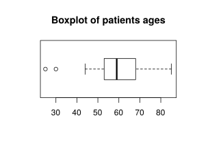
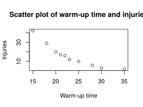

Degrees: Physiotherapy  
Date: May 31, 2018

## Question 1

The ages of a sample of patients of a physical therapy clinic are:

25, 30, 44, 44, 51, 51, 53, 56, 57, 58, 58, 58, 59, 59, 61, 63, 63, 63, 66, 68, 70, 71, 72, 74, 82, 85

1. Compute the quartiles.

2. Draw the box plot and identify outliers (do not group data into intervals).

3. Split the sample into two groups, patients younger and older than 65. In which group is the mean more representative. 
Justify the answer.

4. Which distribution is less symmetric, the one of patients younger than 65 or the one of patients older?

5. Which age is relatively smaller with respect to its group, 50 years in the group of patients younger than 65 or 72 years in the group of patients older than 65?

Use the following sums for the computations.  
Younger than 65: $\sum x_i=953$ years, $\sum x_i^2=52475$ years$^2$, $\sum (x_i-\bar x)^3=-30846.51$ years$^3$ and $\sum (x_i-\bar x)^4=939658.83$ years$^4$.  
Older than 65: $\sum x_i=588$ years, $\sum x_i^2=43530$ years$^2$, $\sum (x_i-\bar x)^3=1485$ years$^3$ and $\sum (x_i-\bar x)^4=26983.5$ years$^4$.

<button class="solution">Show solution</button>

1. $Q_1=53$ years, $Q_2=59$ years and $Q_3=68$ years. 
2. There are 2 outliers: 25, 30. 

3. Let $x$ be the age in patients younger than 65 and $y$ the age in patients older than 65.   
$\bar x=52.9444$ years, $s_x^2=112.1636$ years$^2$, $s_x=10.5907$ years and $cv_x=0.2$.   
$\bar y=73.5$ years, $s_y^2=39$ years$^2$, $s_y=6.245$ years and $cv_y=0.085$.   
The mean is more representative in patients older than 65 since the coefficient of variation is smaller. 
4. $g_{1x}=-1.4426$ and $g_{1y}=0.7621$, thus the distribution of ages of people younger than 65 is less symmetric. 
5. The standard scores are $z_x(50)=-0.278$ and $z_y(72)=-0.2402$, thus 50 years is relative smaller in the group of people younger than 65.

## Question 2
The table below shows the number of injuries of several teams during a league and the average varm-up time of its players.

$$
\begin{array}{lrrrrrrrrrr}
\hline
\mbox{Warm-up time} & 15 & 35 & 22 & 28 & 21 & 18 & 25 & 30 & 23 & 20 \\
\mbox{Injuries} & 42 & 2 & 16 & 6 & 17 & 29 & 10 & 3 & 12 & 20 \\
\hline
\end{array}
$$

1. Draw the scatter plot.

1. Which regression model is more suitable to predict the number of injuries as a function of the warm-up time, the logarithmic or the exponential? Use that regression model to predict the expected number of injuries for a team whose players warm-up 20 minutes a day.

3. Which regression model is more suitable to predict the warm-up time as a function of the number of injuries, the logarithmic or the exponential? Use that regression model to predict the warm-up time required to have no more than 10 injuries in a league.

4. Are these predictions reliable? Which one is more reliable?

Use the following sums for the computations ($X$ warm-up time and $Y$ number of injuries):  
$\sum x_i=237$, $\sum \log(x_i)=31.3728$, $\sum y_j=157$, $\sum \log(y_j)=24.0775$,  
$\sum x_i^2=5937$, $\sum \log(x_i)^2=98.9906$, $\sum y_j^2=3843$, $\sum \log(y_j)^2=66.3721$,  
$\sum x_iy_j=3115$, $\sum x_i\log(y_j)=519.1907$, $\sum \log(x_i)y_j=465.8093$, $\sum \log(x_i)\log(y_j)=73.3995$.

<button class="solution">Show solution</button>

1. 

1. $\bar x=23.7$ min, $s_x^2=32.01$ min$^2$. 
$\bar \log(x)=3.1373$ log(min), $s_{\log(x)}^2=0.0565$ log(min)$^2$. 
$\bar y=15.7$ injuries, $s_y^2=137.81$ injuries$^2$. 
$\bar \log(y)=2.4078$ log(injuries), $s_{\log(y)}^2=0.8399$ log(injuries)$^2$. 
$s_{x\log(y)}=-5.1446$, $s_{\log(x)y}=-2.6744$.  
Exponential determination coefficient: $r^2=0.9844$.  
Logarithmic determination coefficient: $r^2=0.9185$. 
So the exponential regression model es better to predict the number of injuries as a function of the warm-up time. 
Exponential regression model: $y=e^{6.2168+-0.1607x}$.   
Prediction: $y(20)=20.1341$ injuries. 

1. The logarithmic model is better to predict the warm-up time as a function of the number or injuries. 
Logarithmic regression model: $x=164.1851+-47.3292\log(y)$. 
Prediction: $x(10)=55.2056112360638$ min. 
4. Both predictions are very reliable since de deternation coefficient is very high but the last one is a little less reliable as it is for a value further from the data range.

## Question 3

An ultrasonic technique is used to diagnose a disease with a sensitivity of 91% and a specificity of 98%. The prevalence of the disease is 20%,

1. If we apply the technique to an individual and the outcome is positive, what is the probability of having the disease for that individual?

2. If the outcome was negative, what is the probability of not having the disease?

3. Is this technique more reliable to confirm or to rule out the disease? Justify the answer.

4. Compute the probability of having a correct diagnose with this technique.

<button class="solution">Show solution</button>

1. $PPV=0.9192$. 
2. $NPV=0.9776$. 
3. It is more reliable to rule out the disease since the NPV is greater than the NPV. 
4. $P(D\cap +)+P(\overline D\cap -) = 0.966$.

## Question 4
It is known that the femur length of a fetus with 25 weeks of pregnancy follows a normal distribution with mean 44 mm and standard deviation 2 mm.

1. Compute the probability that the femur length of a fetus with 25 weeks is greater than 46 mm.

2. Compute the probability that the femur lenght of a fetus with 25 weeks is between 46 and 49 mm.

3. Compute an interval $(a,b)$ centered at the mean, such that it contains 80% of the femur lengths of fetus with 25 weeks.

<button class="solution">Show solution</button>

Let $X\sim N(44,2)$ be the femur length of fetus with 25 weeks of pregnancy. 
1. $P(X>46)=0.1587$. 
2. $P(46<X<49))=0.1524$. 
3. The interval centered at $44$ that contains 80% of the femur lengths of fetus with 25 weeks is $(41.4369,46.5631)$.

## Question 5

The probability that an injury $A$ is repeated is $4/5$, the probability that another injury $B$ is repeated is $1/2$, and the probability that none of them are repeated is $1/20$. Compute the probability of the following events:
    
1. At least one injury is repeated.

2. Only injury $B$ is repeated.

3. Injury $B$ is repeated if injury $A$ has been repeated.

4. Injury $B$ is repeated if injury $A$ has not been repeated.
    

<button class="solution">Show solution</button>

1. $P(A\cup B)=19/20$. 
2. $P(B\cap\overline{A})=3/20$. 
3. $P(B/A)=7/16$. 
4. $P(B/\overline{A})=3/4$.

## Question 6

A physical therapy clinic opens 6 hours a day and the average number of patients that arrive to the clinic is 12 a day.

1. Compute the probability of arriving more than 4 patients in 1 hour.

2. If the clinic has 4 physiotherapists and each of them can treat one patient per hour, what is the probability that a day there was some hour in which some patient can not be attended? How many physiotherapists must be in the clinic to guarantee that this probability is less than 10%?
    

<button class="solution">Show solution</button>

1. Let $X$ be the number of patients that arrive in 1 hours. $X\sim P(2)$ and $P(X>4)=0.0527$. 
2. Let $Y$ be the number of hours in a day in which some patient can not be treated. $Y\sim B(6, 0.0527)$ and $P(Y>0)=0.2771$.   
The clinic requires 5 phisiotherapists, since $P(X>5)=0.0527$ and $P(Y>0)=0.0954$, with $Y\sim B(6, 0.0166)$ now.

