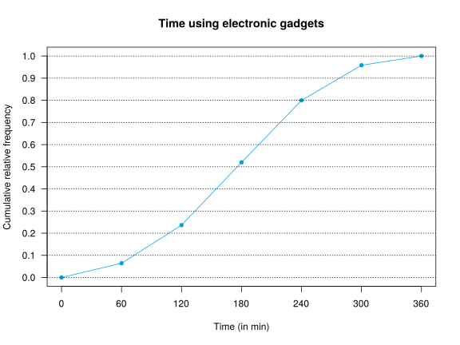
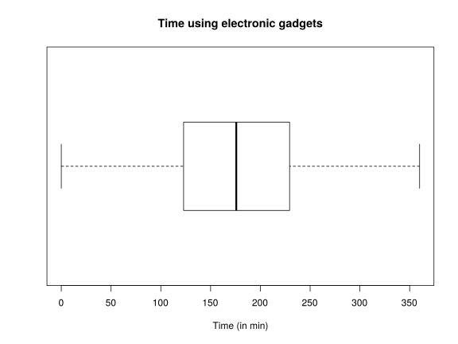

Degrees: Physiotheraphy  
Date: June 02, 2017 

## Exercise 1
A study try to determine the influence of electronic gadgets (mobile phones, tables, consoles, etc.) in neck disorders.
In the sample of persons studied, it was measured the average daily time using some of these devices, and if the person had or not a cervical disc herniation (CDH).
The table below summarizes the results.

$$
\begin{array}{crrr}
\hline
\mbox{Time (in min)} & \mbox{People with CDH} & \mbox{People without CDH} & \mbox{Total}\\
0-60 & 2 & 32 & 34\\
60-120 & 5 & 86 & 91\\
120-180	& 14 & 136 & 150\\
180-240	& 21 & 127 & 148\\
240-300	& 16 & 68 & 84\\
300-360	& 10 & 12 & 22\\
\mbox{Total} & 68 & 461 & 529\\
\hline
\end{array}
$$

1. Plot the ogive of the global distribution of time (including people with CDH and without CDH).
2. Plot the box plot of the global distribution of time and interpret it.
3. In which sample there is less relative dispersion with respect to the mean, in people with CDH or in people without CDH?
4. Which distribution is less symmetric, people with CDH or without CDH?
5. Compute the standard score of a person with CDH that uses those devices 200 minutes a day and the same for a person without CDH. Interpret them.

Use the following sums for the computations:  
People with CDH: $\sum x_i=14640$, $\sum x_i^2=3538800$, $\sum(x_i-\bar x)^3=-8746878.8927$.  
People without CDH: $\sum x_i=78090$, $\sum x_i^2=15650100$, $\sum(x_i-\bar x)^3=-3234289.0161$.  

<button class="solution">Show solution</button>

1. 

2.

3. People with CDH: $\bar x=215.2941$ points, $s=75.4296$ points, $cv=0.3504$.  
People without CDH: $\bar x=169.3926$ points, $s=72.4865$ points, $cv=0.4279$.  
Since the coefficient of variation of people with CDF less than the one of people without CDF, there is less relative spread with respect to the mean in de distribution of people with CDF. 
4. People with CDF: $g_1=-0.2997$. 
People without CDF: $g_1=-0.0184$. 
Since the coefficient of skewness of people with CDF is further from zero, the distribution is less symmetric. 
5. Person with CDH: $z(200)=-0.2028$. 
Person without CDH: $z(200)=0.4222$ 
The person with CDH has a value less than the mean but relatively closer to the mean than the person without CDH.

## Exercise 2
A study try to determine the influence of electronic gadgets (mobile phones, tables, consoles, etc.) in neck disorders.
One goal of the research is determining if there is some relation between the average daily time using some of those devices and the number of cervical vertigo attacks in the last year.
The table below shows the collected information in a sample of 12 persons.

$$
\begin{array}{lrrrrrrrrrrrr}
\hline
\mbox{Time (min)} & 344 & 68 & 24 & 178 & 218 & 315 & 262 & 77 & 152 & 186 & 144 & 103\\
\mbox{Vertigo attacks} & 42 & 3 & 2 & 6 & 14 & 31 & 22 & 3 & 7 & 9 & 3 & 4\\
\hline
\end{array}
$$

1. Which regression model is better to predict the number of vertigo attacks given the time using these devices, the linear or the exponential? Justify the answer.
2. Use the best regression model (the exponential or the linear) to predict the number or vertigo attacks expected for a person that uses those devices 200 minutes every day.
3. Which regression model would you use to predict the time using those devices required to have a given number of vertigo attacks, the linear, the exponential or the logarithmic?
Justify the answer.

Use the following sums for the computations ($X$=Time and $Y$=Vertigo attacks):  
$\sum x_i=2071$, $\sum \log(x_i)=59.3234$, $\sum y_j=146$, $\sum \log(y_j)=24.2119$,  
$\sum x_i^2=465587$, $\sum \log(x_i)^2=299.5558$, $\sum y_j^2=3618$, $\sum \log(y_j)^2=60.1295$,  
$\sum x_iy_j=38162$, $\sum x_i\log(y_j)=5252.95$, $\sum \log(x_i)y_j=800.3072$, $\sum \log(x_i)\log(y_j)=127.0449$.

<button class="solution">Show solution</button>

1.Linear regression model of vertigo attacks on time :  
$\bar x=172.5833$ min, $s_x^2=9013.9097$ min².  
$\bar y=12.1667$ attacks, $s_y^2=153.4722$ attacks².  
$s_{xy}=1080.4028$ min⋅attacks.  
$r^2 = 0.8438$.  
Exponential regression model of vertigo attacks on time:  
$\overline{\log(y)}=2.0177$ log(attacks), $s_{\log(y)}^2=0.9398$ log(attacks)².  
$s_{x\log(y)}=89.5312$ min⋅log(attacks).  
$r^2 = 0.9462$.  
Therefore, the exponential regression model is better since its coefficient of determination is higher.  
2. Exponential regression model of vertigo attacks on time: $y=e^{0.3035 + 0.0099x}$.  
Number of vertigo attacks expected for 200 min usign electronic gadgets $y(200)=9.8747$. 
3. Since the exponential regression model is better than the linear one to predict the number of vertigo attacks as a function of time using electronic gadgets, to predic the time as a function of the number of vertigo attacks is better to use the inverse of the exponential regression model, that is, the logarithmic regression model.

## Exercise 3
Cervical radiculopathy occurs in 0.35% of men.
The Spurling test is a test to diagnose cervical radiculopathy with a sensitivity of 95% and a specificity of 93%.

1. Compute the positive and negative predictive values of the test and interpret them.
Is this test a good test as a screening test (to rule out the disease)?
2. Compute the minimum specificity of the test to be able to diagnose the cervical radiculopathy with a positive outcome.

<button class="solution">Show solution</button>

1. $PPV=P(D|+)=0.0455$.  
$NPV=P(\overline D|-)=0.9998$. It is a good screening test as the post test probability of not having the cervical radiculopathy for a negative outcome is very high.  
2. Minimum specificity $P(-|\overline D)=0.9967$. 

## Exercise 4
The hematocrit concentration in blood of healthy males follows a normal distribution with mean and standard deviation not known.
However, it is know that the first quartile of hematotrit is 38.5% and the third quartile is 52%.

1. Compute the mean and the standard deviation of hematocrit in healthy males.  
2. Compute the percentage of healthy males with more than 64 of hematocrit.

<button class="solution">Show solution</button>

Naming $X$ to the hematocrit level in healthy males,  
1. $\mu=45.25$ and $\sigma=10.07$, thus, $X\sim N(45.25, 10.07)$. 
3. $P(X>64)=0.0313$, thus, a $3.13$% of healthy males. 

## Exercise 5
It is known that 20% of professional cyclists use Erythropoietin (EPO) to improve their physical performance, and 99% of the cyclists that use EPO, also use other forbidden substances to mask the use of EPO.

1. If there are 10 professional cyclists in a team, what is the probability that more than 2 are doped with EPO?
2. If there are 100 professional cyclists doped with EPO in a competition, what is the probability that at least 98 of them had taken some substances to mask the use of EPO?
3. If there are 2000 professional cyclists in a country, what is the probability that some of them has taken EPO without masking it?

<button class="solution">Show solution</button>

1. Naming $X$ to the number of cyclists doped with EPO in a team with 10 cyclists, $X\sim B(10,0.2)$ and $P(X>2)=0.3222$. 
2. Naming $Y$ to the number of cyclists that have taken some substances to mask th EPO in 100 cyclists doped with EPO, $Y\sim B(100,0.99)$ and $P(Y\geq 98)=0.9206$. 
3. Naming $Z$ to the number of cyclists that has taken EPO without masking it in 2000 cyclists, $Z\sim B(2000,0.002)\approx P(4)$ and $P(Z>0)=0.9817$.

## Exercise 6
The probability that an injury $A$ is repeated is 4/5, the probability that another injury $B$ is repeated is
1/2, and the probability that both injuries are repeated is 1/3.
Compute the probability of the following events:

1. Only injury $B$ is repeated.
2. At least one injury is repeated.
3. Injury $B$ is repeated if injury $A$ has been repeated.
4. Injury $B$ is repeated if injury $A$ has not been repeated.
5. Are the injuries independent?

<button class="solution">Show solution</button>

1. $P(B\cap\overline A)=1/6$.  
2. $P(A\cup B)=29/30$.  
3. $P(B\vert A)=5/12$.  
4. $P(B\vert \overline A)=5/6$.  
5. The injuries are dependent as $P(B|A)\neq P(B)$.

