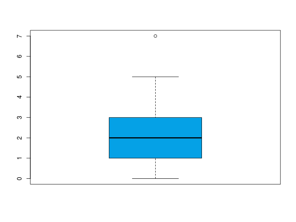

## Exercise 1
Classify the following variables

1. Daily hours of exercise.
2. Nationality.
3.  Blood pressure.
4.  Severity of illness.
5.  Number of sport injuries in a year.
6.  Daily calorie intake.
7.  Size of clothing.
8.  Subjects passed in a course.

<button class="solution">Show solution</button>

1. Quantitative continuous.
2. Qualitative nominal.
3. Quantitative continuous.
4. Qualitative ordinal.
5. Quantitative discrete.
6. Quantitative continuous.
7. Qualitative ordinal.
8. Quantitative discrete.

## Exercise 2
The number of injuries suffered by the members of a soccer team in a league were

0 1 2 1 3 0 1 0 1 2 0 1 1 1 2 0 1 3 2 1 2 1 0 1

1.  Construct the frequency distribution table of the sample.
2.  Draw the bar chart of the sample and the polygon.
3.  Draw the cumulative frequency bar chart and the polygon.

## Exercise 3
A survey about the daily number of medicines consumed by people over 70 years, shows the following results:

3 1 2 2 0 1 4 2 3 5 1 3 2 3 1 4 2 4 3 2
3 5 0 1 2 0 2 3 0 1 1 5 3 4 2 3 0 1 2 3

1.  Construct the frequency distribution table of the sample.
2.  Draw the bar chart of the sample and the polygon.
3.  Draw the cumulative relative frequency bar chart and the polygon.

## Exercise 4
In a survey about the dependency of older people, 23 persons over 75 years were asked about the help they need in daily life. The answers were

B D A B C C B C D E A B C E A B C D B B A A B

where the meanings of letters are:

A No help.
B Help climbing stairs.
C Help climbing stairs and getting up from a chair or bed.
D Help climbing stairs, getting up and dressing.
E Help for almost everything.

Construct the frequency distribution table and the suitable chart.

## Exercise 5
The number of people treated in the emergency service of a hospital every day of November was

15 23 12 10 28 7 12 17 20 21 18 13 11 12 26
30 6 16 19 22 14 17 21 28 9 16 13 11 16 20

1.  Construct the frequency distribution table of the sample.
2.  Draw a suitable chart for the frequency distribution.
3.  Draw a suitable chart for the cumulative frequency distribution.

## Exercise 6
The following frequency distribution table represents the distribution of time (in min) required by people attended in a medical dispensary.

$$
\begin{array}{|c|c|c|c|c|}
\hline \mbox{Time} & n_{i} & f_{i} & N_{i} & F_{i}\\
\hline 
\left[ 0,5\right) & 2 &  &  &  \\ 
\hline 
\left[ 5,10\right) &  &  & 8 &  \\ 
\hline 
\left[ 10,15\right) &  & &  & 0.7 \\ 
\hline 
\left[ 15,20\right) & 6 &  &  &\\ 
\hline
\end{array}
$$

1.  Complete the table.
2.  Draw the ogive.

## Exercise 7
The following table represents the frequency distribution of the yearly uses of a health insurance in a sample of clients of a insurance company.

<table>
 <thead>
  <tr>
   <th style="text-align:right;"> uses </th>
   <th style="text-align:right;"> clients </th>
  </tr>
 </thead>
<tbody>
  <tr>
   <td style="text-align:right;"> 0 </td>
   <td style="text-align:right;"> 4 </td>
  </tr>
  <tr>
   <td style="text-align:right;"> 1 </td>
   <td style="text-align:right;"> 8 </td>
  </tr>
  <tr>
   <td style="text-align:right;"> 2 </td>
   <td style="text-align:right;"> 6 </td>
  </tr>
  <tr>
   <td style="text-align:right;"> 3 </td>
   <td style="text-align:right;"> 3 </td>
  </tr>
  <tr>
   <td style="text-align:right;"> 4 </td>
   <td style="text-align:right;"> 2 </td>
  </tr>
  <tr>
   <td style="text-align:right;"> 5 </td>
   <td style="text-align:right;"> 1 </td>
  </tr>
  <tr>
   <td style="text-align:right;"> 7 </td>
   <td style="text-align:right;"> 1 </td>
  </tr>
</tbody>
</table>

Draw the box plot. How is the symmetry of the distribution?

<button class="solution">Show solution</button>

## Exercise 8
The box plots below correspond to the age of a sample of people by marital status.

1.  Which group has higher ages?
2.  Which group has lower central dispersion?
3.  Which groups have outliers?
4.  Which group has a distribution of ages more asymmetric?

