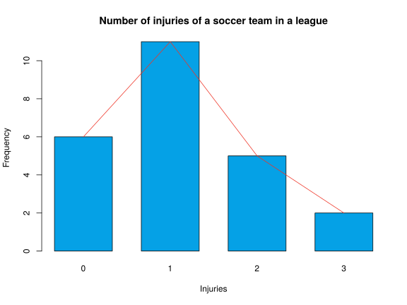
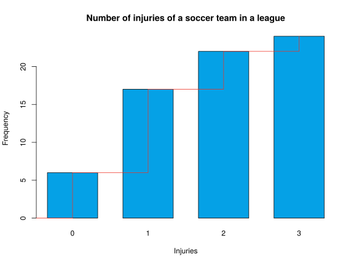
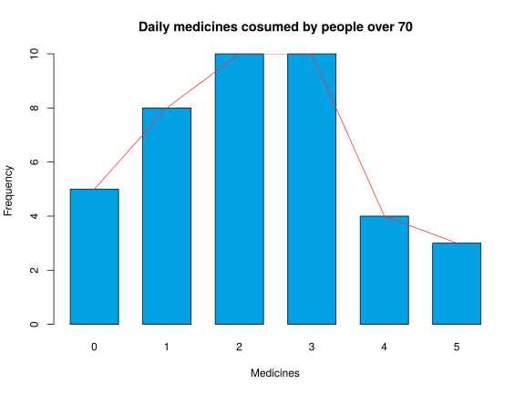
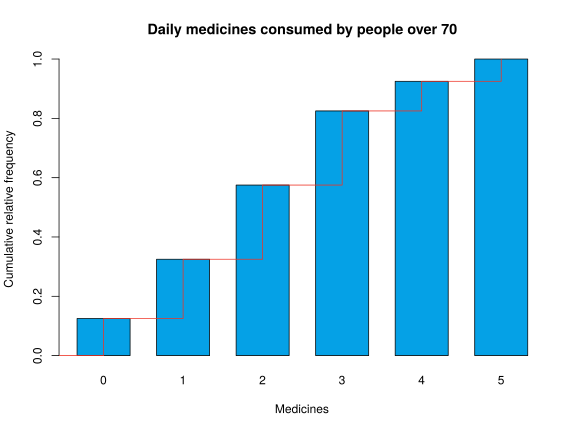
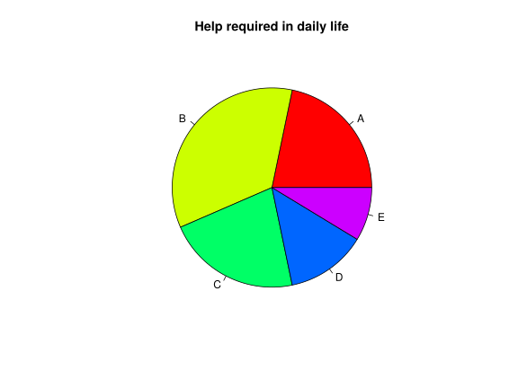
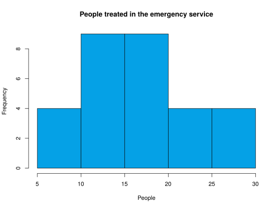
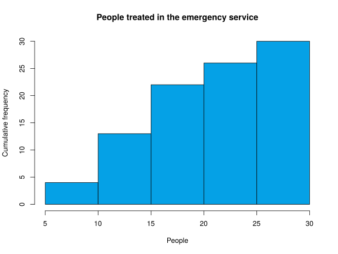
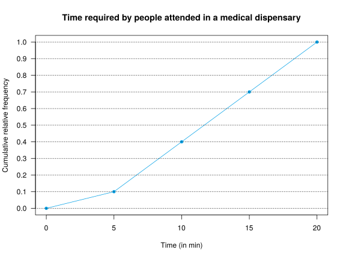
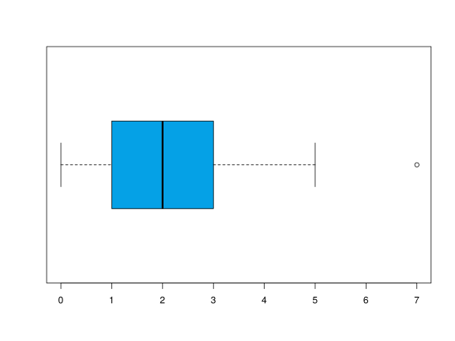
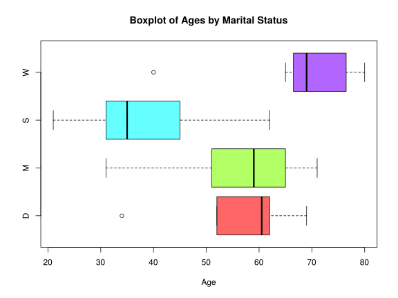

## Exercise 1
Classify the following variables

1. Daily hours of exercise.
2. Nationality.
3.  Blood pressure.
4.  Severity of illness.
5.  Number of sport injuries in a year.
6.  Daily calorie intake.
7.  Size of clothing.
8.  Subjects passed in a course.

<div><button class="solution">Show solution</button></div>
<div id="solution" style="display: none">

1. Quantitative continuous.
2. Qualitative nominal.
3. Quantitative continuous.
4. Qualitative ordinal.
5. Quantitative discrete.
6. Quantitative continuous.
7. Qualitative ordinal.
8. Quantitative discrete.

</div>

## Exercise 2
The number of injuries suffered by the members of a soccer team in a league were

```
0 1 2 1 3 0 1 0 1 2 0 1 1 1 2 0 1 3 2 1 2 1 0 1
```

Compute: 

1.  Construct the frequency distribution table of the sample.
2.  Draw the bar chart of the sample and the polygon.
3.  Draw the cumulative frequency bar chart and polygon.

<div><button class="solution">Show solution</button></div>
<div id="solution" style="display: none">
1. 
<table>
 <thead>
  <tr>
   <th style="text-align:right;"> injuries </th>
   <th style="text-align:right;"> Frec.Abs. </th>
   <th style="text-align:right;"> Frec.Rel. </th>
   <th style="text-align:right;"> Frec.Abs.Acum. </th>
   <th style="text-align:right;"> Frec.Rel.Acum. </th>
  </tr>
 </thead>
<tbody>
  <tr>
   <td style="text-align:right;"> 0 </td>
   <td style="text-align:right;"> 6 </td>
   <td style="text-align:right;"> 0.2500 </td>
   <td style="text-align:right;"> 6 </td>
   <td style="text-align:right;"> 0.2500 </td>
  </tr>
  <tr>
   <td style="text-align:right;"> 1 </td>
   <td style="text-align:right;"> 11 </td>
   <td style="text-align:right;"> 0.4583 </td>
   <td style="text-align:right;"> 17 </td>
   <td style="text-align:right;"> 0.7083 </td>
  </tr>
  <tr>
   <td style="text-align:right;"> 2 </td>
   <td style="text-align:right;"> 5 </td>
   <td style="text-align:right;"> 0.2083 </td>
   <td style="text-align:right;"> 22 </td>
   <td style="text-align:right;"> 0.9167 </td>
  </tr>
  <tr>
   <td style="text-align:right;"> 3 </td>
   <td style="text-align:right;"> 2 </td>
   <td style="text-align:right;"> 0.0833 </td>
   <td style="text-align:right;"> 24 </td>
   <td style="text-align:right;"> 1.0000 </td>
  </tr>
</tbody>
</table>
2.

3. 

</div>

## Exercise 3
A survey about the daily number of medicines consumed by people over 70 shows the following results:


```
3 1 2 2 0 1 4 2 3 5 1 3 2 3 1 4 2 4 3 2 3 5 0 1 2 0 2 3 0 1 1 5 3 4 2 3 0 1 2 3
```

1.  Construct the frequency distribution table of the sample.
2.  Draw the bar chart of the sample and the polygon.
3.  Draw the cumulative relative frequency bar chart and polygon.

<div><button class="solution">Show solution</button></div>
<div id="solution" style="display: none">
1. 
<table>
 <thead>
  <tr>
   <th style="text-align:right;"> medicines </th>
   <th style="text-align:right;"> Frec.Abs. </th>
   <th style="text-align:right;"> Frec.Rel. </th>
   <th style="text-align:right;"> Frec.Abs.Acum. </th>
   <th style="text-align:right;"> Frec.Rel.Acum. </th>
  </tr>
 </thead>
<tbody>
  <tr>
   <td style="text-align:right;"> 0 </td>
   <td style="text-align:right;"> 5 </td>
   <td style="text-align:right;"> 0.125 </td>
   <td style="text-align:right;"> 5 </td>
   <td style="text-align:right;"> 0.125 </td>
  </tr>
  <tr>
   <td style="text-align:right;"> 1 </td>
   <td style="text-align:right;"> 8 </td>
   <td style="text-align:right;"> 0.200 </td>
   <td style="text-align:right;"> 13 </td>
   <td style="text-align:right;"> 0.325 </td>
  </tr>
  <tr>
   <td style="text-align:right;"> 2 </td>
   <td style="text-align:right;"> 10 </td>
   <td style="text-align:right;"> 0.250 </td>
   <td style="text-align:right;"> 23 </td>
   <td style="text-align:right;"> 0.575 </td>
  </tr>
  <tr>
   <td style="text-align:right;"> 3 </td>
   <td style="text-align:right;"> 10 </td>
   <td style="text-align:right;"> 0.250 </td>
   <td style="text-align:right;"> 33 </td>
   <td style="text-align:right;"> 0.825 </td>
  </tr>
  <tr>
   <td style="text-align:right;"> 4 </td>
   <td style="text-align:right;"> 4 </td>
   <td style="text-align:right;"> 0.100 </td>
   <td style="text-align:right;"> 37 </td>
   <td style="text-align:right;"> 0.925 </td>
  </tr>
  <tr>
   <td style="text-align:right;"> 5 </td>
   <td style="text-align:right;"> 3 </td>
   <td style="text-align:right;"> 0.075 </td>
   <td style="text-align:right;"> 40 </td>
   <td style="text-align:right;"> 1.000 </td>
  </tr>
</tbody>
</table>
2.

3. 

</div>

## Exercise 4
In a survey about the dependency of older people, 23 persons over 75 years were asked about the help they need in daily life. The answers were


```
B D A B C C B C D E A B C E A B C D B B A A B
```

where the meanings of letters are:

A No help.
B Help climbing stairs.
C Help climbing stairs and getting up from a chair or bed.
D Help climbing stairs, getting up and dressing.
E Help for almost everything.

Construct the frequency distribution table and a suitable chart.

<div><button class="solution">Show solution</button></div>
<div id="solution" style="display: none">
<table>
 <thead>
  <tr>
   <th style="text-align:left;"> help </th>
   <th style="text-align:right;"> Frec.Abs. </th>
   <th style="text-align:right;"> Frec.Rel. </th>
   <th style="text-align:right;"> Frec.Abs.Acum. </th>
   <th style="text-align:right;"> Frec.Rel.Acum. </th>
  </tr>
 </thead>
<tbody>
  <tr>
   <td style="text-align:left;"> A </td>
   <td style="text-align:right;"> 5 </td>
   <td style="text-align:right;"> 0.2174 </td>
   <td style="text-align:right;"> 5 </td>
   <td style="text-align:right;"> 0.2174 </td>
  </tr>
  <tr>
   <td style="text-align:left;"> B </td>
   <td style="text-align:right;"> 8 </td>
   <td style="text-align:right;"> 0.3478 </td>
   <td style="text-align:right;"> 13 </td>
   <td style="text-align:right;"> 0.5652 </td>
  </tr>
  <tr>
   <td style="text-align:left;"> C </td>
   <td style="text-align:right;"> 5 </td>
   <td style="text-align:right;"> 0.2174 </td>
   <td style="text-align:right;"> 18 </td>
   <td style="text-align:right;"> 0.7826 </td>
  </tr>
  <tr>
   <td style="text-align:left;"> D </td>
   <td style="text-align:right;"> 3 </td>
   <td style="text-align:right;"> 0.1304 </td>
   <td style="text-align:right;"> 21 </td>
   <td style="text-align:right;"> 0.9130 </td>
  </tr>
  <tr>
   <td style="text-align:left;"> E </td>
   <td style="text-align:right;"> 2 </td>
   <td style="text-align:right;"> 0.0870 </td>
   <td style="text-align:right;"> 23 </td>
   <td style="text-align:right;"> 1.0000 </td>
  </tr>
</tbody>
</table>


</div>

## Exercise 5
The number of people treated in the emergency service of a hospital every day of November was


```
15 23 12 10 28 7 12 17 20 21 18 13 11 12 26 30 6 16 19 22 14 17 21 28 9 16 13 11 16 20
```

1.  Construct the frequency distribution table of the sample.
2.  Draw a suitable chart for the frequency distribution.
3.  Draw a suitable chart for the cumulative frequency distribution.

<div><button class="solution">Show solution</button></div>
<div id="solution" style="display: none">
1. 

<table>
 <thead>
  <tr>
   <th style="text-align:left;"> Clases.people </th>
   <th style="text-align:right;"> Frec.Abs. </th>
   <th style="text-align:right;"> Frec.Rel. </th>
   <th style="text-align:right;"> Frec.Abs.Acum. </th>
   <th style="text-align:right;"> Frec.Rel.Acum. </th>
  </tr>
 </thead>
<tbody>
  <tr>
   <td style="text-align:left;"> [5,10] </td>
   <td style="text-align:right;"> 4 </td>
   <td style="text-align:right;"> 0.1333 </td>
   <td style="text-align:right;"> 4 </td>
   <td style="text-align:right;"> 0.1333 </td>
  </tr>
  <tr>
   <td style="text-align:left;"> (10,15] </td>
   <td style="text-align:right;"> 9 </td>
   <td style="text-align:right;"> 0.3000 </td>
   <td style="text-align:right;"> 13 </td>
   <td style="text-align:right;"> 0.4333 </td>
  </tr>
  <tr>
   <td style="text-align:left;"> (15,20] </td>
   <td style="text-align:right;"> 9 </td>
   <td style="text-align:right;"> 0.3000 </td>
   <td style="text-align:right;"> 22 </td>
   <td style="text-align:right;"> 0.7333 </td>
  </tr>
  <tr>
   <td style="text-align:left;"> (20,25] </td>
   <td style="text-align:right;"> 4 </td>
   <td style="text-align:right;"> 0.1333 </td>
   <td style="text-align:right;"> 26 </td>
   <td style="text-align:right;"> 0.8667 </td>
  </tr>
  <tr>
   <td style="text-align:left;"> (25,30] </td>
   <td style="text-align:right;"> 4 </td>
   <td style="text-align:right;"> 0.1333 </td>
   <td style="text-align:right;"> 30 </td>
   <td style="text-align:right;"> 1.0000 </td>
  </tr>
</tbody>
</table>

2. 

3. 

</div>

## Exercise 6
The following frequency distribution table represents the distribution of time (in min) required by people attended in a medical dispensary.

$$
\begin{array}{|c|c|c|c|c|}
\hline \mbox{Time} & n_{i} & f_{i} & N_{i} & F_{i}\\
\hline 
\left[ 0,5\right) & 2 &  &  &  \\ 
\hline 
\left[ 5,10\right) &  &  & 8 &  \\ 
\hline 
\left[ 10,15\right) &  & &  & 0.7 \\ 
\hline 
\left[ 15,20\right) & 6 &  &  &\\ 
\hline
\end{array}
$$

1.  Complete the table.
2.  Draw the ogive.

<div><button class="solution">Show solution</button></div>
<div id="solution" style="display: none">
1. 
$$
\begin{array}{|c|c|c|c|c|}
\hline \mbox{Time} & n_{i} & f_{i} & N_{i} & F_{i}\\
\hline 
\left[ 0,5\right) & 2 & 0.1 & 2 & 0.1 \\ 
\hline 
\left[ 5,10\right) & 6 & 0.3 & 8 & 0.4 \\ 
\hline 
\left[ 10,15\right) & 6 & 0.3 & 14 & 0.7 \\ 
\hline 
\left[ 15,20\right) & 6 & 0.3 & 20  & 1\\ 
\hline
\end{array}
$$

2. 

</div>


## Exercise 7
The following table represents the frequency distribution of the yearly uses of a health insurance in a sample of clients of a insurance company.


| uses| clients|
|----:|-------:|
|    0|       4|
|    1|       8|
|    2|       6|
|    3|       3|
|    4|       2|
|    5|       1|
|    7|       1|

Draw the box plot. Study the symmetry of the distribution.

<div><button class="solution">Show solution</button></div>
<div id="solution" style="display: none">

</div>


## Exercise 8
The box plots below correspond to the age of a sample of people by marital status.



1.  Which group has higher ages?
2.  Which group has lower central dispersion?
3.  Which groups have outliers?
4.  At which group is the age distribution more asymmetric?


<div><button class="solution">Show solution</button></div>
<div id="solution" style="display: none">
1. Widowers. 2. Divorced. 3. Widowers and divorced. 4. Divorced.
</div>


