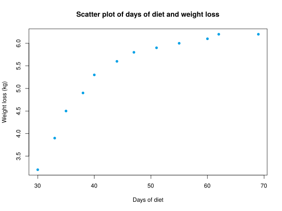
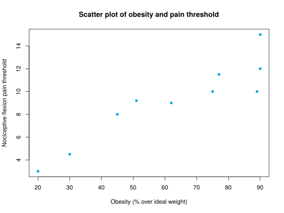

## Exercise 1
A dietary center is testing a new diet in sample of 12 persons. The data below are the number of days of diet and the weight loss (in Kg) until them for every person.

```
(33,3.9)  (51,5.9)  (30,3.2)  (55,6)  (38,4.9)  (62,6.2)  (35,4.5)  (60,6.1)  (44,5.6)  (69,6.2)  (47,5.8)  (40,5.3) 
```

1. Draw the scatter plot. According to the point cloud, what type of regression model explains better the relation between the weight loss and the days of diet?
2. Construct the linear regression model and the logarithmic regression model of the weight loss on the number of days of diet.
3. Use the best model to predict the weight that will lose a person after 100 days of diet. Is this prediction reliable?

Use the following sums ($X$=days of diet and $Y$=weight loss):
$\sum x_i=564$ days, $\sum \log(x_i)=45.8086$ $\log(\mbox{days})$, $\sum y_j=63.6$ Kg, $\sum x_i^2=28234$ days$^2$, $\sum \log(x_i)^2=175.6603$ $\log(\mbox{days})^2$, $\sum y_j^2=347.7$ Kg$^2$, $\sum x_iy_j=3108.5$ days$\cdot$Kg, $\sum \log(x_i)y_j=245.4738$ $\log(\mbox{days})\cdot$Kg.

<div><button class="solution">Show solution</button></div>
<div id="solution" style="display: none">
1.

2. Linear model<br/>
$\bar x=47$ days, $s_x^2=156.9091$ days$^2$.<br/>
$\bar y=5.3$ kg, $s_y^2=0.9655$ kg$^2$.<br/>
$s_{xy}=10.8455$ days$\cdot$kg.<br/>
Regression line of weight loss on days of diet: $y=2.0514 + 0.0691x$.<br/>
$r^2=0.7765$.

Logartihmic model<br/>
$\overline{\log(x)}=3.8174$ log(days), $s_{\log(x)}^2=0.0719$ log(days)$^2$.<br/>
$s_{\log(x)y}=0.2444$ log(days)$\cdot$kg.<br/>
Logartihmic model of weight loss on days of diet: $y=-7.6678 + 3.397\log(x)$.<br/>
$r^2=0.8599$.<br/>
3. $y(100)=7.9761$ kg. 
</div>

## Exercise 2
The concentration of a drug in blood, in mg/dl, depends on time, in hours, according to the data below.


| Drug concentration| Hours|
|------------------:|-----:|
|                  2|    25|
|                  3|    36|
|                  4|    48|
|                  5|    64|
|                  6|    86|
|                  7|   114|
|                  8|   168|

1. Construct the linear regression model of drug concentration on time.
2. Construct the exponential regression model of drug concentration on time.
3. Use the best regression model to predict the drug concentration after $4.8$ hours? Is this prediction reliable? Justify the answer.

Use the following sums ($C$=Drug concentration and $T$=time): $\sum c_i=35$ mg/dl, $\sum \log(c_i)=10.6046$ $\log(\mbox{mg/dl})$, $\sum t_j=541$ hours, $\sum \log(t_j)=29.147$ $\log(\mbox{hours})$, $\sum c_i^2=203$ (mg/dl)$^2$, $\sum \log(c_i)^2=17.5205$ $\log(\mbox{mg/dl})^2$, $\sum t_j^2=56937$ hours$^2$, $\sum \log(t_j)^2=124.0131$ $\log(\mbox{hours})^2$, $\sum c_it_j=3328$ mg/dl$\cdot$hours, $\sum c_i\log(t_j)=154.3387$ mg/dl$\cdot\log(\mbox{hours})$, $\sum \log(c_i)t_j=951.6961$ $\log(\mbox{mg/dl})\cdot$hours, $\sum \log(c_i)\log(t_j)=46.0805$   $\log(\mbox{mg/dl})\cdot\log(\mbox{hours})$.

<div><button class="solution">Show solution</button></div>
<div id="solution" style="display: none">
1. $\bar x=5$ hours, $s_x^2=4.6667$ hours$^2$.<br/>
$\bar y=77.2857$ mg/dl, $s_y^2=2520.9048$ (mg/dl)$^2$.<br/>
$s_{xy}=103.8333$ hours$\cdot$mg/dl.<br/>
Regression line of drug concentration on time: $y=-33.9643 + 22.25x$.<br/>
$r^2=0.9165$.<br/>
2.

$\overline{\log(y)}=4.1639$ log(mg/dl), $s_{\log(y)}^2=0.4415$ log(mg/dl)$^2$.<br/>
$s_{x\log(y)}=1.434$ hours$\cdot$log(mg/dl).<br/>
Exponential model of drug concentration on time: $y=e^{2.6275 + 0.3073x}$.<br/>
$r^2=0.9979$.<br/>
3. $y(4.8)=60.4853$ mg/dl. 
</div>

## Exercise 3
A researcher is studying the relation between the obesity and the response to pain. Te obesity is measured as the percentage over the ideal weight, and the response to pain as the nociceptive flexion pain threshold. The results of the study appears in the table below.


| Obesity| Pain threshold|
|-------:|--------------:|
|      89|           10.0|
|      90|           12.0|
|      77|           11.5|
|      30|            4.5|
|      51|            9.2|
|      75|           10.0|
|      62|            9.0|
|      45|            8.0|
|      90|           15.0|
|      20|            3.0|

1. According to the scatter plot, what model explains better the relation of the response to pain on the obesity?
2. According to the best regression model, what is the response to pain expected for a person with an obesity of 50%? Is this prection reliable?
3. According to the best regression model, what is the expected obesity for a person with a pain threshold of 10? Is this prediction reliable?

Use the following sums ($X$=Obesity and $Y$=Pain threshold):
$\sum x_i=629$, $\sum \log(x_i)=40.4121$, $\sum y_j=92.2$, $\sum \log(y_j)=21.339$, $\sum x_i^2=45445$, $\sum \log(x_i)^2=165.6795$, $\sum y_j^2=960.14$, $\sum \log(y_j)^2=47.6231$, $\sum x_iy_j=6537.7$, $\sum x_i\log(y_j)=1443.1275$, $\sum \log(x_i)y_j=387.5728$, $\sum \log(x_i)\log(y_j)=88.3696$.

<div><button class="solution">Show solution</button></div>
<div id="solution" style="display: none">
1.

2. Linear model<br/>
$\bar x=62.9$, $s_x^2=653.4333$.<br/>
$\bar y=9.22$, $s_y^2=12.2284$.<br/>
$s_{xy}=82.0356$.<br/>
Regression line of pain threshold on obesity: $y=1.3232 + 0.1255x$.<br/>
$r^2=0.8422$.

Logartihmic model<br/>
$\overline{\log(x)}=4.0412$, $s_{\log(x)}^2=0.2629$.<br/>
$s_{\log(x)y}=1.6637$.<br/>
Logartihmic model of pain threshold on obesity: $y=-16.3578 + 6.3293\log(x)$.<br/>
$r^2=0.8611$.<br/>
$y(50)=8.4023$.<br/>
3. 

Exponential model of obesity on pain threshold: $x=e^{2.7868 + 0.1361y}$.<br/>
$x(10)=63.2648$. 

