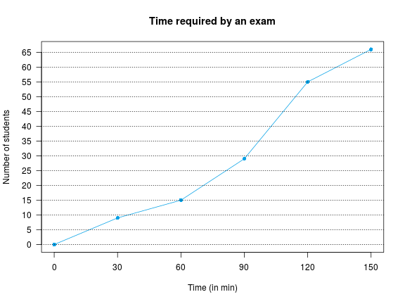
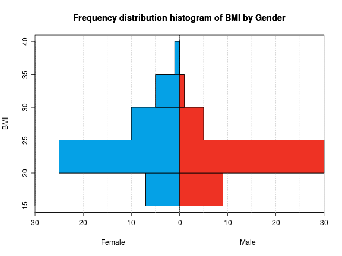
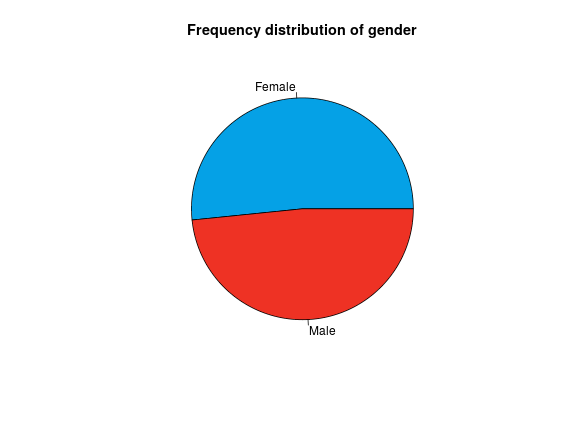

## Exercise 1
The number of injuries suffered by the members of a soccer team in a league were


```
0 1 2 1 3 0 1 0 1 2 0 1 1 1 2 0 1 3 2 1 2 1 0 1
```
Calculate the following statistics and interpret them.
1. Mean.
2. Median.
3. Mode.
4. Quartiles.
5. Percentile 32.

<div><button class="solution">Show solution</button></div>
<div id="solution" style="display: none">
1. $\bar x=1.125$ injuries.
2. $Me=1$ injury.
3. $Mo=1$ injury.
4. $Q_1=1$ injury, $Q_2=1$ injury and $Q_3=2$ injuries.
5. $P_{32}=1$ injury.
</div>

## Exercise 2
The chart below shows the cumulative distribution of the time (in min) required by 66 students to do an exam.



1.  A which time have finished half of the students? And 90% of students?
2.  Which percentage of students have finished after 100 minutes?
3.  Which is the time that best represent the time required by students in the sample to finish the exam? Is this value representative or not?

<div><button class="solution">Show solution</button></div>
<div id="solution" style="display: none">
3. $\bar x=75$ min, $s=51.2348$ min and $cv=0.6831$.
</div>

## Exercise 3
In a study about the children growth two samples where drawn, one for newborns and the other for one year old. The height in cm of children in both samples were


```
Newborn children: 51 50 51 53 49 50 53 50 47 50 
One year old children: 62 65 69 71 65 66 68 69
```
In which group is more representative the mean? Justify the answer.

<div><button class="solution">Show solution</button></div>
<div id="solution" style="display: none">
Newborn children: $\bar x=50.4$ min, $s_x=1.6852$ min and $cv_x=0.0334$.<br/>
One year old children:  $\bar y=66.875$ min, $s_y=2.7128$ min and $cv_y=0.0406$.
</div>

## Exercise 4
To determine the accuracy of a method for measuring hematocrit in blood, the measurement was repeated 8 times on the same blood sample. The results in percentage of hematocrit in plasma were


```
42.2 42.1 41.9 41.8 42 42.1 41.9 42
```
What do you think about the accuracy of the method?

<div><button class="solution">Show solution</button></div>
<div id="solution" style="display: none">
$\bar x=42$ min, $s=0.1225$ min and $cv=0.0029$.
</div>

## Exercise 5
The histogram below shows the frequency distribution of the body mass index (BMI) of a group of people by gender.


1.  Draw the pie chart for the gender.
2.  In which group is more representative the mean of the BMI?
3.  Calculate the mean for the whole sample.

Use the following sums
Females: $\sum x_i=1160$ kg/m$^2$ $\sum x_i^2=29050$ kg$^2$/m$^4$
Males: $\sum x_i=1002.5$ kg/m$^2$ $\sum x_i^2=22781.25$ kg$^2$/m$^4$

<div><button class="solution">Show solution</button></div>
<div id="solution" style="display: none">
1. 


2. Females: $\bar x=24.1667$ min, $s_x=4.6022$ min and $cv_x=0.1904$.<br/>
Males:  $\bar y=22.2778$ min, $s_y=3.1545$ min and $cv_y=0.1416$.<br/>
3. $\bar z=23.2527$.
</div>

The following table represents the frequency distribution of ages at
which a group of people suffered a heart attack.

  --------- ---------- ---------- ---------- ---------- ----------
  Age        \[40-50)   \[50-60)   \[60-70)   \[70-80)   \[80-90)
  Persons       6          12         23         19         5
  --------- ---------- ---------- ---------- ---------- ----------

Could we assume that the sample comes from a normal population?

Use the following sums: $\sum x_i= 4275$ years,
$\sum (x_i-\bar x)^2=7462$ years$^2$, $\sum (x_i-\bar x)^3=-18249$
years$^3$, $\sum (x_i-\bar x)^4=2099636$ years$^4$.

To compare two rehabilitation treatments $A$ and $B$ for an injury,
every treatment was applied to a different group of people. The number
of days required to cure the injury in every group is shown in the
following table:

  -------- ----- -----
  Days       $A$   $B$
  20-40        5     8
  40-60       20    15
  60-80       18    20
  80-100       7     7
  -------- ----- -----

1.  In which treatment is more representative the mean?

2.  In which treatment the distribution of days is more skew?

3.  In which treatment the distribution is more peaked?

Use the following sums:\
$A$: $\sum x_i= 3040$ days, $\sum (x_i-\bar x)^2=14568$ days$^2$,
$\sum (x_i-\bar x)^3=17011.2$ days$^3$, $\sum
(x_i-\bar x)^4=9989603$ days$^4$\
$B$: $\sum x_i= 3020$ days, $\sum (x_i-\bar x)^2=16992$ days$^2$,
$\sum (x_i-\bar x)^3=-42393.6$ days$^3$, $\sum
(x_i-\bar x)^4=12551516$ days$^4$\

The systolic blood pressure (in mmHg) of a sample of persons is
$$135\quad 128\quad 137\quad 110\quad 154\quad 142\quad 121\quad 127\quad 114\quad 103$$

1.  Calculate the central tendency statistics.

2.  How is the relative dispersion with respect to the mean?

3.  How is the skewness of the sample distribution?

4.  How is the kurtosis of the sample distribution?

5.  If we know that the method used for measuring the blood pressure is
    biased, and, in order to get the right values, we have to apply the
    linear transformation $y=1.2x-5$, which are values of the statistics
    required to answer the previous questions for the corrected values
    of the blood pressure?

Use the following sums: $\sum x_i= 1271$ mmHg,
$\sum (x_i-\bar x)^2=2188.9$ mmHg$^2$, $\sum (x_i-\bar x)^3=2764.32$
mmHg$^3$, $\sum (x_i-\bar x)^4=1040080$ mmHg$^4$.

The table below contains the frequency of pregnancies, abortions and
births of a sample of 999 women in a city.

  ----- ------------- ----------- --------
   Num    Pregnancies   Abortions   Births
    0              61         751       67
    1              64         183       80
    2             328          51      400
    3             301          10      300
    4             122           2       90
    5              81           2       62
    6              29           0        0
    7              11           0        0
    8               2           0        0
  ----- ------------- ----------- --------

1.  How many birth outliers are in the sample?

2.  Which variable has lower spread with respect to the mean?

3.  Which value is relatively higher, 7 pregnancies or 4 abortions?
    Justify the answer.

Use the following sums:\
Pregnancies: $\sum x_i= 2783$, $\sum x_i^2=9773$.\
Abortions: $\sum x_i= 333$, $\sum x_i^2=559$.\
Births: $\sum x_i= 2450$, $\sum x_i^2=7370$.

