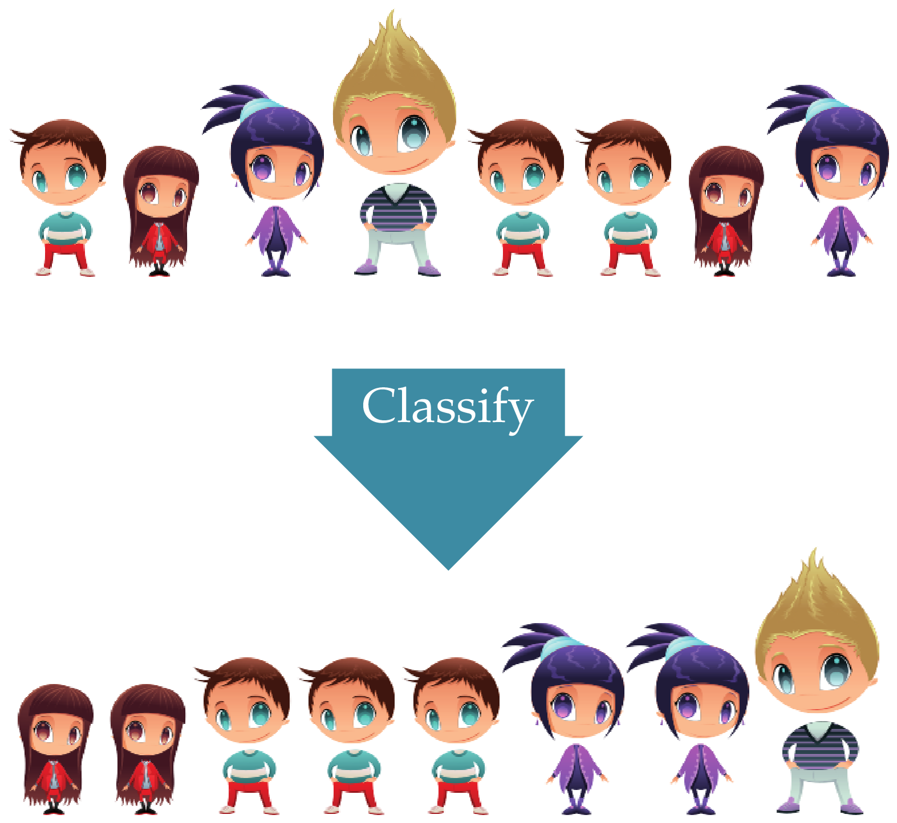
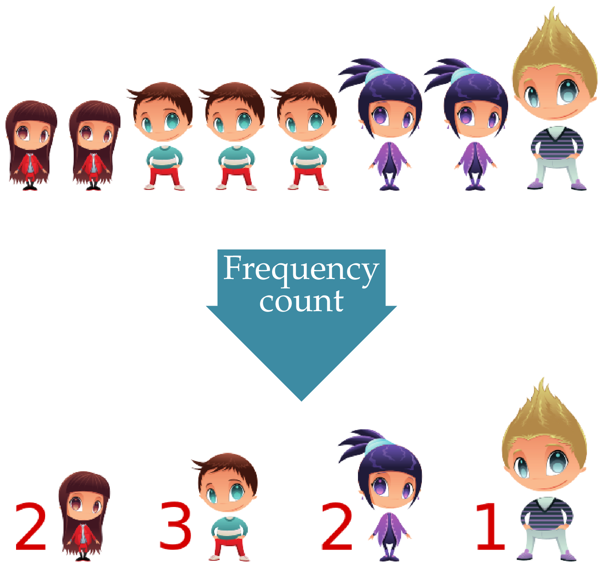

Descriptive Statistics is the part of Statistics in charge of representing, analysing and summarizing the information contained in the
sample.

After the sampling process, is the next step in every statistical study and usually consists of:

1.  Classify, group and sort the data of the sample.

2.  Tabulate and plot data according to their frequencies.

3.  Calculate numerical measures that summarize the information contained in the sample (*sample statistics*).

It has no inferential power $\Rightarrow$ *Do not generalize to the population!*

Frequency distribution
----------------------

The study of a statistical variable starts measuring the variable in the individuals of the sample and classifying the values.

There are two ways of classifying data:

**Non-grouping**: Sort values from lowest to highest value (if there is an order). Used with qualitative variables and discrete variables with few   distinct values.

**Grouping**: Group values in intervals (classes) and sort them from lowest to highest intervals. Used with continuous variables and discrete   variables with many distinct values.

### Sample classification
It consists in grouping the values that are the same and sorting them if there is an order among them. 

**Example**. $X=$Height

### Frequency count
It consists in counting the number of times that every value appears in the sample. 

**Example**. $X=$Height

### Sample frequencies

> **Definition - Sample frequencies**. Given a sample of $n$ values of a variable $X$, for every value $x_i$ of the variable is defined
>
> - **Absolute frequency $n_i$**: Is the number of times that value $x_i$ appears in the sample.
>
> - **Relative frequency $f_i$**: Is the proportion of times that value $x_i$ appears in the sample.
>
$$f_i = \frac{n_i}{n}$$
>
> - **Cumulative absolute frequency $N_i$**: Is the number of values in the sample less than or equal to $x_i$.
>
$$N_i = n_1 + \cdots + n_i = N_{i-1}+n_i$$ 
>
> - **Cumulative relative frequency $F_i$**: Is the proportion of values in the sample less than or equal to $x_i$. 
>
$$F_i = \frac{N_i}{n}$$

<!--
### Frequency table

The set of values of a variable with their respective frequencies is
called of the variable in the sample, and it is usually represented as a
.

|&gt;p1.8cm|&gt;p1.8cm|&gt;p1.8cm|&gt;p1.8cm|p1.8cm&lt;|
& & & &\
$x_1$ & $n_1$ & $f_1$ & $N_1$ & $F_1$\
$\vdots$ & $\vdots$ & $\vdots$ & $\vdots$ & $\vdots$\
$x_i$ & $n_i$ & $f_i$ & $N_i$ & $F_i$\
$\vdots$ & $\vdots$ & $\vdots$ & $\vdots$ & $\vdots$\
$x_k$ & $n_k$ & $f_k$ & $N_k$ & $F_k$\

### Frequency table

#### Example of quantitative variable and non-grouped data

The number of children in 25 families are:

1, 2, 4, 2, 2, 2, 3, 2, 1, 1, 0, 2, 2,\
0, 2, 2, 1, 2, 2, 3, 1, 2, 2, 1, 2

The frequency table for the number of children in this sample is
$$\setlength\arraycolsep{3mm}
\setlength\arrayrulewidth{0.5pt}
\begin{array}{rrrrr}
\hline
x_i & n_i & f_i & N_i & F_i\\
\hline
0 & 2 & 0.08 & 2 & 0.08\\
1 & 6 & 0.24 & 8 & 0.32\\
2 & 14 & 0.56 & 22 & 0.88\\
3 & 2  & 0.08 & 24 & 0.96\\
4 & 1 & 0.04 & 25 & 1 \\
\hline
\sum & 25 & 1 \\
\hline
\end{array}$$

### Frequency table

#### Example of quantitative variable and grouped data

The heights (in cm) of 30 students are:

179, 173, 181, 170, 158, 174, 172, 166, 194, 185,\
162, 187, 198, 177, 178, 165, 154, 188, 166, 171,\
175, 182, 167, 169, 172, 186, 172, 176, 168, 187.

The frequency table for the height in this sample is
$$\setlength\arraycolsep{3mm}
\setlength\arrayrulewidth{0.5pt}
\begin{array}{rrrrr}
\hline
\multicolumn{1}{c}{x_i} & \multicolumn{1}{c}{n_i} & \multicolumn{1}{c}{f_i} & \multicolumn{1}{c}{N_i} & \multicolumn{1}{c}{F_i}\\
\hline
(150,160] & 2 & 0.07 & 2 & 0.07\\
(160,170] & 8 & 0.27 & 10 & 0.34\\
(170,180] & 11 & 0.36 & 21 & 0.70\\
(180,190] & 7  & 0.23 & 28 & 0.93\\
(190,200] & 2 & 0.07 & 30 & 1 \\
\hline
\sum & 30 & 1 \\
\hline
\end{array}$$

### Classes construction

Intervals are known as and the center of intervals as .

When grouping data into intervals, the following rules must be taken
into account:

-   The number of intervals should not be too big nor too small. A usual
    rule of thumb is to take a number of intervals approximately
    $\sqrt{n}$ or $\log_2(n)$.

-   The intervals must not overlap and must cover the entire range of
    values. It doesn’t matter if intervals are left-open and
    right-closed or vice versa.

-   The minimum value must fall in the first interval and the maximum
    value in the last.

### Frequency table

#### Example with qualitative variable

The blood type of 30 people are:

A, B, B, A, AB, 0, 0, A, B, B, A, A, A, A, AB,\
A, A, A, B, 0, B, B, B, A, A, A, 0, A, AB, 0.

The frequency table of the blood type is $$\setlength\arraycolsep{3mm}
\setlength\arrayrulewidth{0.5pt}
\begin{array}{crr}
\hline
\multicolumn{1}{c}{x_i} & \multicolumn{1}{c}{n_i} & \multicolumn{1}{c}{f_i} \\
\hline
\mbox{0} & 5 & 0.16 \\
\mbox{A} & 14 & 0.47 \\
\mbox{B} & 8 & 0.27 \\
\mbox{AB} & 3 & 0.10 \\
\hline
\sum & 30 & 1 \\
\hline
\end{array}$$

*Why there are not cumulative frequencies?*

Frequency distribution graphs
-----------------------------

### Frequency distribution graphs

Usually the frequency distribution is also displayed graphically.

Depending on the type of variable and if data has been grouped or not,
there are different types of charts:

-   Bar chart

-   Histogram

-   Line chart or ogive.

-   Pie chart

### Bar chart

A consists in a set of bars, one for every value or category of the
variable, plotted on a coordinate system.

Usually the values or categories of the variable are represented on the
$x$-axis, and the frequencies on the $y$-axis. For each value or
category of the variable, a bar is draw to the height of its frequency.
The width of the bar is not important but bars should be clearly
separated among them.

Depending on the type of frequency represented in the $y$-axis we get
different types of bar charts.

Sometimes a polygon, known as , is plotted joining the top of every bar.

### Absolute frequency bar chart

#### Non-grouped data

### Absolute frequency line chart or polygon

#### Non-grouped data

### Cumulative absolute frequency bar chart

#### Non-grouped data

### Cumulative absolute frequency line chart or polygon

#### Non-grouped data

### Histogram

A is similar to a bar chart but for grouped data.

Usually the classes or grouping intervals are represented on the
$x$-axis, and the frequencies on the $y$-axis. For each class, a bar is
draw to the height of its frequency. Contrary to bar charts, the width
of bars coincides with the width of classes, and there are no space
between two consecutive bars.

Depending on the type of frequency represented in the $y$-axis we get
different types of histograms.

Sometimes a polygon, known as , is plotted joining the top of every bar.

### Absolute frequency histogram

#### Grouped data

### Absolute frequency histogram

#### Grouped data

### Cumulative absolute frequency histogram

#### Grouped data

### Cumulative absolute frequency line chart or ogive

#### Grouped data

### Cumulative relative frequency histogram

#### Grouped data

### Cumulative relative frequency line chart or ogive

#### Grouped data

### Pie chart

A consists in a circle divided in slices, one for every value or
category of the variable. Each slice is called and its angle or area is
proportional to the frequency of the corresponding value or category.

Pie charts can represent absolute or relative frequencies, but not
cumulative frequencies, and are used with nominal qualitative variables.
For ordinal qualitative or quantitative variables is better to use bar
charts or histograms, cause it’s easy to perceive differences in one
dimension (lenght of bars) than in two dimensions (areas of sectors).

### Pie chart

#### Nominal variables

### Outliers

One of the main problems in samples are , that are values very different
from the rest of values of the sample.

It’s important to find out outliers before doing any analysis, cause .

They always appears in the ends of the distribution, and can be find out
easily with a box and whiskers chart (as be showed later).

### Outliers management

With big samples outliers have less importance and can be left in the
sample.

With small samples we have several options:

-   Remove the outlier if it’s an error.

-   Replace the outlier by the lower or higher value in the distribution
    that is not an outlier if it’s not an error and the outlier doesn’t
    fit the theoretical distribution.

-   Leave the outlier if it’s not an error, and change the theoretical
    model to fit it to outliers.

Sample statistics
=================

### Sample statistics

The frequency table and charts summarize and give an overview of the
distribution of values of the studied variable in the sample, but it’s
difficult to describe some aspects of the distribution from it, as for
example, which are the most representative values of the distribution,
how is the spread of data, which data could be considered outliers, how
is the symmetry of the distribution.

To describe those aspects of the sample distribution more specific
numerical measures, called , are used.

According to the aspect of the distribution that they study, there are
different types of statistics:

Measures of locations:

:   They measure the values where data are concentrated or that divide
    the distribution into equal parts.

Measures of dispersion:

:   They measure the spread of data.

Measures of shape:

:   They measure the symmetry and kurtosis of the distribution.

Location statistics
-------------------

### Location statistics

There are two groups:

Central location measures:

:   They measure the values where data are concentrated, and that
    usually are in the centre of the distribution. These values are the
    values that best represents the sample data. The most important are:

    -   Arithmetic mean

    -   Median

    -   Mode

Non-central location measures:

:   They divide the sample data into equals parts. The most important
    are:

    -   Quartiles.

    -   Deciles.

    -   Percentiles.

### Arithmetic mean

\[Sample arithmetic mean $\bar{x}$\] The *sample arithmetic mean* of a
variable $X$ is the sum of observed values in the sample divided by the
sample size $$\bar{x} = \frac{\sum x_i}{n}$$

From the frequency table can be calculated with the formula
$$\bar{x} = \frac{\sum x_in_i}{n} = \sum x_i f_i$$

In most cases the arithmetic mean is the value that best represent the
observed values in the sample.

### Arithmetic mean calculation

#### Example with non-grouped data

Using the data of the sample with the number of children of families,
the arithmetic mean is $$\begin{aligned}
\bar{x} &= \frac{1+2+4+2+2+2+3+2+1+1+0+2+2}{25}+\\
&+\frac{0+2+2+1+2+2+3+1+2+2+1+2}{25} = \frac{44}{25} = 1.76 \mbox{ children}.\end{aligned}$$
or using the frequency table $$\setlength\arraycolsep{3mm}
\setlength\arrayrulewidth{0.5pt}
\begin{array}{rrrrr}
\hline
\multicolumn{1}{c}{x_i} & \multicolumn{1}{c}{n_i} & \multicolumn{1}{c}{f_i} & \multicolumn{1}{c}{x_in_i} & \multicolumn{1}{c}{x_if_i}\\
\hline
0 & 2 & 0.08 & 0 & 0\\
1 & 6 & 0.24 & 6 & 0.24\\
2 & 14 & 0.56 & 28 & 1.12\\
3 & 2  & 0.08 & 6 & 0.24\\
4 & 1 & 0.04 & 4 & 0.16 \\
\hline
\sum & 25 & 1 & 44 & 1.76 \\
\hline
\end{array}$$
$$\bar{x} = \frac{\sum x_in_i}{n} = \frac{44}{25}= 1.76 \qquad \bar{x}=\sum{x_if_i} = 1.76.$$
That means that the value that best represent the number of children in
the families of the sample is $1.76$ children.

### Arithmetic mean calculation

#### Example with grouped data

Using the data of the sample of student heights, the arithmetic mean is
$$\bar{x} = \frac{179+173+\cdots+187}{30} = 175.07 \mbox{ cm}.$$ or
using the frequency table with the class marks
$$\setlength\arraycolsep{3mm}
\setlength\arrayrulewidth{0.5pt}
\begin{array}{rrrrrr}
\hline
\multicolumn{1}{c}{X} & \multicolumn{1}{c}{x_i} & \multicolumn{1}{c}{n_i} & \multicolumn{1}{c}{f_i} & \multicolumn{1}{c}{x_in_i} & \multicolumn{1}{c}{x_if_i}\\
\hline
(150,160] & 155 & 2 & 0.07 & 310 & 10.33\\
(160,170] & 165 & 8 & 0.27 & 1320 & 44.00\\
(170,180] & 175 & 11 & 0.36 & 1925 & 64.17\\
(180,190] & 185 & 7 & 0.23 & 1295 & 43.17\\
(190,200] & 195 & 2 & 0.07 & 390 & 13 \\
\hline
\sum &  & 30 & 1 & 5240 & 174.67 \\
\hline
\end{array}$$
$$\bar{x} = \frac{\sum x_in_i}{n} = \frac{5240}{30}= 174.67 \qquad \bar{x}=\sum{x_if_i} = 174.67.$$

Observe that when the mean is calculated from the table the result
differs a little from the real value, cause the values used in the
calculations are the class marks instead of the actual values.

### Weighted mean

In some cases the values of the sample have different importance. In
that case the importance or *weight* of each value of the sample must be
taken into account when calculating the mean.

\[Sample weighted mean $\bar{x}_p$\] Given a sample of values
$x_1,\ldots,x_n$ where every value $x_i$ has a weight $p_i$, the
*weighted mean* of variable $X$ is the sum of the product of each value
by its weight, divided by sum of weights
$$\bar{x}_p = \frac{\sum x_ip_i}{\sum p_i}$$

From the frequency table can be calculated with the formula
$$\bar{x}_p = \frac{\sum x_ip_in_i}{\sum p_i}$$

### Weighted mean calculation

Assume that a student wants to calculate a representative measure o its
performance in a course. The grade and the credits of every subjects are

  Subject      Credits   Grade
  ----------- --------- -------
  Maths           6        5
  Economics       4        3
  Chemistry       8        6

The arithmetic mean is
$$\bar{x} = \frac{\sum x_i}{n} = \frac{5+3+6}{3}= 4.67 \text{ points},$$
However, this measure does not represent well the performance of the
student, as not all the subjects have the same importance and require
the same effort to pass. Subjects with more credits require more work
and must have more weight in the calculation of the mean.

In this case is better to use the weighted mean, using the credits as
the weights of grades, as a representative measure of the student effort
$$\bar{x}_p = \frac{\sum x_ip_i}{\sum p_i} = \frac{5\cdot 6+3\cdot 4+6\cdot 8}{6+4+8}= \frac{90}{18} = 5 \text{ points}.$$

### Median

\[Sample median $Me$\] The *sample median* of a variable $X$ is the
value that is in the middle of the ordered sample.

The median divides the sample distribution in into two equal parts, that
is, there are the same number of values above and below the median. It
has cumulative frequencies $N_{Me}= n/2$ y $F_{Me}= 0.5$.

### Median calculation

#### Non-grouped data

With non-grouped data, there are two possibilities:

-   Odd sample size: The median is the value in the position
    $\frac{n+1}{2}$.

-   Even sample size: The median is the average of values in positions
    $\frac{n}{2}$ and $\frac{n}{2}+1$.

### Median calculation

#### Example with non-grouped data

Using the data of the sample with the number of children of families,
the sample size is 25, that is odd, and the median is the value in the
position $\frac{25+1}{2} = 13$ of the sorted sample.
$$0,0,1,1,1,1,1,1,2,2,2,2,\fbox{2},2,2,2,2,2,2,2,2,2,3,3,4$$ and the
median is 2 children.

With the frequency table, the median is the lowest value with a
cumulative absolute frequency greater than or equal to $13$, or with a
cumulative relative frequency greater than or equal to $0.5$.
$$\setlength\arraycolsep{3mm}
\setlength\arrayrulewidth{0.5pt}
\begin{array}{rrrrr}
\hline
x_i & n_i & f_i & N_i & F_i\\
\hline
0 & 2 & 0.08 & 2 & 0.08\\
1 & 6 & 0.24 & 8 & 0.32\\
\rowcolor{coral} \color{color1}2 & 14 & 0.56 & 22 & 0.88\\
3 & 2  & 0.08 & 24 & 0.96\\
4 & 1 & 0.04 & 25 & 1 \\
\hline
\sum & 25 & 1 \\
\hline
\end{array}$$

### Mode

\[Sample Mode $Mo$\] The *sample mode* of a variable $X$ is the most
frequent value in the sample.

With grouped data the *modal class* is the class with the highest
frequency.

It can be calculated for all types of variables (qualitative and
quantitative).

Some distributions can have more than one mode

### Mode calculation

Using the data of the sample with the number of children of families,
the value with the highest frequency is $2$, that is the mode $Mo = 2$
children. $$\setlength\arraycolsep{3mm}
\setlength\arrayrulewidth{0.5pt}
\begin{array}{rr}
\hline
\multicolumn{1}{c}{x_i} & \multicolumn{1}{c}{n_i} \\
\hline
0 & 2 \\
1 & 6 \\
\rowcolor{coral}\color{color1} 2 & 14 \\
3 & 2  \\
4 & 1 \\
\hline
\end{array}$$

Using the data of the sample of student heights, the class with the
highest frequency is $(170,180]$ that is the modal class $Mo=(170,180]$.
$$\setlength\arraycolsep{3mm}
\setlength\arrayrulewidth{0.5pt}
\begin{array}{rr}
\hline
\multicolumn{1}{c}{x_i} & \multicolumn{1}{c}{n_i} \\
\hline
(150,160] & 2 \\
(160,170] & 8 \\
\rowcolor{coral} \color{color1}(170,180] & 11 \\
(180,190] & 7 \\
(190,200] & 2 \\
\hline
\end{array}$$

### Which central tendency statistic should I use?

In general, when all the central tendency statistics can be calculated,
is advisable to use them as representative values in the following
order:

1.  Mean. Mean takes more information from the sample than the others,
    as it takes into account the magnitude of data.

2.  Median. Median takes less information than mean but more than mode,
    as it takes into account the order of data.

3.  Mode. Mode is the measure that fewer information takes from the
    sample, as it only takes into account the absolute frequency
    of values.

But, *be careful with outliers*, as the mean can be distorted by them.
In that case is better to use the median as the value most
representative.

For example, if a sample of number of children of 7 families is

0, 0, 1, 1, 2, 2, 15

$\bar{x}=3$ children and $Me=1$ children

*Which measure represent better the number of children in the sample?*

### Non-central location measures

The non-central location measures or *quantiles* divide the sample
distribution in equal parts.

The most used are:

Quartiles:

:   Divide the distribution into 4 equal parts. There are 3 quartiles:
    $C_1$ (25% acumulated) , $C_2$ (50% acumulated), $C_3$
    (75% acumulated).

Deciles:

:   Divide the distribution into 10 equal parts.\
    There are 9 deciles: $D_1$ (10% acumulated) ,…, $D_9$
    (90% acumulated).

Percentiles:

:   Divide the distribution into en 100 equal parts.\
    There are 99 percentiles: $P_1$ (1% acumulated),…, $P_{99}$
    (99% acumulated).

### Quantiles

&lt;4-&gt; Observe that there is a correspondence between
quartiles, deciles and percentiles. For example, first quartile coincide
with percentile 25, and fourth decile coincides with the percentile
40.

### Quantiles calculation

Quantiles are calculated in a similar way to the median. The only
difference lies in the cumulative relative frequency that correspond to
every quantile.

### Quantile calculation

#### Example with non-grouped data

Using the data of the sample with the number of children of families,
the cumulative relative frequencies were $$\setlength\arraycolsep{3mm}
\setlength\arrayrulewidth{0.5pt}
\begin{array}{rr}
\hline
\multicolumn{1}{c}{x_i} & \multicolumn{1}{c}{F_i} \\
\hline
0 & 0.08\\
1 & 0.32\\
2 & 0.88\\
3 & 0.96\\
4 & 1\\
\hline
\end{array}$$

$$\begin{aligned}
F_{C_1}=0.25 &\Rightarrow C_1 = 1 \text{ children},\\
F_{C_2}=0.5 &\Rightarrow C_2 = 2 \text{ children},\\
F_{C_3}=0.75 &\Rightarrow C_3 = 2 \text{ children},\\
F_{D_4}=0.4 &\Rightarrow D_3 = 2 \text{ children},\\
F_{P_{92}}=0.92 &\Rightarrow P_{92} = 3 \text{ children}.\\\end{aligned}$$

Dispersion statistics
---------------------

### Dispersion statistics

*Dispersion* or *spread* refers to the variability of data. So,
dispersion statistics measure how the data values are scattered in
general, or with respect to a central location measure.

For quantitative variables, the most important are:

-   Range

-   Interquartile range

-   Variance

-   Standard deviation

-   Coefficient of variation

### Range and interquartile range

\[Sample range\] The *sample range* of a variable $X$ is the difference
between the the maximum and the minimum value in the sample.
$$\text{Range} = \max_{x_i} -\min_{x_i}$$

The range measure the largest variation among the sample data. However,
it’s very sensitive to outliers, as they appear at the ends of the
distribution, and for that reason is rarely used.

### Range and interquartile range

The following measure avoid the problem of outliers and is much more
used.

\[Sample interquartile range\] The *sample interquartile range* of a
variable $X$ is the difference between the third and the first sample
quartiles. $$\text{IQR} = Q_3 -Q_1$$

The interquartile range measures the spread of the 50% central data.

### Box plot

The dispersion of a variable in a sample can be graphically represented
with a , that represent five descriptive statistics (minimum, quartiles
and maximum) known as the *five-numbers*. It consist in a box, drawn
from the lower to the upper quartile, that represent the interquartile
range, and two segments, known as the lower and the upper *whiskers*.
Usually the box is split in two with the median.

This chart is very helpful as it serves to many purposes:

-   It serves to measure the spread of data as it represent the range
    and the interquartile range.

-   It serves to detect outliers, that are the values outside the
    interval defined by the whiskers.

-   It serves to measure the symmetry of distribution, comparing the
    length of the boxes and whiskers above and below the median.

### Box plot

#### Example with newborn weights

### Box plot construction

To create a box plot follow the steps below

1.  Calculate the quartiles.

2.  Draw a box from the lower to the upper quartile.

3.  Split the box with the median or second quartile.

4.  For the whiskers calculate first two values called *fences* $f_1$ y
    $f_2$. The lower fence is the lower quartile minus one and a half
    the interquartile range, and the upper fence is the upper quartile
    plus one and a half the interquartile range: $$\begin{aligned}
    f_1&=Q_1-1.5\,\text{IQR}\\
    f_2&=Q_3+1.5\,\text{IQR}\end{aligned}$$ The fences define the
    interval where data are considered normal. Any value outside that
    interval is considered an outlier.\
    For the lower whisker draw a segment from the lower quartile to the
    lower value in the sample grater than or equal to $f_1$, and for the
    upper whisker draw a segment from the upper quartile to the highest
    value in the sample lower than or equal to $f_2$.

5.  Finally, if there are some outlier, draw a dot in every outlier.

### Box plot construction

#### Example of number of children

### Deviations from the mean

Another way of measuring spread of data is with respect to a central
tendency measure, as for example the mean.

In that case, it’s measured the distance from every value in the sample
to the mean, that is called

If deviations are big, the mean is less representative than when they
are small.

### Variance and standard deviation

\[Sample variance $s^2$\] The *sample variance* of a variable $X$ is the
average of squared deviations from the mean.
$$s^2 = \frac{\sum (x_i-\bar x)^2n_i}{n} = \sum (x_i-\bar x)^2f_i$$

It can also be calculated with the formula
$$s^2 = \frac{\sum x_i^2n_i}{n} -\bar x^2= \sum x_i^2f_i-\bar x^2$$ The
variance has the units of the variable squared, and to ease their
interpretation it’s common to calculate its square root.

\[Sample standard deviation $s$\] The *sample standard deviation* of a
variable $X$ is the square root of the variance. $$s = +\sqrt{s^2}$$

### Variance and standard deviation interpretation

Both variance and standard deviation measures the spread of data around
the mean. When the variance or the standard deviation are small, the
sample data are concentrated around the mean, and the mean is a good
representative measure. In contrast, when variance or the standard
deviation are high, the sample data are far from the mean, and the mean
doesn’t represent so good.

  ---------------------------- --------------- ----------------------------
  *Standard deviation small*    $\Rightarrow$  *Mean is representative*
  *Standard deviation big*      $\Rightarrow$  *Mean is unrepresentative*
  ---------------------------- --------------- ----------------------------

The following samples contains the grades of 2 students in 2 subjects

&lt;2-&gt;*Which mean is more representative?*

### Variance and standard deviation calculation

#### Example with non-grouped data

Using the data of the sample with the number of children of families,
and adding a new column to the frequency table with the squared values,
$$\setlength\arraycolsep{3mm}
\setlength\arrayrulewidth{0.5pt}
\begin{array}{rrr}
\hline
\multicolumn{1}{c}{x_i} & \multicolumn{1}{c}{n_i} & \multicolumn{1}{c}{x_i^2n_i} \\
\hline
0 & 2 & 0 \\
1 & 6 & 6 \\
2 & 14 & 56\\
3 & 2  & 18\\
4 & 1 & 16 \\
\hline
\sum & 25 & 96 \\
\hline
\end{array}$$
$$s^2 = \frac{\sum x_i^2n_i}{n}-\bar x^2 = \frac{96}{25}-1.76^2= 0.7424 \mbox{ children}^2.$$
and the standard deviation is $s=\sqrt{0.7424} = 0.8616$ children.

Compared to the range, that is 4 children, the standard deviation is not
very large, so we can conclude that the dispersion of the distribution
is small and consequently the mean, $\bar x=1.76$ children, represents
quite well the number of children of families of the sample.

### Variance and standard deviation calculation

#### Example with grouped data

Using the data of the sample with the heights of students and grouping
heights in classes, the calculation is the same but using the class
marks.

$$\setlength\arraycolsep{3mm}
\setlength\arrayrulewidth{0.5pt}
\begin{array}{rrrr}
\hline
\multicolumn{1}{c}{X} & \multicolumn{1}{c}{x_i} & \multicolumn{1}{c}{n_i} & \multicolumn{1}{c}{x_i^2n_i} \\
\hline
(150,160] & 155 & 2 & 48050\\
(160,170] & 165 & 8 & 217800\\
(170,180] & 175 & 11 & 336875\\
(180,190] & 185 & 7 & 239575\\
(190,200] & 195 & 2 & 76050\\
\hline
\sum &  & 30 & 918350 \\
\hline
\end{array}$$
$$s^2 = \frac{\sum x_i^2n_i}{n}-\bar x^2 = \frac{918350}{30}-174.67^2= 102.06 \mbox{ cm}^2.$$
and the standard deviation is $s=\sqrt{102.06} = 10.1$ cm.

This value is quite small compared to the range of the variable, that
goes from 150 to 200 cm, therefore the distribution of heights has
little dispersion and the mean is very representative.

### Coefficient of variation

Both, variance and standard deviation, have units and that makes
difficult to interpret them, specially when comparing distributions of
variables with different units.

For that reason it’s also common to use the following dispersion measure
that has no units.

\[Sample coefficient of variation $cv$\] The *sample coefficient of
variation* of a variable $X$ is the quotien between the sample standard
deviation and se absolute value of the sample mean.
$$cv = \frac{s}{|\bar x|}$$

The coefficient of variation measures the relative dispersion of data
around the sample mean.

As it has no units, it’s easier to interpret: The higher the it is the
higher the relative dispersion with respect to the mean and less
representative is the mean.

The coefficient of variation it’s very helpful to compare dispersion in
distributions of different variables, even if variables have different
units.

### Coefficient of variation

#### Example

In the sample of the number of children, where the mean was
$\bar x=1.76$ and the standard deviation was $s=0.8616$ children, the
coefficient of variation is
$$cv = \frac{s}{|\bar x|} = \frac{0.8616}{|1.76|} = 0.49.$$ In the
sample of heights, where the mean was $\bar x=174.67$ cm and the
standard deviation was $s=10.1$ cm, the coefficient of variation is
$$cv = \frac{s}{|\bar x|} = \frac{10.1}{|174.67|} = 0.06.$$

This means that the relative dispersion in the heights distribution is
lower than in the number of children distribution, and consequently the
mean of height is most representative than the mean of number of
children.

Shape statistics
----------------

### Shape statistics

They are measures that describe the shape of the distribution.

In particular, the most important aspects are:

Symmetry:

:   It measures the symmetry of the distribution with respect to the
    mean.\
    The statistics most used is the *coefficient of skewness*.

Kurtosis:

:   It measures the length of tails or the peakness of distribution.\
    The statistics most used is the *coefficient of kurtosis*.

### Coefficient of skewness

\[Sample coefficient of skewness $g_1$\] The *sample coefficient of
skewness* of a variable $X$ is the average of the deviations of values
from the sample mean to cube, divided by the standard deviation to cube.
$$g_1 = \frac{\sum (x_i-\bar x)^3 n_i/n}{s^3} = \frac{\sum (x_i-\bar x)^3 f_i}{s^3}$$

It measures the symmetric or skewness of the distribution, that is, how
many values in the sample are above or below the mean and how far from
it.

-   $g_1=0$ indicates that there are the same number of values in the
    sample above and below the mean and equally deviated from it, and
    the distribution is symmetrical.

-   $g_1<0$ indicates that there are more values above the mean than
    below it, but the values below are further from it, and the
    distribution is right-skewed (it has longer tail to the right).

-   $g_1>0$ indicates that there are more values below the mean than
    above it, but the values above are further from it, and the
    distribution is left-skewed (it has longer tail to the left).

### Coefficient of skewness

#### Example of symmetrical distribution

### Coefficient of skewness

#### Example of left-skewed distribution

### Coefficient of skewness

#### Example of right-skewed distribution

### Coefficient of skewness calculation

#### Example with grouped data

Using the frequency table of the sample with the heights of students and
adding a new column with the deviations to the mean $\bar x = 174.67$ cm
to cube, we get $$\setlength\arraycolsep{3mm}
\setlength\arrayrulewidth{0.5pt}
\begin{array}{rrrrr}
\hline
\multicolumn{1}{c}{X} & \multicolumn{1}{c}{x_i} & \multicolumn{1}{c}{n_i} & \multicolumn{1}{c}{x_i-\bar x} & \multicolumn{1}{c}{(x_i-\bar x)^3 n_i} \\
\hline
(150,160] & 155 & 2 & -19.67 & -15221.00\\
(160,170] & 165 & 8 & -9.67 & -7233.85\\
(170,180] & 175 & 11 & 0.33 & 0.40\\
(180,190] & 185 & 7 & 10.33 & 7716.12\\
(190,200] & 195 & 2 & 20.33 & 16805.14\\
\hline
\sum &  & 30 & & 2066.81 \\
\hline
\end{array}$$
$$g_1 = \frac{\sum (x_i-\bar x)^3n_i/n}{s^3} = \frac{2066.81/30}{10.1^3} = 0.07.$$
As it is close to 0, that means that the distribution of heights is
fairly symmetrical.

### Coefficient of kurtosis

\[Sample coefficient of kurtosis $g_2$\] The *sample coefficient of
kurtosis* of a variable $X$ is the average of the deviations of values
from the sample mean to the fourth power, divided by the standard
deviation to the fourth power and minus 3.
$$g_2 = \frac{\sum (x_i-\bar x)^4 n_i/n}{s^4}-3 = \frac{\sum (x_i-\bar x)^4 f_i}{s^4}-3$$

The coefficient of kurtosis measures the the length of tails or the
peakness of distribution with respect to normal (bell-shaped)
distribution of reference.

-   $g_2=0$ indicates that the distribution has the same tails and
    peakedness than a normal distribution (*mesokurtic*).

-   $g_2<0$ indicates that the distribution has longer tails and lower
    peakedness than a normal distribution (*platykurtic*).

-   $g_2>0$ indicates that the distribution has shorter tails and higher
    peakedness than a normal distribution (*leptokurtic*).

### Coefficient of kurtosis

#### Example of mesokurtic distribution

### Coefficient of kurtosis

#### Example of platykurtic distribution

### Coefficient of kurtosis

#### Example of leptokurtic distribution

### Coefficient of kurtosis

#### Example with grouped data

Using the frequency table of the sample with the heights of students and
adding a new column with the deviations to the mean $\bar x = 174.67$ cm
to the fourth power, we get $$\setlength\arraycolsep{3mm}
\setlength\arrayrulewidth{0.5pt}
\begin{array}{rrrrr}
\hline
\multicolumn{1}{c}{X} & \multicolumn{1}{c}{x_i} & \multicolumn{1}{c}{n_i} & \multicolumn{1}{c}{x_i-\bar x} & \multicolumn{1}{c}{(x_i-\bar x)^4 n_i} \\
\hline
(150,160] & 155 & 2 & -19.67 & 299396.99\\
(160,170] & 165 & 8 & -9.67 & 69951.31\\
(170,180] & 175 & 11 & 0.33 & 0.13\\
(180,190] & 185 & 7 & 10.33 & 79707.53\\
(190,200] & 195 & 2 & 20.33 & 341648.49\\
\hline
\sum &  & 30 & & 790704.45 \\
\hline
\end{array}$$
$$g_2 = \frac{\sum (x_i-\bar x)^4n_i/n}{s^4} - 3 = \frac{790704.45/30}{10.1^4}-3 = -0.47.$$
As it is a negative value but not too far from 0, that means that the
distribution of heights is a little bit platykurtic.

### Interpretation 

As we will see in the chapters of inferential statistics, many of the
statistical test can only be applied to normal (bell-shaped)
populations.

Normal distributions are symmetrical and mesokurtic, and therefore, they
have both the coefficients of symmetry and kurtosis 0. So, a way of
checking if a sample comes from a normal population is looking how far
are the coefficients of skewness and kurtosis from 0.

In general, the normality of population is rejected when $g_1$ or $g_2$
are outside the interval $[-2,2]$.

In that case, is common to apply a transformation to the variable to
correct non-normality.

Variable transformations
------------------------

### Variable transformations

In many cases, the raw sample data are transformed to correct
non-normality of distribution or just to get a more appropriate scale.

For example, if we are working with heights in metres and a sample
contains the following values:

$1.75$ m, $1.65$ m, $1.80$ m,

it’s possible to avoid decimals multiplying by 100, that is, changing
from metres to centimetres:

175 cm, 165 cm, 180 cm,

And it’s also possible to reduce the magnitude of data subtracting the
minimum value in the sample, in this case 165 cm:

10 cm, 0 cm, 15 cm,

It’s obvious that these data are easier to work with than the original
ones. In essences, what it’s been done is to apply the following
transformation o data: $$Y= 100X-165$$

### Linear transformations

One of the most common transformations is a *linear transformation*:
$$Y=a+bX.$$

For a linear transformation the mean and the standard deviation of the
transformed variable are $$\begin{aligned}
\bar y &= a+ b\bar x,\\
s_{y} &= |b|s_{x}\end{aligned}$$

Additionally, the coefficient of kurtosis doesn’t change and the
coefficient of skewness changes only the sign if $b$ is negative.

### Standardization and standard scores

One of the most common linear transformations is the *standardization*.

\[Standardized variable and standard scores\] The *standardized
variable* of a variable $X$ is the variable that result of subtracting
the mean from $X$ and dividing by the standard deviation
$$Z=\frac{X-\bar x}{s_{x}}.$$ For each value $x_i$ of the sample, the
*standard score* is the value that results of applying the
standardization transformation $$z_i=\frac{x_i-\bar x}{s_{x}}.$$

The standard score is the number of standard deviations a value is above
or below the mean, and it’s useful to avoid the dependency of the
variable from its measurement units.

The standardized variable always have mean 0 and standard deviation 1.
$$\bar z = 0 \qquad s_{z} = 1$$

### Standardization and standard scores

#### Example

The grades of 5 students in 2 subjects are $$\begin{array}{rccccccccc}
\mbox{Student:} & 1 & 2 & 3 & 4 & 5\\ \cline{1-6}
X: & 2 & 5 & 4 & \alert{8} & 6 & \qquad & \bar x = 5 & \quad s_x = 2\\
Y: & 1 & 9 & \alert{8} & 5 & 2 & \qquad & \bar y = 5 & \quad s_y = 3.16\\
\end{array}$$

*Did the students with an 8 have the same performance in every subject?*

It might seem that both students had the same performance in every
subject because they have the same degree, but in order to get the
performance of every student relative to the group of students, the
dispersion of grades in every subject must be considered. For that
reason is better to use the standard score as a measure of relative
performance. $$\begin{array}{cccccc}
X: & -1.5 & 0 & -0.5 & \alert{1.5} & 0.5 \\
Y: & -1.26 & 1.26 & \alert{0.95} & 0 & -0.95\\
\end{array}$$ That is, the student with an 8 in $X$ is $1.5$ times the
standard deviation below the mean of $X$, while the student with an 8 in
$Y$ is only $0.95$ times the standard deviation below the mean of $Y$.
Therefore, the first student had a higher performance in $X$ than the
second in $Y$.

### Standardization and standard scores

#### Example

Following with the previous example and considering both subjects,

*which is the best student?*

If we only consider the sum of grades $$\begin{array}{rccccc}
\mbox{Student:} & 1 & 2 & 3 & 4 & 5\\ \hline
X: & 2 & 5 & 4 & 8 & 6 \\
Y: & 1 & 9 & 8 & 5 & 2 \\ \hline
\sum & 3 & \alert{14} & 12 & 13 & 8
\end{array}$$ the best student is the second one.

But if the relative performance is considered, taking the standard
scores $$\begin{array}{rccccc}
\mbox{Student:} & 1 & 2 & 3 & 4 & 5\\ \hline
X: & -1.5 & 0 & -0.5 & 1.5 & 0.5 \\
Y: & -1.26 & 1.26 & 0.95 & 0 & -0.95\\ \hline
\sum & -2.76 & 1.26 & 0.45 & \alert{1.5} & -0.45
\end{array}$$ the best student is the fourth one.

### Non-linear transformations

Non-linear transformations are also common to correct non-normality of
distributions.

The square transformation $Y=X^2$ compresses small values and expand
large values. So, it’s used to correct left-skewed distributions.

### Non-linear transformation

The square root transformation $Y=\sqrt x$, the logarithmic
tranformation $Y= \log X$ and the inverse transformation $Y=1/X$
compresses large values and expand small values. So, they are used to
correct right-skewed distributions.

### Factors

Sometimes is interesting to describe the frequency distribution of the
main variable for different subsamples corresponding to the categories
of another variable that is known as or .

Dividing the sample of heights by gender we get two subsamples

  -- --------------------------------------------------- --
     173, 158, 174, 166, 162, 177, 165, 154, 166, 182,   
     169, 172, 170, 168.                                 
     179, 181, 172, 194, 185, 187, 198, 178, 188, 171,   
     175, 167, 186, 172, 176, 187.                       
  -- --------------------------------------------------- --

### Comparing distributions for the levels of a factor
-->
