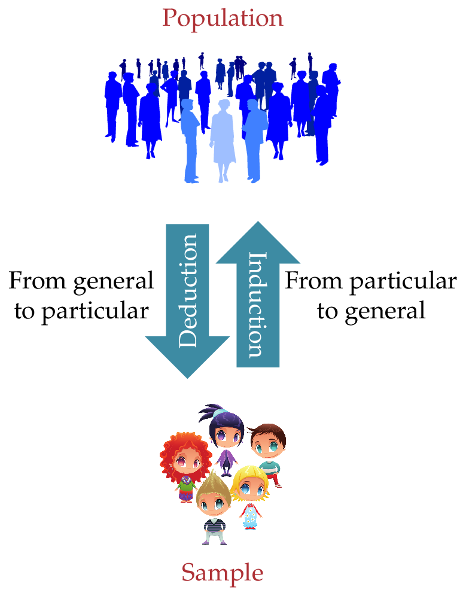
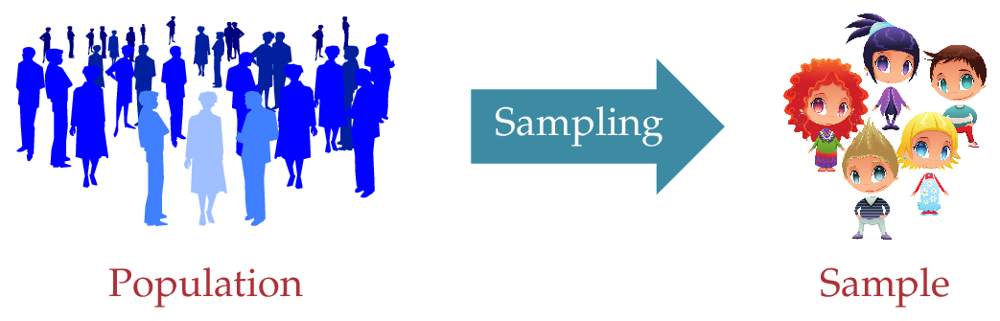
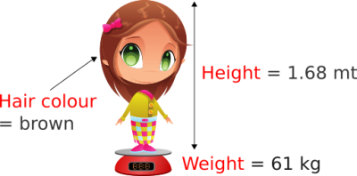
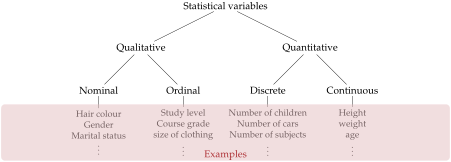
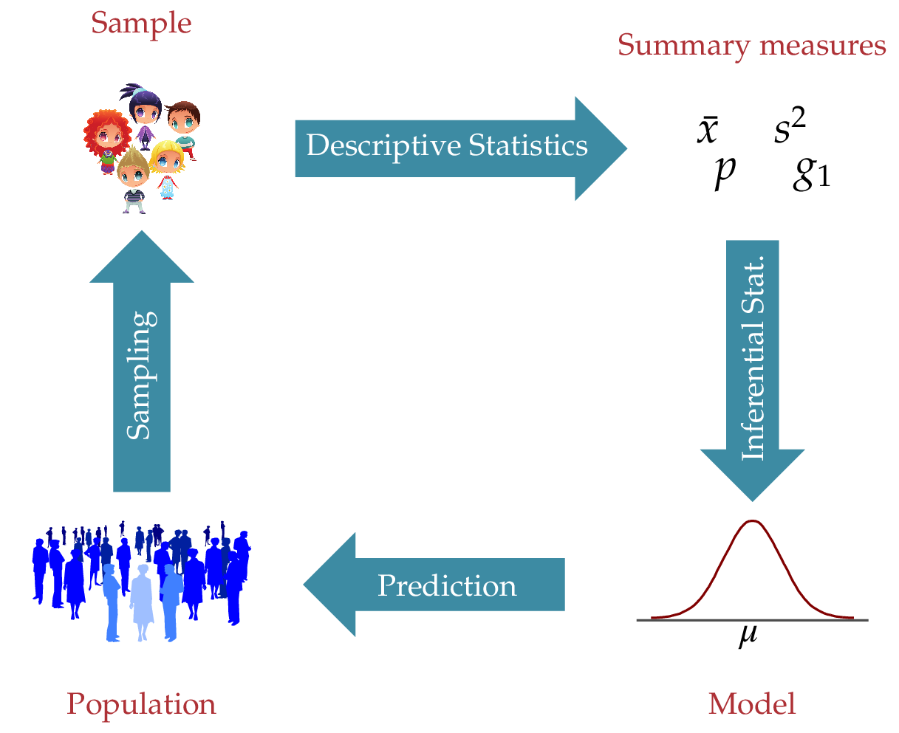

Statistics as a scientific tool
-------------------------------

### What is Statistics?

>**Definition - Statistics**. *Statistics* is a branch of Mathematics that deals with data collection, summary, analysis an interpretation.

The role of Statistics is to extract information from data in order to gain knowledge for taking decisions.

{: .img-center}

Statistics is essential in any scientific or technical discipline which require data handling, especially with large volumes of data, such as Physics, Chemistry, Medicine, Psychology, Economics or Social Sciences.

But, *why is necessary Statistics?*

### A changing World

Scientists try to study the World. A World with a high variability that makes difficult determining the behaviour of things.

Statistics provides a bridge between the real world and the mathematical models that attempt to explain it, providing a methodology to assess the discrepancies between reality and theoretical models.

This makes Statistics an indispensable tool in applied sciences that require design of experiments and data analysis.

Population and sample
---------------------

### Statistical population
 
> **Definition - Population**. A *population* is a set of elements defined by one or more features that has all the elements and they alone. Every element of the population is called *individual*.

> **Definition - Population size**. The number of individuals in a population is known as the *population size* and is represented by $N$.

Sometimes not all the individuals are accessible to study. Then we distinguish between:

- **Theoretical population**: Individuals to which we want extrapolate the study conclusions.
- **Studied population**: Individuals truly accessible in the study.

### Drawbacks in the population study

Scientists study a phenomenon in a population to understand it, to get knowledge about it, and so to control it.

But, for a complete knowledge of the population it is necessary to study all his individuals.

However, this is not always possible for several reasons:

-   The population size is infinite or too large to study all his individuals.
-   The operations that individuals undergo are destructive.
-   The cost, both money and time, that would require study all the
    individuals in the population is not affordable.

### Statistics Sample

When it is not possible or convenient to study all the individuals in a population, we study only a subset of them.

>**Definition - Sample**. A *sample* is a subset of the population.

>**Definition - Sample size**. The number of individuals of the sample is called *sample size* and is represented by $n$.

Usually, the population study is conducted on samples drawn from it.

The sample study only gives an approximate knowledge of the population. But in most cases is *enough*.

### Sample size determination

One of the most interesting questions that arise:

The answer depends of several factors, as the population variability or the desired reliability for extrapolations on the population.

Unfortunately we can’t answer that question until the end of the course, but in general, the most individuals have the sample, the more reliable will be the conclusions on the population, but also the study will be longer and more expensive.

**Example**. To understand what a sufficient sample size means we can use a picture example. A digital photography consist in a lot of small points called pixels disposed in an big array layout with rows and columns (the more rows and columns, the more resolution has the picture). Here the picture is the population and every pixel is and individual. Every pixel has a colour and it's the variability of colours what forms the picture motif. 

*How many pixels must we take in a sample in order to know the motif of a picture?*

The answer depends on the variability of colours in the picture. If all the pixels in the picture are of the same colour, only one pixel is required to know the motif. But, if there is a lot of variability in the colours, a large sample size will be required. 

The image below contains a small sample of the pixels of a picture. Could you find out the motif of the picture? 

{: .img-center}

*With a small sample size it’s difficult to find out the picture motif!*

The image below contains a larger sample of pixels. Could you find out the motif of the picture now?

{: .img-center}

*With a large sample is easier to find out the picture motif!*

And here is the whole population.

{: .img-center}

*It’s not required to know all the pixels of a picture to find out its motif!*

### Types of reasoning

**Deduction properties**:  If the premises are true, it guarantees the certainty of the conclusions (that is, if something is true in the population, it is also true in the sample). However,

**Induction properties**: It doesn’t guarantee the certainty of the conclusions (if something is true in the sample, it may not be true in the population, so be careful with the extrapolations!). But, *it's the only way to generate new knowledge!* 

Statistics is fundamentally based on inductive reasoning, because it uses the information obtained from samples to draw conclusions about populations.

Sampling
--------
>**Definition - Sampling**. The process of selecting the elements included in a sample is known as *sampling*.

To reflect reliable information about the whole population, the sample must be representative of the population. That means that the sample should reproduce on a smaller scale the population variability.

### Types of sampling

There exists a lot of sampling methods but all of them can be grouped in two categories:

**Random sampling**: The sample individuals are selected randomly. All the population individuals have the same likelihood of being selected (equiprobability).

**Non random sampling**: The sample individuals are not selected randomly. Some population individuals have a higher likelihood of being selected than others.

Only random sampling methods avoid the selection bias and guarantee the representativeness of the sample, and therefore, the validity of conclusions.

Non random sampling methods are not suitable to make generalizations because doesn’t guarantee the representativeness of the sample. Nevertheless, usually are less expensive and can be used in exploratory studies.

### Simple random sampling

The most popular random sampling method is the *simple random sampling*, that has the following properties:

-   All the population individuals have the same likelihood of being selected in the sample.
-   The individual selection is performed with replacement, that is, each selected individual is returned to the population before selecting the next one. This way the population doesn’t change.
-   Each individual selection is independent of the others.

The only way of doing a random sampling is to assign a unique identity number to each population individual (conducting a *census*) and performing a random drawing.

Statistical variables
---------------------

In every statistical study we are interested in some properties or characteristics of individuals.

>**Definition - Statistical variable**. A *statistical variable* is a property or characteristic measured in the population individuals.

The *data* is the actual values or outcomes recorded on a statistical variable.

### Types of statistical variables

According to the nature of their values and their scale, they can be:

- **Qualitative variables**. They measure non-numeric qualities. They can be:

    - **Nominals**: There is no natural order between its categories.
        Example: The eyes or hair colour.

    - **Ordinals**: There is a natural order between its categories.
        Example: The education level.

- **Quantitative variables**: They measure numeric quantities. They can be:

    - **Discrete**: Their values are isolated numbers (usually integers).
        Example: The number of children or cars in a family.

    - **Continuous**:  They can take any value in a real interval.
        Example: The height, weight or age of a person.

Qualitative and discrete variables are also called *categorical variables* and their values *categories*.

#### Choosing the appropriate variable

Sometimes a characteristic could be measured in variables of different types.

**Example**. Whether a person smokes or not could be measure in several ways:

-   Smokes: yes/no. (Nominal)

-   Smoking level: No smoking/unusual/moderate/quite/heavy. (Ordinal)

-   Number of cigarettes per day: 0,1,2,…(Discrete)

In those cases quantitative variables are preferable to qualitative, continuous variables are preferable to discrete variables and ordinal variables are preferable to nominal, as they give more information.

According to their role in the study:

- **Independent variables**: Variables that no depends on other variables in the study. Usually they are manipulate in an experiment in order to observe their effect on a dependent variable. They are also known as *predictor variables*.

- **Dependent variables**: Variables that depends on other variables in the study. They are not manipulated in an experiment and are also known as *outcome variables*.

**Example**. In a study on the performance of students in a course, the intelligence of students and the daily study time are independent variables, while the course grade is a dependent variable.

### Types of statistical studies

According to their role in the study:

- **Experimental**: When the independent variables are manipulated in order to see the effect that that change have on the dependent variables.
    **Example**. In a study on the performance of students in a test, the teacher manipulates the study time and create two or more groups asking students in each group to study a different number of hours.

- **Non-experimental**: When the independent variables are not manipulated. That not means that it is impossible to do so, but it will either be impractical or unethical to do so.
    **Example**. In a study a researcher could be interested in the effect of smoking over the lung cancer. However, whilst possible, it would be unethical to ask individuals to smoke in order to study what effect this had on their lungs. In this case, the researcher could study two groups of people, one with lung cancer and other without, an observe in each group how many persons smoke or not.

Experimental studies allow to identify a cause and effect between variables while non-experimental studies only allow to identify association or relationship between variables.

### The data table

The variables of a study will be measured in each individual of the sample. This will give a data set that usually is arranged in a tabular form known as *data table*.

In this table each column contains the information of a variable and each row contains the information of an individual.

**Example**. The table below contains data about the variables Name, Age, Gender, Weight and Height of a sample of 6 persons. 

| Name               | Age  | Gender | Weight(Kg) | Height(cm) |
|:-------------------|:----:|:----:|:----:|:------:|
| José Luis Martínez |  18  |   H  |  85  |   179  |
| Rosa Díaz          |  32  |   M  |  65  |   173  |
| Javier García      |  24  |   H  |  71  |   181  |
| Carmen López       |  35  |   M  |  65  |   170  |
| Marisa López       |  46  |   M  |  51  |   158  |
| Antonio Ruiz       |  68  |   H  |  66  |   174  |

Phases of a statistical study
-----------------------------

Usually a statistical study goes through the following phases:

1.  The study begins with a previous design in which are set the study goals, the population, the variables to measure and the required sample size.

2.  Next, the sample is selected from the population and the variables are measured in the individuals of the sample (getting the data    table). This is accomplished by *sampling*.

3.  The next step consists in describing and summarizing the information of the sample. This is the job of *Descriptive Statistics*.

4.  Then, the information obtained is projected on a mathematical model that intend to explain what happens in population, and the model is validated. This is accomplished by *Inferential Statistics*.

5.  Finally, the validated model is used to perform predictions and to draw conclusions on the population.

### The statistical cycle

